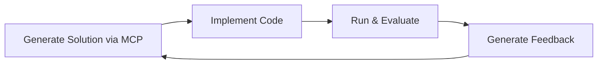

A search strategy decides which candidate to try next. It generates solution ideas, runs each as an experiment, and records the result so the next choice is informed by the last.

## Which strategies ship?

One: `generic` — a coding agent plus MCP gates for ideation and implementation. Both shipped modes and every benchmark run it; benchmarks differ only in the handler that scores each candidate.

## Generic search

The main strategy for general problem solving. Uses Claude Code with MCP gates for both ideation and implementation.


```mermaid
flowchart LR
    A[Generate Solution via MCP] --> B[Implement Code]
    B --> C[Run & Evaluate]
    C --> D[Generate Feedback]
    D --> A
```

### Configuration

```yaml
search_strategy:
  type: "generic"
  params:
    idea_generation_model: "claude-opus-5"
    implementation_model: "claude-opus-5"
    auth_mode: "oauth"
    gate_failure_policy: "warn"
    ideation_gates: ["research", "experiment_history", "repo_memory", "leeroopedia"]
    implementation_gates: ["research", "repo_memory", "leeroopedia"]
```

`auth_mode` names the Claude Code credential source: `oauth` (the shipped
default — subscription login), `api_key`, or `auto` to let the adapter
resolve one. AWS Bedrock support was removed on 26 August 2026.

Gate requirements are checked before each agent is configured. `warn` (the
default) removes unavailable gates and logs a warning, `skip` removes them
silently, and `error` stops configuration. Unknown gate names always fail. See
[Capability-Aware MCP Gates](/docs/evolve/mcp-gates).

`parent_policy` controls experiment lineage. `best` (the default) refines the
best valid candidate; `baseline` starts every candidate from `main`. Ideation
reads from a detached worktree of that same selected ref, so its code and
RepoMemory context match the implementation base. See
[Parent Selection](/docs/evolve/parent-selection) for lineage and resume
semantics.

### Usage

```python
from kapso.execution.search_strategies import SearchStrategyFactory

strategy = SearchStrategyFactory.create(
    strategy_type="generic",
    problem_handler=handler,
    llm=llm,
    coding_agent_config=config,
    params={"ideation_timeout": 300},
)

strategy.run(context, budget_progress=0.0)
best = strategy.get_best_experiment()
```

### MCP gates

The generic strategy uses MCP gates for external knowledge access:

| Gate | Tools | Purpose |
|------|-------|---------|
| `research` | `research_*` | Deep research capabilities |
| `experiment_history` | `get_top_experiments`, `get_recent_experiments`, `search_similar_experiments` | Learn from past experiments |
| `repo_memory` | `get_repo_memory_section`, `list_repo_memory_sections`, `get_repo_memory_summary` | Repository understanding |
| `leeroopedia` | `search_knowledge`, `build_plan`, `review_plan`, `verify_code_math`, `diagnose_failure`, `propose_hypothesis`, `query_hyperparameter_priors`, `get_page` | Curated ML/AI knowledge via [Leeroopedia](https://leeroopedia.com) |

## Node structure (SearchNode)

```python
@dataclass
class SearchNode:
    node_id: int
    parent_node_id: Optional[int] = None
    
    # Step 1: Solution generation
    solution: str = ""
    
    # Step 2: Implementation
    branch_name: str = ""
    code_changes_summary: str = ""
    
    # Step 3: Evaluation
    evaluation_script_path: str = ""
    evaluation_output: str = ""
    
    # Step 4: Feedback
    feedback: str = ""
    score: Optional[float] = None
    should_stop: bool = False
    evaluation_valid: bool = True
    
    # Metadata
    had_error: bool = False
    error_message: str = ""
    workspace_dir: str = ""
```

## Who evaluates and who stops?

In `kapso.evolve()` the coding agent builds the evaluation and the feedback generator owns the stop decision. Benchmark runs use the same strategy but their handler supplies the official evaluation, and a handler may still cast a legacy stop vote via `stop_condition()`.

## How do I add my own?

```python
from kapso.execution.search_strategies.base import SearchStrategy
from kapso.execution.search_strategies.factory import register_strategy

@register_strategy("my_custom_search")
class MyCustomSearch(SearchStrategy):
    def __init__(self, config, workspace_dir=None, import_from_checkpoint=False):
        # The factory passes all three — omitting the last is a TypeError
        super().__init__(config, workspace_dir, import_from_checkpoint)
        # Custom initialization

    def run(self, context, budget_progress=0.0):
        # Generate and run experiments
        solution = self.generate_solution(context)
        result = self._implement(
            solution, context,
            branch_name="experiment_0",
        )
        self.node_history.append(result)

    def get_experiment_history(self, best_last=False):
        if best_last:
            return sorted(self.node_history, key=lambda x: x.score)
        return self.node_history

    def get_best_experiment(self):
        valid = [e for e in self.node_history if not e.had_error]
        return max(valid, key=lambda x: x.score) if valid else None

    def checkout_to_best_experiment_branch(self):
        best = self.get_best_experiment()
        if best:
            self.workspace.switch_branch(best.branch_name)
```

## Related

<CardGroup cols={2}>
  <Card title="Parent selection" icon="code-branch" href="/docs/evolve/parent-selection">
    Which candidate to build on
  </Card>
  <Card title="Orchestrator" icon="gear" href="/docs/evolve/orchestrator">
    What drives the strategy
  </Card>
</CardGroup>

Related pages: [Parent selection](/docs/evolve/parent-selection) · [Orchestrator](/docs/evolve/orchestrator) · [Orchestrator](/docs/evolve/orchestrator)

Kapso is an open-source framework by [Leeroo](https://leeroo.com) that builds software toward measurable goals through experiment campaigns. Source code: [github.com/Leeroo-AI/kapso](https://github.com/Leeroo-AI/kapso) · Install: `pip install leeroo-kapso` · Every page as plain text: [llms.txt](https://docs.leeroo.com/llms.txt).
