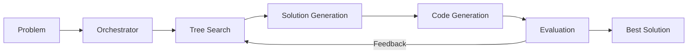

Praxium is an automated experimentation system that uses LLM-guided tree search to solve Kaggle competitions and algorithmic optimization problems.

## How It Works

The system iteratively generates solutions, implements them via coding agents, evaluates results, and uses feedback to guide the next iteration.

## Supported Benchmarks

<CardGroup cols={2}>
  <Card title="MLE-Bench" icon="chart-line" href="/docs/benchmarks/mle-bench">
    Solve Kaggle ML competitions with automated experimentation. Supports tabular, image, text, and audio problems.
  </Card>
  <Card title="ALE-Bench" icon="code" href="/docs/benchmarks/ale-bench">
    Tackle AtCoder algorithmic optimization problems. Generates C++ solutions using optimization algorithms.
  </Card>
</CardGroup>

<Card title="Generic Problems" icon="flask" href="/docs/benchmarks/generic-problems">
  Solve arbitrary problems with custom evaluators and stop conditions.
</Card>

## Core Components

| Component | Description |
|-----------|-------------|
| **OrchestratorAgent** | Coordinates the solve loop, manages budget (time, cost, iterations) |
| **Search Strategy** | Tree search for solution exploration (expand, select, prune) |
| **Experiment Workspace** | Git-based workspace with branch per experiment |
| **Coding Agents** | Pluggable code generators (Aider, Gemini, Claude Code, OpenHands) |
| **Knowledge Search** | Neo4j-based domain knowledge retrieval |

## Quick Links

<CardGroup cols={3}>
  <Card title="Quickstart" icon="rocket" href="/docs/quickstart">
    Get running in 5 minutes
  </Card>
  <Card title="Architecture" icon="sitemap" href="/docs/concepts/architecture">
    System design overview
  </Card>
  <Card title="Configuration" icon="gear" href="/docs/guides/configuration">
    YAML config reference
  </Card>
</CardGroup>

