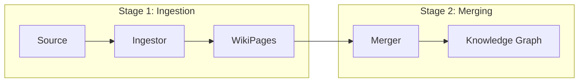

## Overview

The Knowledge Learning Pipeline is a two-stage process that transforms raw sources (repositories, research, experiments) into structured wiki pages in the Knowledge Graph.



## Using the Pipeline

### Full Pipeline

```python
from src.knowledge.learners import KnowledgePipeline, Source

pipeline = KnowledgePipeline(wiki_dir="data/wikis")

# Full pipeline: ingest + merge
result = pipeline.run(Source.Repo("https://github.com/user/repo"))
print(f"Created: {result.created}, Merged: {result.merged}")
```

### Via Kapso API

```python
from src.kapso import Kapso, Source

kapso = Kapso()

# Learn from multiple sources
kapso.learn(
    Source.Repo("https://github.com/huggingface/transformers"),
    kapso.research("QLoRA best practices", mode="idea"),
    wiki_dir="data/wikis",
)
```

### Extract Only (No Merge)

```python
# Get WikiPages without modifying KG
result = pipeline.run(
    Source.Repo("https://github.com/user/repo"),
    skip_merge=True,
)
pages = result.extracted_pages
```

## Source Types

The `Source` namespace provides typed wrappers for knowledge inputs:

| Source Type | Description | Status |
|-------------|-------------|--------|
| `Source.Repo(url, branch="main")` | Git repository | Implemented |
| `Source.Solution(solution)` | Completed experiment | Basic |
| `Source.Idea(query, source, content)` | Research idea | Implemented |
| `Source.Implementation(query, source, content)` | Code implementation | Implemented |
| `Source.ResearchReport(query, content)` | Research report | Implemented |

```python
from src.knowledge.learners import Source

# Repository source
repo = Source.Repo("https://github.com/user/repo", branch="main")

# Solution source (from evolve())
solution = kapso.evolve(goal="...")
sol_source = Source.Solution(solution)

# Research sources (from research())
findings = kapso.research("topic", mode=["idea", "implementation"])
# findings.ideas is List[Source.Idea]
# findings.implementations is List[Source.Implementation]
```

## Stage 1: Ingestors

Ingestors extract WikiPages from sources. Each source type has a dedicated ingestor.

### IngestorFactory

```python
from src.knowledge.learners.ingestors import IngestorFactory

# Create by type
ingestor = IngestorFactory.create("repo")
pages = ingestor.ingest(Source.Repo("..."))

# Auto-detect from source
ingestor = IngestorFactory.for_source(source)

# List available ingestors
IngestorFactory.list_ingestors()  # ["repo", "solution", "research"]
```

### RepoIngestor

The most sophisticated ingestor, using a multi-phase pipeline:

1. **Repository Understanding** - Generates AST scaffold, agent explores file structure
2. **Knowledge Extraction** - Extracts concepts, patterns, and implementation details
3. **Page Generation** - Creates structured wiki pages from extracted knowledge
4. **Validation** - Ensures graph integrity and fixes broken links

### ResearchIngestor

Converts web research results into WikiPages:

```python
research = kapso.research("QLoRA best practices", mode="idea")

# Ingest into WikiPages
ingestor = IngestorFactory.create("research")
pages = ingestor.ingest(research)
```

## Stage 2: Knowledge Merger

The merger uses a **hierarchical sub-graph-aware algorithm** with a single Claude Code agent call. It processes connected pages as units, respecting the Knowledge Graph DAG structure.

### Merge Algorithm

The merger executes a 5-phase process:

1. **Sub-Graph Detection** - Groups connected pages into sub-graphs
2. **Planning** - Top-down merge decisions (root to leaves)
3. **Execution** - Bottom-up page creation/editing (leaves to root)
4. **Audit** - Verifies nodes and edges after each sub-graph
5. **Finalize** - Collects results and generates summary

### Merge Actions

| Action | Description |
|--------|-------------|
| `CREATE_NEW` | New page for novel knowledge |
| `MERGE_INTO` | Update existing page with new content |
| `skip` | Duplicate or low-quality |

### Using the Merger

```python
from src.knowledge.learners import KnowledgeMerger

merger = KnowledgeMerger()
result = merger.merge(
    proposed_pages=pages,
    wiki_dir="data/wikis",
)

print(f"Created: {len(result.created)}")
print(f"Edited: {len(result.edited)}")
print(f"Failed: {len(result.failed)}")
```

### Merge Result

```python
@dataclass
class MergeResult:
    total_proposed: int       # Pages proposed for merge
    subgraphs_processed: int  # Sub-graphs detected and processed
    created: List[str]        # New page IDs created
    edited: List[str]         # Existing pages updated
    failed: List[str]         # Pages that failed to process
    errors: List[str]         # Error messages
    plan_path: Optional[Path] # Path to merge plan file
```

## WikiPage Structure

```python
@dataclass
class WikiPage:
    id: str                 # Unique page identifier
    page_title: str         # Human-readable title
    page_type: str          # Page category
    overview: str           # Brief summary (for embedding)
    content: str            # Full page content
    domains: List[str]      # Topic domains
    sources: List[Dict]     # Source references
    outgoing_links: List[Dict]  # Graph connections
```

## CLI Usage

```bash
# Learn from a GitHub repository
python -m src.knowledge.learners https://github.com/user/repo

# Specify a branch
python -m src.knowledge.learners https://github.com/user/repo --branch develop

# Extract only (don't merge)
python -m src.knowledge.learners https://github.com/user/repo --extract-only

# Custom wiki directory
python -m src.knowledge.learners https://github.com/user/repo --wiki-dir ./my_wikis

# Verbose logging
python -m src.knowledge.learners https://github.com/user/repo --verbose
```

### CLI Options

| Option | Short | Description |
|--------|-------|-------------|
| `--type` | `-t` | Source type: `repo`, `paper`, `solution` |
| `--branch` | `-b` | Git branch (default: main) |
| `--extract-only` | `-e` | Only extract, don't merge |
| `--wiki-dir` | `-w` | Wiki directory path |
| `--verbose` | `-v` | Enable verbose logging |

## Pipeline Result

```python
@dataclass
class PipelineResult:
    sources_processed: int
    total_pages_extracted: int
    merge_result: Optional[MergeResult]
    extracted_pages: List[WikiPage]
    errors: List[str]

    @property
    def created(self) -> int
    @property
    def edited(self) -> int
    @property
    def success(self) -> bool
```
