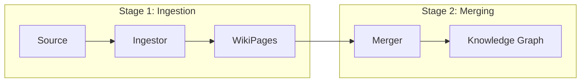

## Overview

The Knowledge Learning Pipeline is a two-stage process that transforms raw sources (repositories, research, experiments) into structured wiki pages in the Knowledge Graph.



## Using the Pipeline

### Full Pipeline

```python
from src.knowledge_base.learners import KnowledgePipeline, Source

pipeline = KnowledgePipeline(wiki_dir="data/wikis")

# Full pipeline: ingest + merge
result = pipeline.run(Source.Repo("https://github.com/user/repo"))
print(f"Created: {result.created}, Edited: {result.edited}")
```

### Via Kapso API

```python
from src.kapso import Kapso, Source

kapso = Kapso()

# Learn from multiple sources
findings = kapso.research("QLoRA best practices", mode="idea")
kapso.learn(
    Source.Repo("https://github.com/huggingface/transformers"),
    *findings.ideas,
    wiki_dir="data/wikis",
)
```

### Extract Only (No Merge)

```python
# Get WikiPages without modifying KG
result = pipeline.run(
    Source.Repo("https://github.com/user/repo"),
    skip_merge=True,
)
pages = result.extracted_pages
```

## Source Types

The `Source` namespace provides typed wrappers for knowledge inputs:

| Source Type | Description | Status |
|-------------|-------------|--------|
| `Source.Repo(url, branch="main")` | Git repository | Implemented |
| `Source.Solution(solution)` | Completed experiment | Basic |
| `Source.Idea(query, source, content)` | Research idea | Implemented |
| `Source.Implementation(query, source, content)` | Code implementation | Implemented |
| `Source.ResearchReport(query, content)` | Research report | Implemented |

```python
from src.knowledge_base.types import Source

# Repository source
repo = Source.Repo("https://github.com/user/repo", branch="main")

# Solution source (from evolve())
solution = kapso.evolve(goal="...")
sol_source = Source.Solution(solution)

# Research sources (from research())
findings = kapso.research("topic", mode="both")
# findings.ideas is List[Source.Idea]
# findings.implementations is List[Source.Implementation]
```

## Stage 1: Ingestors

Ingestors extract WikiPages from sources. Each source type has a dedicated ingestor.

### IngestorFactory

```python
from src.knowledge_base.learners.ingestors import IngestorFactory

# Create by type
ingestor = IngestorFactory.create("repo")
pages = ingestor.ingest(Source.Repo("..."))

# Auto-detect from source
ingestor = IngestorFactory.for_source(source)

# List available ingestors
IngestorFactory.list_ingestors()  # ["repo", "solution", "idea", "implementation", "researchreport"]
```

### RepoIngestor

The most sophisticated ingestor, using a two-branch multi-phase pipeline:

**Phase 0: Repository Understanding (pre-phase)**
- Parse repo structure, generate `_RepoMap.md` with AST info
- Agent fills in natural language understanding for each file
- Subsequent phases read this file instead of re-exploring

**Branch 1: Workflow-Based Extraction**
- **Phase 1a: Anchoring** - Find workflows from README/examples, write Workflow pages + rough WorkflowIndex
- **Phase 1b: Anchoring Context** - Enrich WorkflowIndex with detailed implementation context
- **Phase 2: Excavation+Synthesis** - Trace imports, write Implementation-Principle pairs together
- **Phase 3: Enrichment** - Mine constraints/tips, write Environment/Heuristic pages
- **Phase 4: Audit** - Validate graph integrity, fix broken links
- **Phase 4b: Repo Builder** - Create GitHub repositories for workflows

**Branch 2: Orphan Mining (runs after Branch 1)**
- **Phase 5a: Triage (code)** - Deterministic filtering into AUTO_KEEP/AUTO_DISCARD/MANUAL_REVIEW
- **Phase 5b: Review (agent)** - Agent evaluates MANUAL_REVIEW files
- **Phase 5c: Create (agent)** - Agent creates wiki pages for approved files
- **Phase 5d: Verify (code)** - Verify all approved files have pages
- **Phase 6: Orphan Audit** - Validate orphan nodes

### Research Ingestors

Research ingestors convert web research results into WikiPages using a three-phase agentic pipeline:

**Phase 1: Planning**
- Analyzes content and decides what pages to create
- Writes `_plan.md` with page decisions

**Phase 2: Writing**
- Creates wiki pages following section definitions
- Writes pages to staging directory

**Phase 3: Auditing**
- Validates pages and fixes issues
- Ensures graph integrity

There are three specialized research ingestors:

| Ingestor | Source Type | Description |
|----------|-------------|-------------|
| `IdeaIngestor` | `idea` | Extracts principles from research ideas |
| `ImplementationIngestor` | `implementation` | Extracts implementations from code examples |
| `ResearchReportIngestor` | `researchreport` | Extracts comprehensive knowledge from reports |

```python
findings = kapso.research("QLoRA best practices", mode="idea")

# Ingest into WikiPages (auto-detects ingestor type)
ingestor = IngestorFactory.for_source(findings.ideas[0])
pages = ingestor.ingest(findings.ideas[0])

# Or create by type
ingestor = IngestorFactory.create("idea")
pages = ingestor.ingest(Source.Idea(query="...", source="...", content="..."))
```

## Stage 2: Knowledge Merger

The merger uses a **hierarchical sub-graph-aware algorithm** with a single Claude Code agent call. It processes connected pages as units, respecting the Knowledge Graph DAG structure.

### Wiki Hierarchy

The Knowledge Graph follows a top-down DAG structure:

```
Principle (Core Node - The Theory)
├── implemented_by → Implementation (MANDATORY 1+)
└── uses_heuristic → Heuristic (optional)

Implementation (The Code)
├── requires_env → Environment (optional)
└── uses_heuristic → Heuristic (optional)

Environment (Leaf - Target Only)
Heuristic (Leaf - Target Only)
```

### Merge Algorithm

The merger executes a 5-phase process:

**Phase 1: Sub-Graph Detection**
- Parses `outgoing_links` to build an adjacency list
- Finds root nodes (no incoming edges from proposed pages)
- Groups connected components into sub-graphs

**Phase 2: Planning (Top-Down)**
- For each sub-graph, makes merge decisions starting from root:
  - **Root decision**: Search for similar pages of same type → `MERGE` or `CREATE_NEW`
  - **Children decisions** (recursive):
    - If parent = `CREATE_NEW` → child inherits `CREATE_NEW` (no search needed)
    - If parent = `MERGE` → search only among target's children → `MERGE` or `CREATE_NEW`
  - **Special case**: Heuristics with multiple parents use lowest parent for scoped search
- Computes execution order (bottom-up): Environment → Heuristic → Implementation → Principle
- Records deferred edges (which parent adds edge after processing)

**Phase 3: Execution (Bottom-Up)**
- Processes nodes in computed order
- For `CREATE_NEW`: Get page structure, prepare content, call `kg_index`
- For `MERGE`: Get page structure, fetch target, merge content intelligently, call `kg_edit`
- Updates `outgoing_links` to point to processed children's `result_page_id`

**Phase 4: Audit**
- Verifies nodes exist (`CREATE_NEW`/`MERGE`)
- Verifies edges (parent has edge to child's `result_page_id`)
- Handles failures with retries (max 3)

**Phase 5: Finalize**
- Collects all `result_page_id` values
- Categorizes as created (`CREATE_NEW`) or edited (`MERGE`)
- Writes final summary to `_merge_plan.md`

### Merge Actions

| Action | Description |
|--------|-------------|
| `CREATE_NEW` | New page for novel knowledge |
| `MERGE` | Update existing page with new content |

### Edge Types

| From | Edge Type | To |
|------|-----------|-----|
| Principle | `implemented_by` | Implementation |
| Principle | `uses_heuristic` | Heuristic |
| Implementation | `requires_env` | Environment |
| Implementation | `uses_heuristic` | Heuristic |

### Important Rules

1. **Same-type search only**: Principles search among Principles, Implementations among Implementations, etc.
2. **Scoped search**: When parent is `MERGE`, children search only among the target's children
3. **Inherited CREATE_NEW**: If parent is `CREATE_NEW`, all descendants are `CREATE_NEW` (no search)
4. **Additive edges**: When merging, keep existing edges and add new ones
5. **Bottom-up execution**: Process leaves (Environment, Heuristic) before parents
6. **No cross-type merges**: Never merge a Principle with an Implementation, etc.

### MCP Tools Used

The merger uses these MCP tools via the `kg-graph-search` server:

| Tool | Purpose |
|------|---------|
| `search_knowledge` | Find similar pages in the graph |
| `get_wiki_page` | Read existing page content by title |
| `get_page_structure` | Get sections definition for a page type |
| `kg_index` | Create new page in the graph |
| `kg_edit` | Update existing page in the graph |

### Using the Merger

```python
from src.knowledge_base.learners import KnowledgeMerger

merger = KnowledgeMerger()
result = merger.merge(
    proposed_pages=pages,
    wiki_dir="data/wikis",
)

print(f"Created: {len(result.created)}")
print(f"Edited: {len(result.edited)}")
print(f"Failed: {len(result.failed)}")
```

### Merge Modes

The merger operates in two modes based on whether a KG index exists:

1. **No Index Mode**: Creates all pages as new, writes to wiki directory, then creates index
2. **Merge Mode**: Runs agentic hierarchical merge using MCP tools

Index detection order:
1. Explicit `kg_index_path` from config
2. Auto-detect `.index` file in wiki directory

### Merge Result

```python
@dataclass
class MergeResult:
    total_proposed: int       # Pages proposed for merge
    subgraphs_processed: int  # Sub-graphs detected and processed
    created: List[str]        # New page IDs created
    edited: List[str]         # Existing pages updated
    failed: List[str]         # Pages that failed to process
    errors: List[str]         # Error messages
    plan_path: Optional[Path] # Path to merge plan file
    
    @property
    def success(self) -> bool  # True if no errors and no failures
    
    @property
    def total_processed(self) -> int  # created + edited count
```

## WikiPage Structure

```python
@dataclass
class WikiPage:
    id: str                 # Unique page identifier
    page_title: str         # Human-readable title
    page_type: str          # Page category
    overview: str           # Brief summary (for embedding)
    content: str            # Full page content
    domains: List[str]      # Topic domains
    sources: List[Dict]     # Source references
    outgoing_links: List[Dict]  # Graph connections
```

## CLI Usage

```bash
# Learn from a GitHub repository
python -m src.knowledge.learners https://github.com/user/repo

# Specify a branch
python -m src.knowledge.learners https://github.com/user/repo --branch develop

# Extract only (don't merge)
python -m src.knowledge.learners https://github.com/user/repo --extract-only

# Custom wiki directory
python -m src.knowledge.learners https://github.com/user/repo --wiki-dir ./my_wikis

# Verbose logging
python -m src.knowledge.learners https://github.com/user/repo --verbose
```

### CLI Options

| Option | Short | Description |
|--------|-------|-------------|
| `--type` | `-t` | Source type: `repo`, `paper`, `solution` |
| `--branch` | `-b` | Git branch (default: main) |
| `--extract-only` | `-e` | Only extract, don't merge |
| `--wiki-dir` | `-w` | Wiki directory path |
| `--verbose` | `-v` | Enable verbose logging |

## Pipeline Result

```python
@dataclass
class PipelineResult:
    sources_processed: int
    total_pages_extracted: int
    merge_result: Optional[MergeResult]
    extracted_pages: List[WikiPage]
    errors: List[str]

    @property
    def created(self) -> int
    @property
    def edited(self) -> int
    @property
    def success(self) -> bool
```
