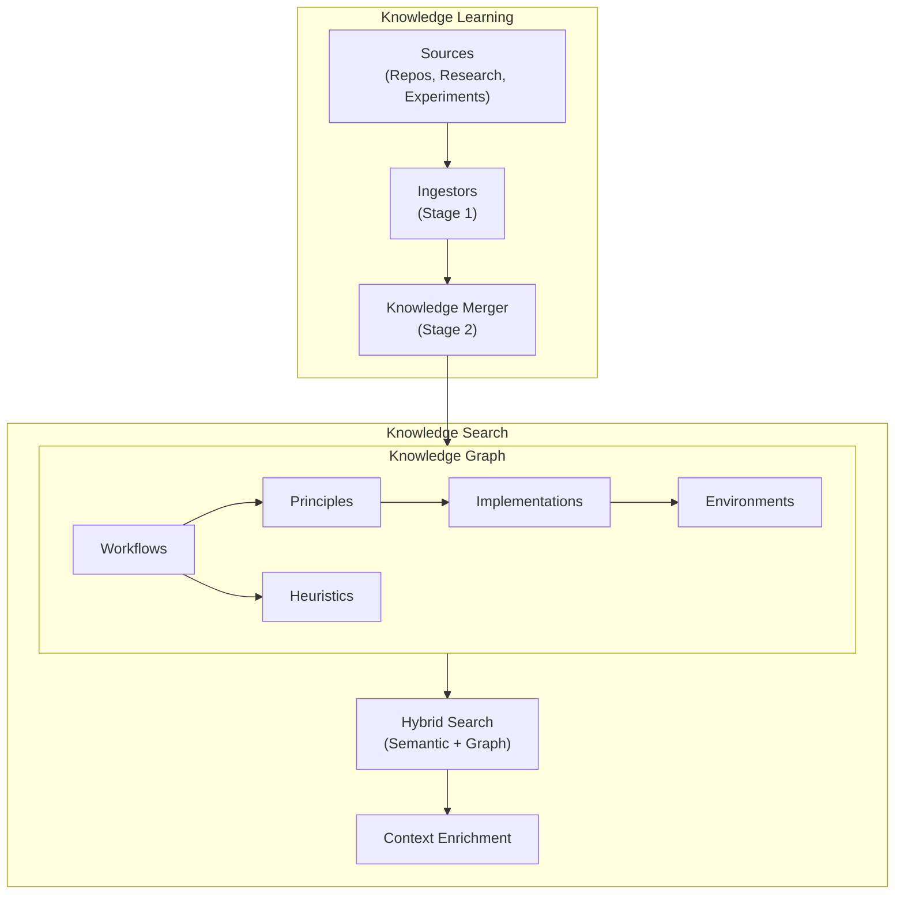
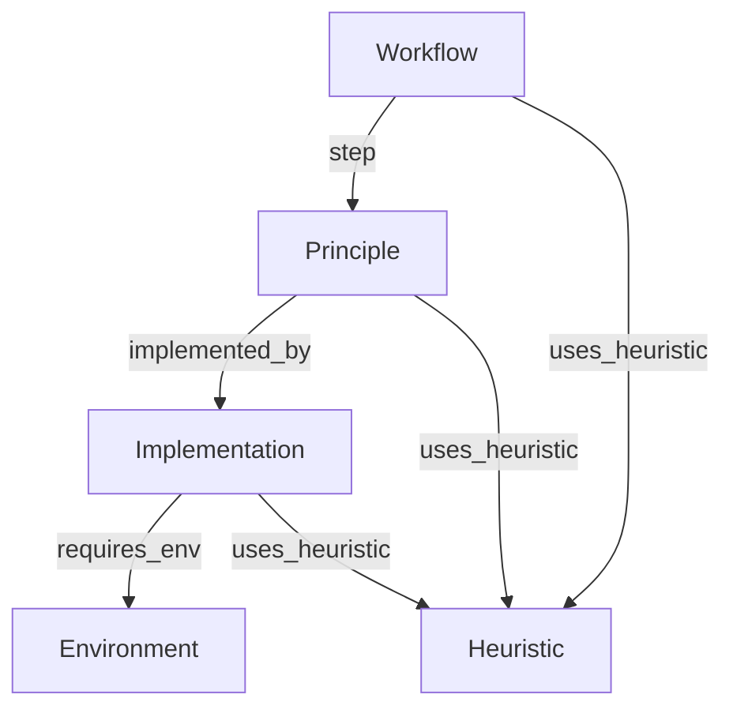

## Overview

The knowledge system provides domain-specific guidance during problem-solving. It helps the agent recommend proven approaches and avoid common pitfalls by learning from repositories, research, and past experiments.



## Key Concepts

### Knowledge Graph (KG)

The KG stores domain knowledge in a structured format:

- **Storage**: Weaviate (vector embeddings) + Neo4j (graph structure)
- **Schema**: 5 page types organized as a directed acyclic graph (DAG)
- **Content**: Wiki pages with overviews, content, and connections

### Knowledge Pipeline

A two-stage process for learning from sources:

1. **Stage 1 (Ingestors)**: Extract WikiPages from sources
2. **Stage 2 (Merger)**: Intelligently merge into the KG

### Knowledge Search

Hybrid retrieval that combines:

- **Semantic search**: Vector similarity in Weaviate
- **Graph traversal**: Connected pages from Neo4j
- **LLM reranking**: Relevance scoring

## Using Knowledge in Kapso

### Option 1: Pre-indexed KG

```python
from src.kapso import Kapso

# One-time: Index wiki pages
kapso = Kapso()
kapso.index_kg(
    wiki_dir="data/wikis_llm_finetuning",
    save_to="data/indexes/llm_finetuning.index",
)

# Every time: Load existing index
kapso = Kapso(kg_index="data/indexes/llm_finetuning.index")
solution = kapso.evolve(goal="Fine-tune LLaMA with QLoRA")
```

### Option 2: Learn from Sources

```python
from src.kapso import Kapso, Source

kapso = Kapso()

# Learn from a repository
kapso.learn(
    Source.Repo("https://github.com/huggingface/transformers"),
    wiki_dir="data/wikis",
)

# Learn from web research
research = kapso.research("QLoRA best practices", mode="idea")
kapso.learn(research, wiki_dir="data/wikis")
```

### Option 3: Research as Context

```python
from src.kapso import Kapso

kapso = Kapso()

# Research without persisting to KG
research = kapso.research(
    "unsloth FastLanguageModel example",
    mode="implementation",
    depth="deep",
)

# Use research as context
solution = kapso.evolve(
    goal="Fine-tune with Unsloth + LoRA",
    additional_context=research.to_context_string(),
)
```

## Wiki Page Types

The KG uses 5 page types organized as a **Top-Down DAG**:

| Type | Role | Example |
|------|------|---------|
| **Workflow** | The Recipe - ordered sequence of steps | "QLoRA Fine-tuning" |
| **Principle** | The Theory - library-agnostic concepts | "Low Rank Adaptation" |
| **Implementation** | The Code - concrete API reference | "TRL_SFTTrainer" |
| **Environment** | The Context - hardware/dependencies | "CUDA_11_Environment" |
| **Heuristic** | The Wisdom - tips and optimizations | "Learning_Rate_Tuning" |

### Connection Schema



## Search Backends

| Backend | Data Format | Storage | Use Case |
|---------|-------------|---------|----------|
| `kg_graph_search` | Wiki pages (.md) | Weaviate + Neo4j | Semantic search with reranking |
| `kg_llm_navigation` | JSON (nodes/edges) | Neo4j only | LLM-guided graph navigation |

## Infrastructure Requirements

Both backends require database infrastructure:

```bash
# Start Weaviate and Neo4j
./scripts/start_infra.sh

# Stop infrastructure
./scripts/stop_infra.sh
```

## Next Steps

<CardGroup cols={2}>
  <Card title="Learning Pipeline" icon="graduation-cap" href="/docs/knowledge/learning-pipeline">
    How knowledge is extracted and merged
  </Card>
  <Card title="Search Backends" icon="magnifying-glass" href="/docs/knowledge/search-backends">
    Hybrid search implementation
  </Card>
  <Card title="Wiki Structure" icon="book" href="/docs/knowledge/wiki-structure">
    Page types and connection schema
  </Card>
  <Card title="Configuration" icon="gear" href="/docs/guides/configuration">
    YAML config for knowledge search
  </Card>
</CardGroup>
