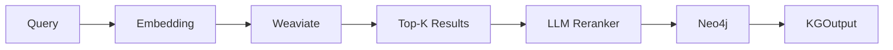
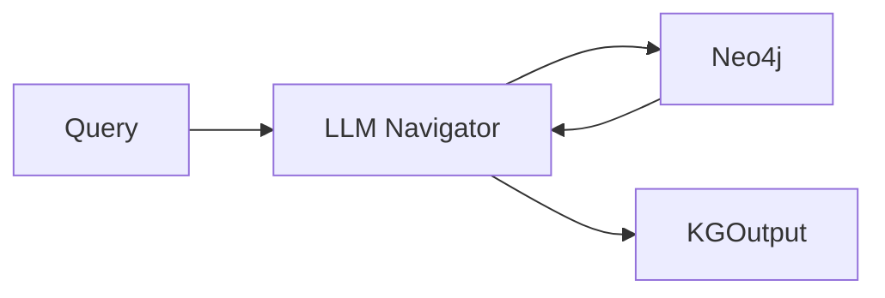

## Overview

Kapso provides two search backends for querying the Knowledge Graph:

| Backend | Best For | Storage |
|---------|----------|---------|
| `kg_graph_search` | Wiki pages with semantic search | Weaviate + Neo4j |
| `kg_llm_navigation` | JSON knowledge graphs | Neo4j only |

## kg_graph_search

The primary backend for wiki-based knowledge. Combines vector embeddings with graph structure.

### Architecture



### Features

- **Semantic search**: OpenAI embeddings for similarity matching
- **LLM reranking**: Reorder results by query relevance
- **Graph enrichment**: Add connected pages from Neo4j
- **Filtering**: By page type, domain, score threshold

### Usage

```python
from src.knowledge_base.search import KnowledgeSearchFactory, KGSearchFilters

# Create search instance
search = KnowledgeSearchFactory.create("kg_graph_search", params={
    "weaviate_collection": "KapsoKG",
    "embedding_model": "text-embedding-3-large",
    "use_llm_reranker": True,
    "reranker_model": "gpt-4.1-mini",
})

# Search with filters
result = search.search(
    query="How to fine-tune LLM with limited GPU memory?",
    filters=KGSearchFilters(
        top_k=5,
        domains=["LLMs", "PEFT"],
    )
)

# Use results
for item in result:
    print(f"{item.page_title}: {item.score:.2f}")

# Get formatted context for LLM
context = result.to_context_string(max_results=3)
```

### Configuration

```yaml
knowledge_search:
  type: "kg_graph_search"
  enabled: true
  params:
    weaviate_collection: "KapsoKG"
    embedding_model: "text-embedding-3-large"
    use_llm_reranker: true
    reranker_model: "gpt-4.1-mini"
    include_connected_pages: true
```

## kg_llm_navigation

Alternative backend for JSON-based knowledge graphs with LLM-guided navigation.

### Architecture



### Features

- **LLM-guided**: LLM decides which nodes to visit
- **Graph navigation**: Follows edges to find relevant nodes
- **No embeddings**: Works with any graph structure

### Usage

```python
from src.knowledge_base.search import KnowledgeSearchFactory

# Create search instance
search = KnowledgeSearchFactory.create("kg_llm_navigation")

# Index JSON data
with open("kg_data.json") as f:
    graph_data = json.load(f)
search.index(graph_data)

# Search
result = search.search(
    query="Best practices for feature engineering",
    context="Working on tabular data competition",
)
```

### Configuration

```yaml
knowledge_search:
  type: "kg_llm_navigation"
  enabled: true
  params:
    neo4j_uri: "bolt://localhost:7687"
    neo4j_user: "neo4j"
    neo4j_password: "password"
```

## Search Data Structures

### KGSearchFilters

```python
@dataclass
class KGSearchFilters:
    top_k: int = 10                    # Max results
    min_score: Optional[float] = None  # Score threshold (0-1)
    page_types: Optional[List[str]] = None  # Filter by type
    domains: Optional[List[str]] = None     # Filter by domain
    include_content: bool = True       # Include full content
```

### KGOutput

```python
@dataclass
class KGOutput:
    query: str
    filters: Optional[KGSearchFilters]
    results: List[KGResultItem]
    total_found: int
    search_metadata: Dict[str, Any]

    @property
    def is_empty(self) -> bool
    @property
    def top_result(self) -> Optional[KGResultItem]

    def get_by_type(self, page_type: str) -> List[KGResultItem]
    def get_by_domain(self, domain: str) -> List[KGResultItem]
    def get_above_score(self, min_score: float) -> List[KGResultItem]
    def to_context_string(self, max_results=5) -> str
```

### KGResultItem

```python
@dataclass
class KGResultItem:
    id: str
    score: float
    page_title: str
    page_type: str
    overview: str
    content: str = ""
    metadata: Dict[str, Any] = field(default_factory=dict)

    @property
    def domains(self) -> List[str]
    @property
    def sources(self) -> List[Dict[str, str]]
```

## Indexing

### Index Wiki Pages

```python
from src.kapso import Kapso

kapso = Kapso()

# Index from wiki directory
kapso.index_kg(
    wiki_dir="data/wikis_llm_finetuning",
    save_to="data/indexes/llm_finetuning.index",
    force=True,  # Clear existing data
)
```

### Index JSON Graph

```python
kapso.index_kg(
    data_path="benchmarks/mle/data/kg_data.json",
    save_to="data/indexes/kaggle.index",
    search_type="kg_llm_navigation",  # Override backend
)
```

### Index File Format

The `.index` file is a JSON reference:

```json
{
  "version": "1.0",
  "created_at": "2025-01-15T10:30:00Z",
  "data_source": "data/wikis_llm_finetuning",
  "search_backend": "kg_graph_search",
  "backend_refs": {
    "weaviate_collection": "KapsoWiki",
    "embedding_model": "text-embedding-3-large"
  },
  "page_count": 99
}
```

## Search Presets

| Preset | top_k | LLM Reranker | Connected Pages |
|--------|-------|--------------|-----------------|
| `DEFAULT` | 10 | Yes | Yes |
| `FAST` | 5 | No | No |
| `THOROUGH` | 20 | Yes | Yes |

## NullKnowledgeSearch

A no-op implementation used when KG is disabled:

```python
search = KnowledgeSearchFactory.create_null()
result = search.search("query")  # Returns empty KGOutput
```

## Creating Custom Backends

```python
from src.knowledge_base.search.base import KnowledgeSearch
from src.knowledge_base.search.factory import register_knowledge_search

@register_knowledge_search("my_custom_search")
class MyCustomSearch(KnowledgeSearch):
    def index(self, data: KGIndexInput) -> None:
        # Index wiki pages or data
        pass

    def search(self, query: str, filters=None, context=None) -> KGOutput:
        # Return search results
        pass

    def get_page(self, page_title: str) -> Optional[WikiPage]:
        # Direct page lookup
        pass

    def edit(self, data: KGEditInput) -> bool:
        # Edit existing page
        pass
```
