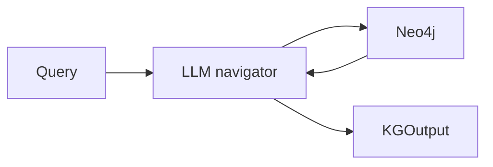

Kapso ships two backends for querying the [knowledge graph](/docs/knowledge/overview). Which one you want depends on what you indexed.

## Which backend should I use?

| Backend | Use it for | Storage | How it retrieves |
|---------|-----------|---------|------------------|
| `kg_graph_search` | Wiki pages built by [`learn_knowledge()`](/docs/knowledge/learning-pipeline) | Weaviate + Neo4j | Vector similarity, optional LLM reranking, then graph enrichment |
| `kg_llm_navigation` | JSON node-and-edge graphs | Neo4j only | An LLM walks the graph, deciding which nodes to visit |

Set it with `knowledge_search.type` in your [config](/docs/reference/configuration#knowledge-search), or override per index with `kapso index_kg --search-type`.

## kg_graph_search

The primary backend for wiki-based knowledge. It embeds the query, retrieves from Weaviate, optionally reranks with an LLM, then pulls connected pages from Neo4j.


```mermaid
flowchart LR
    Q[Query] --> E[Embedding]
    E --> W[Weaviate]
    W --> R[Top-K results]
    R --> L[LLM reranker]
    L --> N[Neo4j enrichment]
    N --> O[KGOutput]
```

```python
from kapso.knowledge_base.search import KnowledgeSearchFactory, KGSearchFilters

search = KnowledgeSearchFactory.create("kg_graph_search", params={
    "weaviate_collection": "KapsoKG",
    "embedding_model": "text-embedding-3-large",
    "use_llm_reranker": True,
})

result = search.search(
    query="How to fine-tune an LLM with limited GPU memory?",
    filters=KGSearchFilters(top_k=5, domains=["LLMs", "PEFT"]),
)

for item in result:
    print(f"{item.page_title}: {item.score:.2f}")

context = result.to_context_string(max_results=3)
```

Its three presets differ only in how much work they do after the vector search:

| Preset | LLM reranking | Connected pages |
|--------|---------------|-----------------|
| `DEFAULT` | yes | yes |
| `FAST` | no | no |
| `RERANK_ONLY` | yes | no |

Shipped defaults are `embedding_model: text-embedding-3-large`, `weaviate_collection: KapsoKG`, `include_connected_pages: true`, `use_llm_reranker: false` and `reranker_overview_max_chars: 300`. A preset overrides them; anything a preset omits falls back to these.

<Note>
  This is a different setting from `defaults.models.embedding` in the main config, which is `text-embedding-3-small` and is used for memory rather than for this backend.
</Note>

## kg_llm_navigation

For JSON graphs, where an LLM navigates the structure instead of embedding it. No embeddings are involved, so it works with any graph shape.


```mermaid
flowchart LR
    Q[Query] --> L[LLM navigator]
    L --> N[Neo4j]
    N --> L
    L --> O[KGOutput]
```

```python
import json
from kapso.knowledge_base.search import KnowledgeSearchFactory

search = KnowledgeSearchFactory.create("kg_llm_navigation")

with open("kg_data.json") as handle:
    search.index(json.load(handle))

result = search.search(
    query="Best practices for feature engineering",
    context="Working on a tabular data competition",
)
```

Its four presets trade exploration against cost:

| Preset | `search_top_k` | `navigation_steps` | `expansion_limit` |
|--------|----------------|--------------------|-------------------|
| `DEFAULT` | 1 | 3 | 3 |
| `DEEP_SEARCH` | 3 | 5 | 5 |
| `SHALLOW` | 1 | 2 | 2 |
| `MINIMAL` | 1 | 1 | 1 |

All four use `search_node_type: specialization`.

## What comes back from a search

Both backends return a `KGOutput`.

```python
@dataclass
class KGOutput:
    query: str
    filters: Optional[KGSearchFilters]
    results: List[KGResultItem]
    total_found: int
    search_metadata: Dict[str, Any]

    is_empty: bool          # property
    top_result: Optional[KGResultItem]   # property

    def get_by_type(self, page_type: str) -> List[KGResultItem]
    def get_by_domain(self, domain: str) -> List[KGResultItem]
    def get_above_score(self, min_score: float) -> List[KGResultItem]
    def to_context_string(self, max_results=5) -> str
```

Each result is a `KGResultItem` with `id`, `score`, `page_title`, `page_type`, `overview`, `content` and `metadata`, plus `domains`, `sources` and `last_updated` as properties.

Narrow a search with `KGSearchFilters`:

```python
@dataclass
class KGSearchFilters:
    top_k: int = 10
    min_score: Optional[float] = None
    page_types: Optional[List[str]] = None
    domains: Optional[List[str]] = None
    include_content: bool = True
```

## How do I index content?

Indexing writes a `.index` file that campaigns load with `--kg-index`. See [`index_kg()`](/docs/reference/kapso-api#index-kg).

```python
from kapso import Kapso

kapso = Kapso()

kapso.index_kg(
    wiki_dir="data/wikis",
    save_to="data/indexes/finetuning.index",
    force=True,
)
```

For a JSON graph, point at the file and name the backend:

```python
kapso.index_kg(
    data_path="benchmarks/mle/data/kg_data.json",
    save_to="data/indexes/kaggle.index",
    search_type="kg_llm_navigation",
)
```

The `.index` file is a small JSON reference, not the data itself:

```json
{
  "version": "1.0",
  "created_at": "2026-01-15T10:30:00Z",
  "data_source": "data/wikis",
  "search_backend": "kg_graph_search",
  "backend_refs": {
    "weaviate_collection": "KapsoKG",
    "embedding_model": "text-embedding-3-large"
  },
  "page_count": 99
}
```

Indexing needs Weaviate and Neo4j running. See [Optional: knowledge-graph backends](/docs/installation#optional-knowledge-graph-backends).

## What happens when knowledge search is off?

`KnowledgeSearchFactory.create_null()` returns a no-op backend whose `search()` gives an empty `KGOutput`. `MINIMAL` mode ships with `knowledge_search.enabled: false` and uses it, so a campaign runs without any knowledge-graph infrastructure.

## Can I add my own backend?

Register a class implementing `KnowledgeSearch`:

```python
from kapso.knowledge_base.search.base import KnowledgeSearch
from kapso.knowledge_base.search.factory import register_knowledge_search

@register_knowledge_search("my_custom_search")
class MyCustomSearch(KnowledgeSearch):
    def index(self, data: KGIndexInput) -> None:
        ...

    def search(self, query: str, filters=None, context=None) -> KGOutput:
        ...

    def get_page(self, page_title: str) -> Optional[WikiPage]:
        ...

    def edit(self, data: KGEditInput) -> bool:
        ...
```

Add its presets to `knowledge_search.yaml` beside the two shipped backends.

## Related

<CardGroup cols={2}>
  <Card title="Knowledge graph" icon="brain" href="/docs/knowledge/overview">
    What the graph holds and where it comes from
  </Card>
  <Card title="Learning pipeline" icon="graduation-cap" href="/docs/knowledge/learning-pipeline">
    How sources become wiki pages
  </Card>
</CardGroup>
