## Overview

The Knowledge Graph uses a structured wiki format with 5 page types organized as a **Top-Down Directed Acyclic Graph (DAG)**. This structure ensures knowledge flows from high-level workflows down to specific implementations.

## Page Types

```mermaid
flowchart TD
    W["🗺️ Workflow\nThe Recipe"]
    P["📐 Principle\nThe Theory"]
    I["💻 Implementation\nThe Code"]
    E["🖥️ Environment\nThe Context"]
    H["💡 Heuristic\nThe Wisdom"]

    W -->|step| P
    W -->|uses_heuristic| H
    P -->|implemented_by| I
    P -->|uses_heuristic| H
    I -->|requires_env| E
    I -->|uses_heuristic| H
```



### Workflow (The Recipe)

**Purpose**: Ordered sequence of steps to accomplish a goal.

**Example**: "QLoRA Fine-tuning Workflow"

```markdown
# QLoRA Fine-tuning Workflow

## Overview
Step-by-step guide to fine-tune LLMs with QLoRA for memory efficiency.

## Steps
1. [[step::Principle:Quantization_Theory]]
2. [[step::Principle:LoRA_Adaptation]]
3. [[step::Principle:Training_Loop]]

## Heuristics
- [[uses_heuristic::Heuristic:Learning_Rate_Tuning]]
- [[uses_heuristic::Heuristic:Batch_Size_Selection]]
```

### Principle (The Theory)

**Purpose**: Library-agnostic concepts and algorithms.

**Example**: "Low Rank Adaptation"

```markdown
# Low Rank Adaptation

## Overview
Technique to reduce trainable parameters by decomposing weight updates.

## Theory
LoRA decomposes weight update ΔW = BA where B ∈ R^{d×r} and A ∈ R^{r×k}...

## Implementations
- [[implemented_by::Implementation:TRL_SFTTrainer]]
- [[implemented_by::Implementation:PEFT_LoraConfig]]

## Heuristics
- [[uses_heuristic::Heuristic:Rank_Selection]]
```

### Implementation (The Code)

**Purpose**: Concrete API reference and code patterns.

**Example**: "TRL SFTTrainer"

```markdown
# TRL SFTTrainer

## Overview
High-level trainer for supervised fine-tuning from Hugging Face TRL.

## Code Pattern
```python
from trl import SFTTrainer
trainer = SFTTrainer(
    model=model,
    train_dataset=dataset,
    peft_config=lora_config,
)
trainer.train()
```

## Environment
- [[requires_env::Environment:CUDA_11_Environment]]
- [[requires_env::Environment:Transformers_4_Environment]]

## Heuristics
- [[uses_heuristic::Heuristic:Gradient_Checkpointing]]
```

### Environment (The Context)

**Purpose**: Hardware, OS, and dependency requirements.

**Example**: "CUDA 11 Environment"

```markdown
# CUDA 11 Environment

## Overview
NVIDIA CUDA 11.x runtime environment for GPU acceleration.

## Requirements
- NVIDIA GPU with compute capability >= 7.0
- CUDA Toolkit 11.8
- cuDNN 8.6

## Setup
```bash
conda install pytorch pytorch-cuda=11.8 -c pytorch -c nvidia
```
```

### Heuristic (The Wisdom)

**Purpose**: Tips, optimizations, and lessons learned.

**Example**: "Learning Rate Tuning"

```markdown
# Learning Rate Tuning

## Overview
Best practices for selecting learning rate in fine-tuning.

## Guidelines
- Start with 2e-5 for full fine-tuning
- Use 1e-4 to 3e-4 for LoRA
- Reduce by 10x when loss plateaus

## Evidence
- Paper: "An Empirical Study of Learning Rates" (2023)
- Experiment: titanic_v3 achieved 0.92 with lr=2e-4
```

## Edge Types

| Edge | From | To | Meaning |
|------|------|-----|---------|
| `step` | Workflow | Principle | "This step is defined by this theory" |
| `implemented_by` | Principle | Implementation | "This theory is realized by this code" |
| `requires_env` | Implementation | Environment | "This code needs this context" |
| `uses_heuristic` | Any | Heuristic | "This is optimized by this wisdom" |

## Link Syntax

Links use MediaWiki-style syntax with edge types:

```
[[edge_type::PageType:Page_Title]]
```

Examples:
```markdown
[[step::Principle:Data_Loading]]
[[implemented_by::Implementation:PyTorch_DataLoader]]
[[requires_env::Environment:Python_3_10]]
[[uses_heuristic::Heuristic:Prefetch_Factor]]
```

## Page Structure

Each page follows a consistent structure:

```markdown
# Page Title

## Overview
Brief summary (used for embedding and search results).

## Content
Main content with details, examples, code snippets.

## Metadata
- **Domains**: LLMs, Fine_Tuning, PEFT
- **Sources**: https://github.com/huggingface/trl
- **Last Updated**: 2025-01-15

## Connections
- [[edge_type::PageType:Connected_Page]]
```

## WikiPage Data Structure

```python
@dataclass
class WikiPage:
    id: str                 # "Workflow/QLoRA_Finetuning"
    page_title: str         # "QLoRA Fine-tuning"
    page_type: str          # "Workflow"
    overview: str           # Brief summary
    content: str            # Full content
    domains: List[str]      # ["LLMs", "Fine_Tuning"]
    sources: List[Dict]     # [{"type": "repo", "url": "..."}]
    last_updated: str       # ISO timestamp
    outgoing_links: List[Dict]  # Parsed connections
```

## File Organization

Wiki pages are stored in type-based subdirectories:

```
data/wikis/
├── Workflow/
│   ├── QLoRA_Finetuning.md
│   └── Model_Training.md
├── Principle/
│   ├── Low_Rank_Adaptation.md
│   └── Quantization.md
├── Implementation/
│   ├── TRL_SFTTrainer.md
│   └── PEFT_LoraConfig.md
├── Environment/
│   └── CUDA_11_Environment.md
└── Heuristic/
    ├── Learning_Rate_Tuning.md
    └── Batch_Size_Selection.md
```

## Design Principles

### Top-Down DAG

Knowledge flows from abstract (Workflow) to concrete (Implementation/Environment):

1. **Workflows** define what to do
2. **Principles** explain why it works
3. **Implementations** show how to code it
4. **Environments** specify where it runs
5. **Heuristics** optimize everything

### No Cycles

The graph is acyclic. Pages can only link to pages of equal or lower abstraction level.

### Reusable Components

- **Principles** can be shared across workflows
- **Implementations** can realize multiple principles
- **Heuristics** can apply to any level

## Best Practices

<Tip>
**Start with Workflows** when learning a new domain. They provide the big picture and link to everything else.
</Tip>

<Note>
**Heuristics are gold**. They capture hard-won knowledge that prevents common mistakes.
</Note>

<Warning>
**Keep overviews concise**. The overview is embedded for semantic search. Long overviews dilute search relevance.
</Warning>
