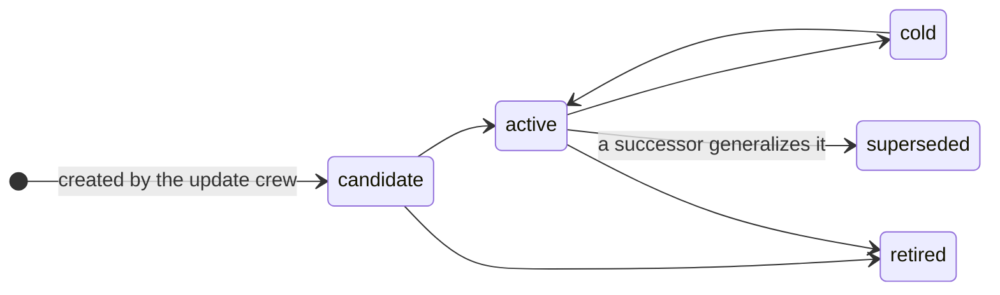

The bank is a git repository. Each card is a file, each lesson is a reviewed commit, and every commit is tagged, so any campaign can be pinned to an exact bank state.

## What is on a card

A card has two parts: a **body**, which is the fact itself, and a **reliability block**, which is what the evidence says about it.

The body is written to be read cold by an engineer who has never seen the card before. Its first heading states the rule as a plain sentence — that sentence becomes the card's *hero*, the one-liner shown in the bank index.

| Card type | What it holds |
|-----------|---------------|
| `insight` | A mechanism that paid or failed, and the conditions under which it holds |
| `procedure` | A runnable harness. The code ships with the card, under `procedures/<name>/` |

The reliability block carries a `state`, a `score`, and a `rationale`. The rationale is not optional:

<Note>
  A score with no rationale fails conformance. The frame rejects the card with `reliability rationale missing — no naked scores`. Every number on a card has to say what earned it.
</Note>

## Reliability states

A card sits in one of five states, and only two of them ever reach a campaign.



| State | Serves? | Meaning |
|-------|---------|---------|
| `candidate` | yes | New, or a generalizing successor. Its claim is a prediction with its test attached |
| `active` | yes | Carrying evidence that supports it |
| `cold` | no | Kept, but not served |
| `retired` | no | Withdrawn. Frozen history |
| `superseded` | no | Replaced by a successor that generalizes it |

<Note>
  The frame enforces the **doors**, not the timing. It requires that a generalizing successor is born `candidate`, that a card leaving the bank moves to `retired/` rather than being deleted, that a retired card is never modified afterwards, and that `supersedes` and `superseded_by` link both ways. When a card is promoted or cooled is the update crew's judgment, argued in the rationale.
</Note>

### Retirement is one-way

A card that stops being true is not deleted. It moves to `retired/` and stays there, frozen. Two invariants enforce this:

- Removing a card from the bank without moving it to `retired/` is a finding.
- Modifying a card after retirement is a finding.

The bank keeps its own history of what it once believed, which is what lets a grader ask whether a retirement was justified.

## Repository layout

```text
insights/          one .md per insight card, plus index.md
procedures/        one directory per procedure: card.md and its code
retired/           insights/ and procedures/ that no longer serve
log.md             the bank's own history
sightings.md       where cards have been seen to apply
.decoys.yaml       quarantined names, never served
```

Every lesson lands as one commit tagged `lr_<id>`, so a campaign can pin the exact bank it was served.

## Creating a bank

```bash
kapso learn init-bank
```

This creates the bank home — a bare repository plus the founding skeleton — at `learning.bank.local_path`, which ships as `data/kapso-bank.git`.

The bank is local-only until you give it a remote:

```bash
kapso bank connect https://github.com/your-org/kapso-bank.git
```

Or create the repository and connect it in one step, using the `gh` CLI:

```bash
kapso bank create your-org/kapso-bank
```

<Note>
  Credentials stay with `git` and `gh`. Kapso never handles them.
</Note>

## Contradictions are named, never silent

A card may declare that it `contradicts` another. Two rules follow:

- A `contradicts` target must be an active card. Pointing at a card that is not active is a finding.
- When two cards that contradict each other are served together, the pair is named to the reading agent rather than presented side by side as though they agreed.

## Reading the bank yourself

```python
from kapso import Kapso

kapso = Kapso()
print(kapso.memory.explain())
```

`memory` reports the bank head and the trajectory count alongside the knowledge-graph state. See [memory](/docs/reference/kapso-api#memory).

## Related

<CardGroup cols={2}>
  <Card title="From campaign to lesson" icon="arrow-right-arrow-left" href="/docs/learning/pipeline">
    How cards get written
  </Card>
  <Card title="Grading" icon="scale-balanced" href="/docs/learning/graders">
    How the bank is measured
  </Card>
</CardGroup>

Related pages: [From campaign to lesson](/docs/learning/pipeline) · [Grading](/docs/learning/graders) · [Overview](/docs/learning/overview)

Kapso is an open-source framework by [Leeroo](https://leeroo.com) that builds software toward measurable goals through experiment campaigns. Source code: [github.com/Leeroo-AI/kapso](https://github.com/Leeroo-AI/kapso) · Install: `pip install leeroo-kapso` · Every page as plain text: [llms.txt](https://docs.leeroo.com/llms.txt).
