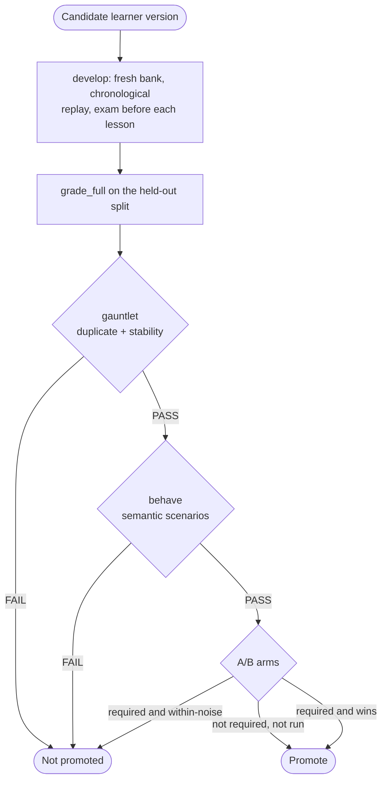

Everything else in this section treats the bank as the thing being improved. Here the **crew** is the artifact and the bank is disposable.

A development run asks: if this version of the update crew had processed the corpus from the beginning, how good would the resulting bank be?

## The development run

```bash
kapso learn develop --split splits/d1.yaml --learner-version crew_v4
```

The driver is deliberately dumb. Batching is chronology plus a size knob, the split is the exam's authority, and every decision that matters comes from the [graders](/docs/learning/graders) rather than from the driver.

1. Create a **fresh, disposable bank**.
2. Replay the learn set in chronological order, in batches of `learning.develop.batch_size`, shipped at `3`.
3. Before each batch is ingested, hindcast the evolving bank against it. This is the training curve: the bank is always asked to predict before it is allowed to learn.
4. Run `grade_full` against the held-out split.
5. Write the keep-best row into `learning.develop.versions_ledger`.

Batch and held-out disjointness is asserted, not assumed.

## The promotion gates

Scores alone do not promote a version. Three gates sit after grading, and a failure in any one blocks.



### Gauntlet

Two traps that buy an answer key by construction. See [the gauntlet](/docs/learning/graders#the-gauntlet).

```bash
kapso learn gauntlet --learner-version crew_v4
```

### Behaviour scenarios

Mechanical tests prove the machinery holds its invariants. Behaviour scenarios prove the behaviour is semantically right, judged by a cross-model reviewer against fixtures whose correct outcome was authored and signed by a person at creation time.

```bash
kapso learn behave --all
kapso learn behave --scenario ./scenarios/serve-thin-bank
```

A scenario directory holds `scenario.yaml` naming the machinery under test — `serve`, `grade-exam`, `update` or `frozen` (reviewer-only slices of frozen real artifacts) — a `truth.md` with the ground truth and expected outcome, and a `rubric.md` of the reviewer's questions.

<Note>
  A semantic `FAIL` blocks promotion exactly as a gauntlet `FAIL` does. The reviewer runs on `claude-fable-5`, a different model from the crew it reviews.
</Note>

### A/B arms

The causal instrument. Two otherwise identical `evolve` runs differ only in the bank ref they are served, and the frame judges the paired per-task deltas with their standard errors.

Two rules keep it honest:

- **A guard KPI** checks the candidate is never worse where the bank is thin. "Never worse where irrelevant", measured rather than assumed.
- **`within-noise` blocks.** When A/B is required, a within-noise result is not a win and is never rounded into one.

`learning.ab.required` ships as `false`, and with it false a run that did not happen is recorded as **not-run** — never as passed. `learning.ab.pairs` ships at `5`.

## Codify

Codify is a separate mechanism worth knowing about: **evolve minus ideation**. The card is the idea, so there is nothing to ideate.

```bash
kapso learn codify --request requests/card-117.yaml
```

<Note>
  The shipped run target is `gcp_ephemeral`, and `learning.codify.gcp.project` deliberately ships empty: set your own GCP project id in your config (or switch `learning.codify.target` to `local`) before running codify, or provisioning refuses with an error naming the key.
</Note>

One spec, one lane: implement, evaluate, judge, feed back, iterate, bounded by `learning.codify.max_iterations`, shipped at `3`. The implementor session **adapts** existing code rather than authoring it, the registered evaluation runs on the placement target, and the judge evaluates the claims — reproduction, faithfulness, honesty about preconditions, ledger consistency.

Passing has two halves, and both are required:

| Half | Means |
|------|-------|
| Mechanical gates green | Decision outcomes match exactly; numeric outcomes reproduce within ±`tolerance_z`·SE of the recorded value; artifact outcomes property-check |
| Judge endorsement | A different model agrees the claims hold |

`tolerance_z` ships at `2`. Two inherited checks guard the gates themselves: an **anti-weak-test** check requires the evaluation to assert the recorded values rather than something weaker, and an **actually-invoked** check requires every gated artifact to be freshly produced, since the workspace is staged with fixture inputs only.

## Related

<CardGroup cols={2}>
  <Card title="Grading" icon="scale-balanced" href="/docs/learning/graders">
    The reports and scorecards these gates read
  </Card>
  <Card title="The pipeline" icon="arrow-right-arrow-left" href="/docs/learning/pipeline">
    What a learner version actually runs
  </Card>
</CardGroup>

Related pages: [Grading](/docs/learning/graders) · [The pipeline](/docs/learning/pipeline) · [Overview](/docs/learning/overview)

Kapso is an open-source framework by [Leeroo](https://leeroo.com) that builds software toward measurable goals through experiment campaigns. Source code: [github.com/Leeroo-AI/kapso](https://github.com/Leeroo-AI/kapso) · Install: `pip install leeroo-kapso` · Every page as plain text: [llms.txt](https://docs.leeroo.com/llms.txt).
