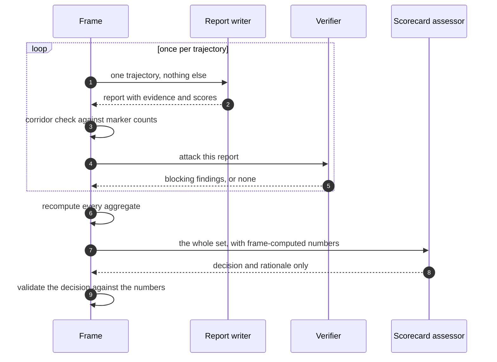

Grading asks one question: does this bank actually help on a campaign it has not seen?

Answering it honestly is harder than running the numbers, because the thing being graded and the thing doing the grading are both models. The design answers that with **information barriers** and **frame-computed arithmetic**.

## The two layers of a report

A hindcast report has an evidence layer and a scoring layer, and the second is tethered to the first.

The evidence layer is a set of marked entries, each citing the trajectory:

| Dimension | Markers |
|-----------|---------|
| Foresight | `HIT-SERVED`, `HIT-UNSERVED`, `MISS-UNCARDED`, `MISS-NOVEL` |
| Accuracy | `AGREED`, `CONTRADICTED`, `OUT-OF-SCOPE`, `THIN` |
| Serving | `SERVED-USED`, `UPTAKE-FAIL`, `SERVE-MISS`, `SERVE-NOISE` |

The scoring layer is one score per dimension. The frame computes a crude corridor centre from the marker counts and **rejects any score outside centre ± 0.2**. A grader cannot write a number its own evidence does not support.

<Note>
  Null is a verdict, not a gap. An empty evidence base scores null. Writing a number over an empty base rejects the report — and so does hiding an existing evidence base behind a null.
</Note>

The band is `learning.graders.score_band`, shipped at `0.2`.

## Who sees what

Three roles, deliberately kept apart. The barriers are the point: each report-writer sees exactly one trajectory and never another writer's report, a scorecard, or a trend.



| Role | Sees | Shipped model |
|------|------|---------------|
| Report writer | One trajectory | `gpt-5.6-sol` via Codex |
| Verifier | One report, to attack it | `claude-fable-5` via Claude Code |
| Scorecard assessor | The whole set | `gpt-5.6-sol` via Codex |

The verifier runs on a **different model** from the writer on purpose. A report survives only if a different model, asked to attack it, cannot land a blocking finding. Repair rounds are bounded by `learning.graders.crew.repair_rounds`, shipped at `5`.

<Note>
  All arithmetic is frame math. An agent-written number is never trusted for aggregation. The assessor writes the decision and the rationale; the frame recomputes the numbers and validates the decision against them.
</Note>

## Two modes

| Mode | When | Who runs |
|------|------|----------|
| Exam | One arriving trajectory, in normal operation | Writer and verifier |
| Full | Every held-out trajectory, when developing a learner | Writer, verifier, aggregation, assessor. Gauntlet verdicts merge in |

```bash
kapso learn grade --bank ./bank --bank-head lr_042 --trajectory <id>
kapso learn grade --bank ./bank --bank-head lr_042 --split splits/d1.yaml --learner-version crew_v4
```

## The split manifest

The split is the authority on which trajectories are learned from and which are held out. One `split.yaml` per exam version, versioned with the harness.

The frame checks three things at load:

- Every trajectory in the store appears **exactly once**.
- No family — the grouping key — appears on both sides.
- Every version carries its rationale.

Scorecards stamp their `split_version`, and **paired comparisons are only valid within one version**. Comparing a score from one split version against another is not a comparison.

## The scorecard

Aggregation is frame math over the admitted reports. Three rules matter more than the numbers:

- **`within-noise` is a first-class decision.** It is never rounded up into a win.
- **Gates dominate scores.** A failed gate is not offset by a good score.
- Calibration pools at buckets `0.4` and `0.7`, with a minimum of `20` observations before a bucket is used.

## The gauntlet

Scores tell you how a bank did. The gauntlet asks whether the *learning step itself* behaves, by running it on controlled input where the correct answer is known by construction.

| Trap | What it does | Passes when |
|------|--------------|-------------|
| Duplicate | Feeds a clone of a trajectory under a fresh identity | The crew recognises it rather than banking it twice |
| Stability | Runs the same input twice | Touched cards, states, transitions and scores match within `0.1`; prose is free to differ |

```bash
kapso learn gauntlet --learner-version crew_v4
```

The stability tolerance is `learning.graders.gauntlet.stability_tolerance`. Prose being free to differ is deliberate: two runs that reach the same decisions by the same evidence have not disagreed just because they worded it differently.

## Related

<CardGroup cols={2}>
  <Card title="Development regime" icon="flask" href="/docs/learning/development">
    Promoting a learner version
  </Card>
  <Card title="The pipeline" icon="arrow-right-arrow-left" href="/docs/learning/pipeline">
    Where grading sits in the chain
  </Card>
</CardGroup>

Related pages: [Development regime](/docs/learning/development) · [The pipeline](/docs/learning/pipeline) · [Overview](/docs/learning/overview)

Kapso is an open-source framework by [Leeroo](https://leeroo.com) that builds software toward measurable goals through experiment campaigns. Source code: [github.com/Leeroo-AI/kapso](https://github.com/Leeroo-AI/kapso) · Install: `pip install leeroo-kapso` · Every page as plain text: [llms.txt](https://docs.leeroo.com/llms.txt).
