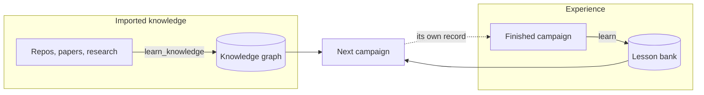

Kapso keeps two memories, and they are filled by different methods.

**Imported knowledge** comes from outside: repositories, papers, research findings. `learn_knowledge()` folds it into the knowledge graph.

**Experience** comes from Kapso's own work. Every finished campaign is a record of what was tried, what it scored, and what happened next. `learn()` mines that record into **evidence-priced cards** in a lesson bank, so the next campaign starts knowing what the last one measured.

This section is about the second memory. For the first, see [Knowledge graph](/docs/knowledge/overview).

## Why a second memory

A knowledge graph tells you what people have written down. It cannot tell you which of those approaches actually paid off on *your* task, at *your* scale, against *your* evaluation.

The lesson bank answers that. Each card records a mechanism that paid or failed, the conditions it held under, and the measurements behind it. A card is never a bare assertion: it carries a reliability state, a score, and the evidence trail that earned them.

## What a lesson looks like

Cards come in two types.

| Type | What it holds |
|------|---------------|
| `insight` | A mechanism that paid or failed, and the conditions it holds under |
| `procedure` | A runnable harness. Its code ships with the card |

Every card carries a reliability block with a state, a score, and a written rationale. Scores are never naked — a card with a score and no rationale fails conformance. See [The lesson bank](/docs/learning/bank).

## How a campaign becomes a lesson

One finished campaign moves through four stages. Each stage is bounded by a **frame** that does the mechanical work and validates the result; the judgment inside is done by agent sessions the frame launches.

| Stage | Command | What happens |
|-------|---------|--------------|
| Import | [`kapso learn import`](/docs/reference/cli#kapso-learn-import) | The campaign bundle enters the trajectory store under a stable identity |
| Mine | [`kapso learn mine`](/docs/reference/cli#kapso-learn-mine) | The bundle is read into derived `mined/` views: strategy, operations, artifacts |
| Grade | [`kapso learn grade`](/docs/reference/cli#kapso-learn-grade) | The bank is graded against the trajectory before it learns from it |
| Update | [`kapso learn update`](/docs/reference/cli#kapso-learn-update) | The update crew folds the result in as one reviewed, tagged commit |

`kapso.learn(solution)` runs all four for a single campaign. See [From campaign to banked lesson](/docs/learning/pipeline).

## Grading before learning

The order matters. The bank is graded **against a trajectory before it learns from that trajectory**, which is what makes the score mean anything: the bank is being asked to predict something it has not seen.

That is the `exam` argument on [`learn()`](/docs/reference/kapso-api#learn), and it defaults to `True`. Setting it `False` is for development replays only.

## Serving

Banked lessons reach a campaign through three tools the reading agent calls itself. The frame introduces the bank and lists what is in it; it never selects cards on the agent's behalf.

<Warning>
  `learning.serving.enabled` ships as `false`. Until you turn it on in [config](/docs/reference/configuration#learning), the bank is written but never read, so banked lessons have no effect on `evolve()`.
</Warning>

See [Serving lessons to a campaign](/docs/learning/serving).

## Where to next

<CardGroup cols={2}>
  <Card title="The lesson bank" icon="database" href="/docs/learning/bank">
    Cards, reliability states, and the bank repository
  </Card>
  <Card title="From campaign to lesson" icon="arrow-right-arrow-left" href="/docs/learning/pipeline">
    Import, mine, grade, update
  </Card>
  <Card title="Grading" icon="scale-balanced" href="/docs/learning/graders">
    How a bank is measured, and against what
  </Card>
  <Card title="Serving" icon="share-nodes" href="/docs/learning/serving">
    How lessons reach a running campaign
  </Card>
</CardGroup>
