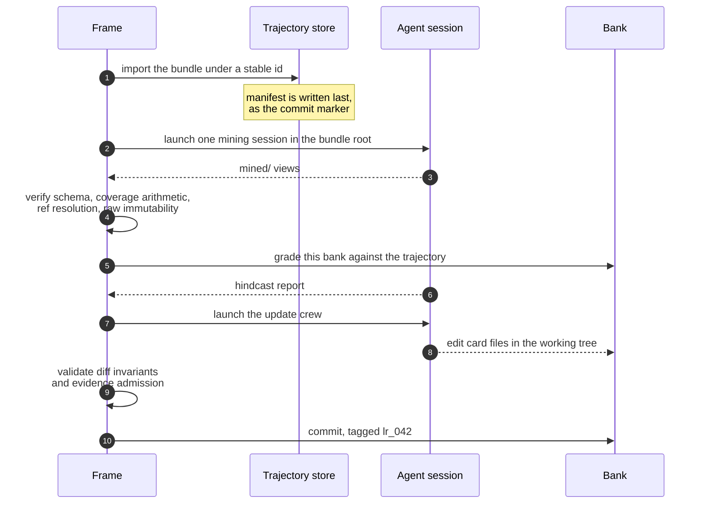

Four stages turn one finished campaign into banked cards. `kapso.learn(solution)` runs all four; each is also a command you can run on its own.

```bash
kapso learn import --archive ./campaign.tgz
kapso learn mine --all
kapso learn grade --bank ./bank --bank-head lr_042 --trajectory <id>
kapso learn update --learner-version crew_v4 --batch-manifest batch.yaml
```

## The frame does the mechanics, agents do the judgment

Every stage has the same shape, and it is the reason the output can be trusted: a **frame** stages the work, launches **one** agent session, and then mechanically verifies what came back. The frame never orchestrates the agents and never judges the content. The agents never write the numbers that get aggregated.

When verification fails, the frame allows a bounded number of repair rounds — each crew's `repair_rounds` setting, shipped as 1 for mining, 3 for the update crew and 5 for the graders — and then fails loud.



## Import

A campaign bundle enters the trajectory store under a stable identity:

```text
<task>/<YYYYMMDDTHHMMSS>_<lane>
```

Bundles are stored **unpacked**, one object per file, never as a tarball. Atomicity comes from writing the manifest last: a bundle whose `trajectory.yaml` is present is a bundle that arrived completely.

Reads go through exactly three doors — `manifest`, `resolve` and `open_ref` — and there is no other door. That is what lets a card cite a line in a campaign log and have the citation still resolve months later.

```bash
kapso learn import --subset subset.yaml
kapso learn import --archive gs://bucket/runs/task/20260731T092629_lane-a2.tgz
```

## Mine

Mining reads a bundle into derived views. The raw bundle is never modified; `mined/` sits beside it.

| File | What it holds |
|------|---------------|
| `mined/index.md` | The campaign at a glance |
| `mined/strategy.md` | What was tried and why |
| `mined/operations.md` | How it was run |
| `mined/artifacts.md` | What it produced |

Per-iteration directories carry the same treatment for each experiment.

The frame's verification is not a formality. It checks the schema, coverage arithmetic against stable identities, ref resolution with a **quote re-grep** — every quoted line must still be found at the reference it cites — index consistency, and raw immutability against the manifest hashes.

```bash
kapso learn mine --all
kapso learn mine --trajectory <id> --force
```

## Grade

The bank is graded **against a trajectory before it learns from that trajectory**. Two modes:

| Mode | What it asks |
|------|--------------|
| Exam | How does this bank do on one arriving trajectory? |
| Full | How does this bank do across a held-out split? |

```bash
kapso learn grade --bank ./bank --bank-head lr_042 --trajectory <id>
kapso learn grade --bank ./bank --bank-head lr_042 --split splits/d1.yaml --learner-version crew_v4
```

See [Grading](/docs/learning/graders) for what a report contains and how scores are bounded.

## Update

The update crew folds the batch into the bank. The proposal medium is the working tree: the crew edits card files directly, and the frame validates the **final diff**.

The transaction is rejected whole on any violation. Checks cover the surface, the [diff invariants](/docs/learning/bank#reliability-states), evidence admission, coverage arithmetic and score bounds. Up to `learning.update_crew.repair_rounds` repair bounces (shipped: 3), then failure.

A green transaction commits as **one reviewed commit**, tagged `lr_<id>`, and pushed to the bank home.

```bash
kapso learn update --learner-version crew_v4 --batch-manifest batch.yaml
```

Omit `--batch-manifest` for docket-only consolidation.

## Running the whole chain

For one arriving campaign:

```bash
kapso learn ingest --trajectory <id> --learner-version crew_v4
```

`ingest` is the operating-regime chain: mine, then exam, then lesson. From Python, [`learn()`](/docs/reference/kapso-api#learn) does the same for a `SolutionResult`:

```python
lesson = kapso.learn(solution)
print(lesson.bank_head_after, lesson.cards_updated)
```

## Related

<CardGroup cols={2}>
  <Card title="Grading" icon="scale-balanced" href="/docs/learning/graders">
    What the graders check
  </Card>
  <Card title="Development regime" icon="flask" href="/docs/learning/development">
    Developing and promoting a learner version
  </Card>
</CardGroup>

Related pages: [Grading](/docs/learning/graders) · [Development regime](/docs/learning/development) · [Overview](/docs/learning/overview)

Kapso is an open-source framework by [Leeroo](https://leeroo.com) that builds software toward measurable goals through experiment campaigns. Source code: [github.com/Leeroo-AI/kapso](https://github.com/Leeroo-AI/kapso) · Install: `pip install leeroo-kapso` · Every page as plain text: [llms.txt](https://docs.leeroo.com/llms.txt).
