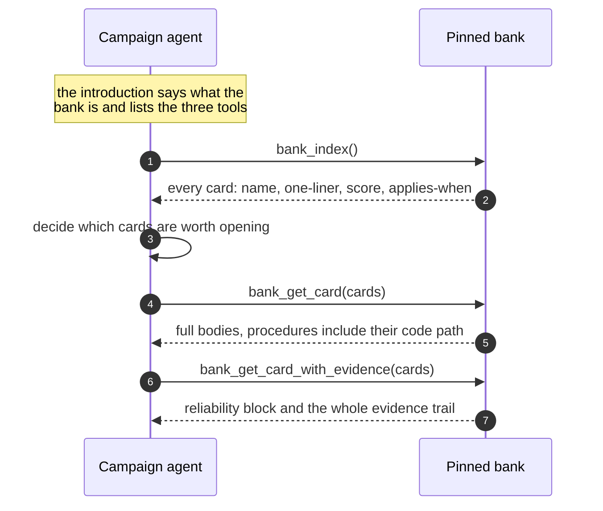

<Warning>
  `learning.serving.enabled` ships as `false`. Until you enable it in [config](/docs/reference/configuration#learning), a campaign never reads the bank, and banked lessons have no effect on `evolve()`.
</Warning>

Serving is deliberately not retrieval-augmentation. The frame does not pick cards and paste them into a prompt. It introduces the bank, says what is in it, and hands the agent three tools. **Selection belongs to the reading agent.**

## What happens at launch

Before any session exists, the frame pins the bank and stages the tools:

- The bank is checked out at a **pinned ref**, so the campaign is served one exact bank state for its whole life.
- The introduction is compiled.
- The tool parameters are staged.

Everything lands in `.kapso/serving/` inside the campaign work directory: the pinned checkout, the launch record, and the sessions' pull log. A harvested trajectory therefore carries the exact state it was served, which is what makes [grading](/docs/learning/graders) possible later.

<Note>
  The network is never on the campaign path. Serving reads the durable local home at `learning.bank.local_path`. A campaign does not fail because a remote was unreachable.
</Note>

## The three tools



| Tool | Returns | Call it when |
|------|---------|--------------|
| `bank_index()` | The whole bank as one index page | Your next decision might have been faced before. Cheap |
| `bank_get_card(cards)` | Full card bodies | You want the actual advice |
| `bank_get_card_with_evidence(cards)` | The card plus reliability and evidence | Before you stake real budget on it |

The index is the **whole bank**, not a filtered subset. There is no `k` cap, no ranking cut and no relevance discount — rank is plain reliability order. Scope is shown as information; judging relevance is the reader's job.

## What the frame does filter

One thing only, and silently: **quarantine**. Cards in the decoy registry and cards in non-serving states — `cold`, `retired`, `superseded` — never appear on either surface.

That is the entire filter. Everything else the bank knows, the agent can see.

## Contradictions are named

When a returned set contains two cards that declare they contradict each other, the pair is named to the agent rather than presented side by side as if they agreed. Disagreement in the bank is surfaced as disagreement.

## Probe offers

A card may carry an optional measurement offer. Probes ride **card reads only** — never the index, never the introduction — and they arrive with an explicit cost clause:

> This is an optional measurement offer, not your default gate: adopt its protocol only if it is affordable at this dataset's scale, and say so explicitly. An ignored probe stays queued.

That wording exists because of a real failure: a probe protocol silently adopted as the default gate taxed every experiment on a large dataset. The budget is `learning.retriever.probe_budget`, shipped at `1`.

## Enabling serving

```yaml
learning:
  serving:
    enabled: true
  bank:
    local_path: data/kapso-bank.git
```

Then run a campaign as usual. To restrict which cards are eligible, pass `serving_scope` to [`evolve()`](/docs/reference/kapso-api#evolve).

## Why an introduction rather than an injection

Injecting selected cards makes the frame guess what matters before the agent has seen the problem. Handing over an index and three tools moves that judgment to the point where the context exists.

It also leaves a record. The pull log shows which cards the agent actually opened and at what depth, which is the evidence the `SERVED-USED`, `UPTAKE-FAIL` and `SERVE-MISS` markers are scored from during [grading](/docs/learning/graders#the-two-layers-of-a-report).

## Related

<CardGroup cols={2}>
  <Card title="The lesson bank" icon="database" href="/docs/learning/bank">
    What is on a card
  </Card>
  <Card title="Grading" icon="scale-balanced" href="/docs/learning/graders">
    How serving is measured
  </Card>
</CardGroup>

Related pages: [The lesson bank](/docs/learning/bank) · [Grading](/docs/learning/graders) · [Overview](/docs/learning/overview)

Kapso is an open-source framework by [Leeroo](https://leeroo.com) that builds software toward measurable goals through experiment campaigns. Source code: [github.com/Leeroo-AI/kapso](https://github.com/Leeroo-AI/kapso) · Install: `pip install leeroo-kapso` · Every page as plain text: [llms.txt](https://docs.leeroo.com/llms.txt).
