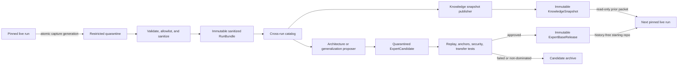

# Cross-run learning and the expert base

Status: refined architecture; not implemented. This supersedes the earlier
merged-store/starter-kit proposal.

## Decision

Kapso should learn on two timescales:

1. **Fast evidence learning.** Every run publishes an immutable, provenance-bound
   record of what was tried, what happened, and what remains unresolved.
2. **Slow procedural learning.** Only reusable code that survives independent
   tests, replay, transfer checks, and review enters a versioned expert-base
   release used to start future runs.

The system has five durable artifacts:

| Artifact | Purpose | May influence a live run? | May become startup code? |
|---|---|---:|---:|
| `ExpertScopeContract` | Defines the repo lineage's task families and domain-specific context dimensions without hardcoding them in core | Yes; all bindings validate against it | No |
| `RunBundle` | Sanitized durable evidence plus an explicit completeness frontier | No; source material only | No |
| `KnowledgeSnapshot` | Frozen, sanitized cross-run episodes, claims, and prior ideas | Yes; read-only prior evidence | No |
| `ExpertCandidate` | Isolated proposal for a reusable module change | No | Only after promotion |
| `ExpertBaseRelease` | Immutable, tested, history-free ML/AI capability repo | Yes; the run starts from it | Yes |

The core invariant is:

> Experiment memory records what happened. Knowledge claims state where an
> interpretation might apply. Expert candidates preserve possible procedures.
> Only cross-context executable evidence changes the expert base.

This realizes the human-scientist analogy without turning experience into a
benchmark/model decision tree or copying the latest winning repository.

## 1. Evidence that shaped the design

- [CoALA](https://arxiv.org/abs/2309.02427) provides the useful separation of
  episodic, semantic, and procedural memory. It is a taxonomy, not evidence that
  these should share a physical store.
- [ExpeL](https://arxiv.org/abs/2308.10144) supports retrieving both prior
  episodes and derived insights. In one HotpotQA ablation, adding Reflexion
  outputs to insight construction reduced success; the authors identify
  hallucination as a possible explanation. Kapso therefore treats independent
  acceptance of derived claims as a governance requirement, not as a result the
  paper itself establishes.
- [Voyager](https://arxiv.org/abs/2305.16291) demonstrates composable executable
  skills admitted after execution, environment feedback, and LLM
  self-verification. Its success check is not an objective verifier, so one
  successful execution is necessary evidence, not sufficient promotion evidence.
- [Agent Workflow Memory](https://arxiv.org/abs/2409.07429) demonstrates induction
  of recurring fine-grained workflows with example-specific context abstracted.
- The [memory-management study](https://arxiv.org/abs/2505.16067) shows why
  add-all is unsafe: similar inputs make agents follow retrieved outputs, so bad
  or misaligned episodes propagate errors. Admission and retrieval quality are
  correctness concerns, not just token optimizations.
- [Darwin Gödel Machine](https://arxiv.org/abs/2505.22954) supports preserving
  diverse candidate lineages rather than hill-climbing only from the current
  winner. Temporary regressions can be useful stepping stones.
- [AlphaEvolve](https://arxiv.org/abs/2506.13131) motivates staged evaluation
  and multiple metrics; [GEPA](https://arxiv.org/abs/2507.19457) motivates
  preserving candidates that are Pareto-optimal across task subsets. Kapso's
  quality/robustness/cost/portability promotion dimensions are a design decision
  inspired by those mechanisms, not an evaluated result from either paper.
- The compute-matched [TroVE re-evaluation](https://openreview.net/forum?id=7AJJgfqNEL)
  and [SWE-Skills-Bench](https://arxiv.org/abs/2603.15401) are important
  counterevidence: apparent skill gains can vanish after compute matching, most
  evaluated skills add no pass-rate lift, and version-mismatched guidance can hurt.
- The [AGENTS.md evaluation](https://arxiv.org/abs/2602.11988) finds that
  indiscriminate repository context can reduce task success while increasing
  cost. It supports keeping live context selected and measured. Encoding durable
  capability in code and tests instead of an ever-growing generated instruction
  file is Kapso's architectural choice.
- [MLE-bench](https://arxiv.org/abs/2410.07095) reinforces that contamination is
  an evaluation threat. Kapso therefore requires provenance, sanitation,
  revocation, and an untouched validation surface as governance controls.

These results motivate a two-timescale architecture; no cited work evaluates this
exact combined design across heterogeneous ML/AI tasks. They do not justify automatic
cross-domain transfer or automatic promotion of generated code.

## 2. Current Kapso authority boundaries

The existing v3 contracts are correct and remain unchanged:

| Current authority | Owns | Must not own |
|---|---|---|
| `GenericSearch.node_history` | Current campaign's contiguous executable nodes and parentage | Foreign nodes |
| `IdeaArchive` (`kapso.ideation_archive.v3`) | Current campaign batches, ideas, claims, gaps, decisions, outcomes | Foreign ideas with missing local batches |
| `CampaignEvidenceSnapshot` | Deterministic projection of the current archive and current nodes | Prior-run evidence |
| `ExperimentHistoryStore` (`kapso.experiment_history.v4`) | Strict executed projection of the current run; contiguous local node IDs | Cross-run records or unexecuted ideas |
| `RepoMemory` | Understanding of the code in one run's branches | Cross-run scientific truth |
| `RunCheckpoint` | Exact resumable state of one run | A mutable global knowledge pointer |

Consequences:

- Foreign episodes never enter `ExperimentHistoryStore`, `node_history`, the
  run checkpoint's node list, or the local evidence snapshot.
- Foreign ideas never enter `IdeaArchive` directly. A generator may use a prior
  idea as inspiration, but it creates a new local `IdeaRecord` with a new local
  batch, parent resolution, analysis, and selection.
- Foreign nodes cannot be parents, incumbents, local supported levers, or local
  gap closures.
- Local integer node IDs are display identifiers only outside their run. A
  cross-run reference is globally qualified and content addressed.
- The current `solution_embedding` remains a local convenience. Cross-run
  vectors require an explicit embedding-space identity.

The previous proposal contradicted these boundaries by adding `origin` to a
mutable merged `experiment_history.json`. It would break contiguity, archive
references, reconciliation, resume, and parent semantics. That path is rejected.

## 3. Architecture



There are two loops.

### 3.1 Live run loop

At launch, a trusted resolver publishes one immutable, attested `LaunchManifest`
so independently changing knowledge and expert-base pointers cannot produce a
torn pair. It contains:

```text
launch_manifest_id
scope_contract_id
knowledge_snapshot_id
expert_base_release_id
embedding_space_id
task_adapter_id
dependency/runtime contract
security denylist generation
```

If the pinned scope has no release, the resolver first completes the
`ExpertRepoArchitect` bootstrap pipeline and publishes validated `E0`; it never
launches a scientific run from an unstructured mutable directory.

The launcher verifies the manifest and its publisher attestation, materializes the
expert base and task adapter atomically, checks the resulting workspace tree hash,
and writes a pre-orchestrator `BootstrapPin` before the first paid action. The pin
is absorbed into `RunCheckpoint` after strategy construction; current checkpoint
state cannot exist early enough to serve this bootstrap role.
The knowledge snapshot remains read-only. The run then:

1. starts from the pinned expert-base source plus a task adapter;
2. builds a local `RepoMemory` for that actual workspace;
3. retrieves a bounded prior-knowledge packet for ideation;
4. uses v3 normally to generate, analyze, select, execute, and evaluate local ideas;
5. persists local nodes to the existing experiment store and local ideas to the
   existing archive;
6. appends execution-revision events and periodically atomically publishes a
   mutually reconcilable capture manifest so stopped runs remain harvestable.

A run never updates global knowledge or the stable expert base.

### 3.2 Cross-run evolve loop

After runs finish or stop, an offline, serialized publisher:

1. receives an atomically published run capture in access-restricted quarantine;
2. validates its checkpoint frontier, provenance, evaluation integrity, and
   allowlisted payload, then sanitizes it before global persistence;
3. publishes an immutable sanitized `RunBundle` that supersedes any older capture
   of the same run;
4. projects executed work into `TransferEpisode` records and unexecuted work into
   `PriorIdea` records;
5. appends review assertions and proposes evidence-linked knowledge claims;
6. resolves admission, dispute, supersession, taint, and revocation states;
7. publishes a new immutable `KnowledgeSnapshot` by compare-and-swap;
8. proposes capability or repository-architecture patches only when their
   respective evidence triggers fire;
9. validates candidates through an evaluator cascade;
10. publishes a new `ExpertBaseRelease` and compatible `LaunchManifest` only
    after their promotion and startup policies pass.

Learning is therefore fast in the catalog and intentionally slow in startup code.
At the expected scale of 10-30 runs, a healthy outcome is many useful episodes,
fewer supported claims, and perhaps only a handful of expert-base promotions.

## 4. Durable schemas

These are semantic contracts, not a commitment to one serialization library.
All documents use exact fields, canonical JSON, UTC timestamps, checksums for
referenced blobs, and fail-loud validation. For a content-addressed object, the
hash preimage is the canonical immutable payload with its ID field omitted.
Attestations sign the resulting ID and publication context and live in an outer
envelope excluded from that preimage, avoiding signature/hash recursion.
Adjudication, admission, eligibility, and revocation state live in separate
immutable catalog revisions; they never mutate a content-addressed payload.

### 4.1 `ExpertScopeContract`

```text
ExpertScopeContract
  scope_contract_id            # immutable revision identity
  scope_id
  supersedes_scope_contract_id
  purpose + explicit non-goals
  task_family_ontology
  task_family_lineage
  artifact_classes
  required_context_dimensions
  context_dimension_schemas
  context_dimension_lineage
  task_adapter_contract
  sanitation_policy_ref
  validation_policy_ref
  repository_architecture_constraints
```

The scope contract is the only framework-level declaration of what one expert
repo lineage is intended to cover. It may be narrow or broad: a single `ml_ai`
scope can include language-model post-training and relational tabular prediction,
while a deployment that needs isolation can declare separate scopes. Scope is not
inferred from folder names or benchmark conditionals. Each contract revision is
immutable, attested, and pinned by runs, bundles, snapshots, candidates, and
releases. Adding a task family publishes a reviewed successor revision; lineage
metadata keeps older episode bindings interpretable without runtime compatibility
paths or rewriting history.

A broad scope is justified only when its task families can share a release,
security, dependency, and validation envelope or have evidence-backed reusable
capabilities. Incompatible trust boundaries, runtimes, licenses, or operational
owners require separate scope lineages rather than one universal repository.

Domain-specific context keys are registered here with exact schemas. That lets a
post-training adapter bind model/tokenizer/template facts and a RelBench adapter
bind entity/schema/time-split facts without adding either vocabulary to core
cross-run code.

### 4.2 `RunBundle`

```text
RunBundle
  bundle_id                    # hash of canonical manifest
  scope_contract_id, scope_id, run_id, campaign_id
  completion_state             # complete | stopped | crashed
  capture_generation
  supersedes_bundle_id
  checkpoint_frontier
  capture_watermarks
  artifact_completeness        # present | absent_before_frontier | unavailable
  started_at, captured_at
  kapso_commit
  launch_manifest_id
  knowledge_snapshot_id
  expert_base_release_id
  task_context_binding
  artifact_environment
  checkpoint_ref
  execution_event_journal_ref
  idea_archive_ref
  experiment_history_ref
  branch_snapshot_refs
  run_log_refs
  checksums
```

Every artifact is conditionally present according to `artifact_completeness`; a
crash bundle is valid only when its declared frontier is internally reconcilable.
The append-only event journal preserves failed and recovered execution revisions
that the current experiment-store projection replaces in place. Until that journal
exists, a bundle can honestly preserve only the latest durable projection.

The manifest references sanitized content-addressed blobs rather than duplicating
weights, data, repositories, and logs. Raw capture first lands in a restricted,
deletable quarantine surface. Only allowlisted output may enter the durable
cross-run object store. The current post-training scripts merely sync the results
directory; implementation must explicitly export and test an atomic capture
manifest for the local store, archive, checkpoint, event journal, selected source
snapshot, and branch frontier.

### 4.3 Context fingerprints

Score comparison and transfer applicability are different questions and use
different fingerprints.

```text
EvaluationFingerprint
  benchmark + dataset/split versions
  evaluator code/config hash
  metric + objective direction
  fidelity and fraction
  exact seed or replicate set + aggregation protocol
  judge/model version where applicable

TaskContextBinding
  scope_contract_id
  task family and capability tags
  task-adapter id
  input and target contract fingerprints
  starting artifact refs
  method and toolchain fingerprints
  dependency/runtime versions
  budget and hardware envelope
  transfer dimensions            # exact keys/types declared by the scope

ArtifactEnvironment
  kapso commit
  expert-base release
  task-adapter hash
  relevant dependency lock hash
```

An effect is mechanically comparable only when its source measurements share an
`EvaluationFingerprint`. Transfer compatibility over `TaskContextBinding`
separately classifies a source
as `exact_context`, `analogical`, or `incompatible` for the current task.
An experiment whose parent is the unmeasured baseline has no relative effect;
harvest must not reinterpret a delta against numeric zero as improvement.

This is the neutrality boundary for `KnowledgeSnapshot`: core records know only
the scope, task family, registered context dimensions, generic intervention and
outcome states, and artifact references. Adding RelBench or another ML/AI family
requires a new scope/task-family contract, adapter, sanitation policy, and
validation policy—not a new episode/snapshot schema or a core conditional.
Within a broad scope, cross-family records may be retrieved as explicit analogies,
but raw measurements are comparable only under the same evaluation fingerprint.

### 4.4 `TransferEpisode`

```text
TransferEpisode
  episode_id                   # content identity
  source                       # scope/run/campaign/node/idea/batch
  source_bundle_id
  supersedes_episode_id
  task_context_binding
  artifact_environment
  proposal                     # exact source proposal
  intervention_ref             # exact diff/artifact reference
  intervention_structure       # coupled | isolated_by_ablation
  parent_episode_ref           # qualified; never a live parent
  attempts[]
    execution_revision
    captured_at
    evaluation_fingerprint     # null only when evaluation did not run
    execution_status           # completed | failed_technical | interrupted
    evaluation_status          # valid | invalid | partial | not_run
    comparison_status          # comparable | not_comparable | inconclusive
    measurements
    source_parent_effect       # value + uncertainty, only if comparable
    feedback
    technical_difficulties
    confounders
  terminal_attempt_revision
  safe_observation_refs
  sanitation_report_id
  derivation_refs
```

One source idea/node produces one episode with an ordered, gap-free attempt list.
This matches v3 recovery, where several execution revisions share one idea and
node while the local store keeps only the latest projection. The append-only
journal reconstructs the earlier failed and interrupted attempts; a later capture
publishes a superseding episode rather than a second independent observation.
`FAILED` is deliberately not one state. A failed implementation, a valid negative
result, an invalid evaluation, and an interrupted attempt have different transfer
meaning. Partial observations are retained with explicit validity; they never
pretend to be a scored experiment.
An episode with coupled changes may inspire transfer but cannot support a causal
mechanism claim until an ablation or other identification evidence isolates it.

### 4.5 `PriorIdea`

```text
PriorIdea
  prior_idea_id
  source_bundle_id + source campaign/batch/idea
  proposal + descriptor + assumptions
  source_status                 # deferred | rejected | unexecuted
  source_rationale
  evidence_refs
  task_context_binding
  sanitation_report_id
```

A `PriorIdea` is frontier inspiration. It cannot be selected or executed directly.
Generation must produce a new local idea that cites it and passes current v3
parent resolution, hard rules, novelty analysis, and selection.
Projection is disjoint: every source idea appears exactly once. Any idea linked to
a node, including an interrupted or recoverable node, becomes a `TransferEpisode`;
only never-linked ideas may become `PriorIdea`s.
For a run with multiple capture generations, projection uses the latest admitted
supersession frontier and content-deduplicates already journaled node revisions;
partial and final bundles cannot count the same execution twice.

### 4.6 `ReviewAssertion`

```text
ReviewAssertion
  assertion_id
  subject_id                    # episode, claim, candidate, or release
  reviewer_id + reviewer_role
  rubric_version
  judgment
  rationale
  exact_evidence_refs
  created_at
  supersedes_assertion_id
  reviewer_attestation
```

Assertions are append-only. They do not overwrite a one-line `verdict.json`.
Configured adjudication derives the active state. Unresolved disagreement yields
`disputed` or `inconclusive`, blocking exploit anchoring and expert promotion.
Reviewer identity is accepted only through a configured trust root or cloud-IAM
attestation; a string `reviewer_id` is not authentication.

### 4.7 `KnowledgeClaim`

```text
KnowledgeClaim
  claim_id
  revision_id                   # immutable revision payload identity
  scope_contract_id
  statement
  mechanism
  applicability_predicates
  explicit_exclusions
  supporting_episode_ids
  contradicting_episode_ids
  proposal_provenance
  state                         # proposed | provisional | supported | disputed |
                                # superseded | revoked
  review_assertion_ids
  supersedes_claim_ids
```

Claims are semantic memory, not instructions or routing rules. A coding agent may
propose or revise them, but cannot certify them. Evidence and review transition
their state. Every claim renders with applicability, exclusions, support,
contradictions, and state; an unbound statement is unrepresentable.
Applicability and exclusion predicates may use only context dimensions registered
by the pinned `ExpertScopeContract`; core code contains no LLM- or tabular-specific
predicate names.
Updating evidence or state creates a new immutable claim revision. `claim_id`
names the lineage; `revision_id` names the exact object pinned by a snapshot.

### 4.8 `CatalogEntryState`

```text
CatalogEntryState
  subject_payload_id
  catalog_generation
  admission_state               # quarantined | admitted | disputed |
                                # superseded | revoked
  assertion_ids
  revocation_ids
  taint_source_ids
  publisher_attestation
```

This immutable projection keeps active trust state out of episode, module, and
candidate payload identities. A later assertion publishes a new catalog
generation; it does not rewrite the subject.

### 4.9 Expert artifacts

```text
ExpertModuleContract
  module_id + version
  purpose
  inputs + outputs
  preconditions + incompatibilities
  resource bounds
  dependency/license manifest
  supporting_episode_ids
  known_failure_episode_ids
  test and replay refs

ExpertRepositoryMap
  repository_map_id
  scope_contract_id
  capability_nodes[]           # stable capability ID, contract ref, owned paths,
                               # and task-family bindings
  dependency_edges[]
  task_adapter_boundary
  validation_entrypoints
  architecture_invariants

ExpertBaseReleaseManifest
  release_id                   # source tree + manifest hash
  scope_contract_id + scope_id
  parent_release_ids
  repository_map_ref
  module_versions
  semantic_book_digest
  source_archive_ref
  test-matrix results
  approval assertions
  contamination scanner version
  dependency lock hash
  compatibility_envelope
  publisher_attestation
```

Contracts describe capability and operating envelope. They do not say “if model X
and benchmark Y, run recipe Z.” Task identity may appear in evidence or an
explicit external adapter, never as a hidden default in the generic core.
`ExpertRepositoryMap` is the machine-readable topology authority. Capability IDs
are semantic and independent of paths, so a directory move does not sever evidence
lineage; splits and merges mint new IDs with explicit lineage.

### 4.10 `ExpertCandidateManifest`

```text
ExpertCandidateManifest
  candidate_id
  scope_contract_id
  change_kind                  # capability | repository_architecture
  parent_release_id + parent_tree_hash
  trigger + trigger_evidence_ids
  patch_ref + candidate_tree_hash
  module_contract_refs
  proposed_repository_map_ref
  proposer_operation + model/CLI provenance
  source_dependency_ids
  ancestor_candidate_ids
  capability_lineage           # preserve evidence provenance across move/split/merge
  validation_attempt_refs       # full dev results; opaque sealed attestations
  sanitation_report_id
```

Failed and non-dominated candidates remain immutable, auditable inputs to future
generalization. Their active eligibility lives in `CatalogEntryState`.

### 4.11 `TaskAdapterManifest`

```text
TaskAdapterManifest
  task_adapter_id
  scope_contract_id
  task_family_id
  publisher_attestation
  task/evaluator binding
  context-dimension binding
  source_tree_ref + tree_hash
  dependency/runtime contract
  sanitation_report_id
  validation_refs
```

The benchmark or an explicitly authorized publisher supplies this read-only,
pinned adapter. Kapso may change a local copy in experiment branches, but cannot
silently update the shared adapter or use it to bypass expert-release gates.

### 4.12 `KnowledgeSnapshotManifest`

```text
KnowledgeSnapshotManifest
  snapshot_id
  scope_contract_id
  scope_id
  parent_snapshot_ids
  included_bundle_ids
  admitted_episode_ids
  admitted_prior_idea_ids
  active_claim_revision_ids
  catalog_generation
  entry_state_refs
  included_assertion_ids
  included_revocation_ids
  proof_dependency_closure_ids
  sanitation_policy_version
  retrieval_policy_version
  embedding_sidecars[]          # each names its EmbeddingSpaceId
  prompt_budget_policy
  checksums
  published_at
  publisher_attestation
```

Raw sanitized bundles are retained. The snapshot carries the complete admitted
metadata and proof dependency closure for its catalog generation; only the
query-specific prompt packet is bounded. Exact assertion and revocation closures,
not timestamps, define reproducible state.

### 4.13 `LaunchManifest`

```text
LaunchManifest
  launch_manifest_id
  launch_request_hash           # intended run/campaign/task/runtime request
  scope_contract_id
  knowledge_snapshot_id
  expert_base_release_id
  embedding_space_id
  task_adapter_id
  dependency/runtime contract
  sanitation and security-denylist generations
  expected source composition hash
  publisher_attestation
```

The launch resolver creates this only after checking release/module and adapter
preconditions against the intended task and runtime. It passes the immutable ID
directly to that run; there is no scope-global launch pointer. The launcher must
match `launch_request_hash` to its own request, preventing substitution with a
validly attested manifest for another task. New runs fail before startup if the
current release is expired, unrevalidated, or incompatible.

## 5. Module responsibilities

| Module | Input | Output | Hard responsibility |
|---|---|---|---|
| `RunCaptureExporter` | Reconciled local checkpoint frontier | Atomic restricted capture | Journal revisions; publish one complete generation with watermarks and supersession |
| `CaptureValidator` | Restricted capture | Valid structural projection | Verify schema, hashes, trust, provenance, cross-artifact joins, and evaluation fingerprints |
| `SanitationGate` | Valid quarantined capture and scope policy | Allowlisted payload + report | Detect secrets, eval leakage, forbidden artifacts, licenses, unsafe paths, and taint closure before global CAS |
| `RunBundlePublisher` | Allowlisted payload | Immutable sanitized bundle | Content-address and attest one capture generation; never interpret results |
| `EpisodeProjector` | Valid sanitized local store/archive | Episodes and prior ideas | Preserve exact source meaning; decompose execution/evaluation/comparison states; mint no lessons |
| `ReviewRegistry` | Reviewer assertions | Append-only adjudicated view | Preserve authorship, rubric, conflict, supersession, and audit history |
| `ClaimProposer` | Selected episodes and contradictions | Proposed/revised claims | Use a coding agent to abstract mechanisms; never admit or certify its own output |
| `CrossRunCatalog` | Bundles, projections, assertions, claims | Ordered immutable generations | Global identity, lineage, exact assertion/revocation closure, taint, supersession, and auditability |
| `KnowledgeSnapshotPublisher` | Catalog closure and policy | Immutable snapshot + CAS pointer | Deterministic admission, proof closure, revocation, sidecar indexing, attestation, and atomic publication |
| `CrossRunRetriever` | Pinned snapshot and current query | Bounded prior packet | Hard compatibility before similarity; trust/outcome/diversity balance; no current-run mutation |
| `PriorKnowledgeAdapter` | Prior packet | v3 prompt/analysis input | Keep foreign refs typed and separate from local evidence; persist exact packet in batch provenance |
| `ExpertRepoArchitect` | Scope contract, current release/map, task-family bindings, evidence | Architecture candidate with repository map | In bootstrap mode create the minimal initial topology; later propose atomic move/split/merge/refactor changes and capability lineage without mutating a stable release |
| `GeneralizationProposer` | Trigger, release, episodes/claims, selected candidate ancestors | Isolated expert candidate | Produce the smallest task-general patch and contract; preserve candidate lineage |
| `ExpertCandidateValidator` | Capability or architecture candidate and evaluator cascade | Promotion evidence | Scope conformance, contract/topology graph integrity, security, leakage, replay, fresh-task, cross-family, cost, and full-release regression checks |
| `ExpertReleasePublisher` | Approved candidate set | Immutable release + CAS pointer | Rebase/compose, compile and validate the semantic book, rerun the release matrix, publish history-free source, support revocation |
| `LaunchResolver` | Snapshot, release, adapter, runtime, trust roots | Attested launch manifest | Prevent torn combinations; enforce eligibility, compatibility, freshness, and denylist state |
| `StarterWorkspaceBuilder` | Launch manifest and optional bootstrap pin | Atomic live workspace | Verify attestations; on fresh launch stage/fsync/rename, on resume verify the existing tree before workspace construction; never reuse `initial_repo` |

The catalog and expert-base release store are separate. A high-confidence episode
can immediately improve retrieval while its code remains quarantined.
`ClaimProposer`, `ExpertRepoArchitect`, and `GeneralizationProposer` use the
configured Codex or Claude Code CLI through the existing coding-agent boundary.
Direct model API use is limited to embeddings; model output never performs an
admission or promotion state transition by itself.

## 6. Retrieval and ideation-v3 integration

### 6.1 Retrieval plan

For each ideation batch, the engine first builds current-run evidence, chooses the
local policy, ranks gaps, and plans the directive. Only then does
`CrossRunRetriever` build a query from the problem, transfer context, open local
gaps, and the directive's operator descriptors. It then:

1. excludes revoked, tainted, unauthorized, and scope/task-family-incompatible
   records;
2. classifies structured transfer compatibility;
3. filters claims by state and applicability;
4. ranks within a compatibility tier by evidence quality, retrieval utility,
   semantic similarity, and recency;
5. applies diversity caps by run, lineage, approach family, and outcome;
6. selects separate positive, negative, inconclusive, and frontier slots within
   configured record and byte budgets.

Semantic similarity is a ranking hint, never an admission, truth, or sign signal.
Selected packet records render in full according to their schema; the selector
skips a whole oversized record rather than clipping its contents. Raw diffs and
logs remain addressable artifacts and are loaded only when explicitly needed.
The packet is proof-closed: selecting a claim or relative effect also selects its
required parent measurement, supporting/contradicting episodes, assertions, and
active sanitation/trust state. If that closure exceeds budget, the top-level item
is skipped rather than rendered without the evidence that makes it auditable.

Vectors are sidecars keyed by:

```text
EmbeddingSpaceId = hash(provider, model, dimensions, canonicalizer_version)
```

Search never compares vectors from different spaces. Canonical source text is
authoritative and permits deterministic re-indexing into a new snapshot.

### 6.2 Exact v3 connection

Add a new immutable `PriorKnowledgeSnapshot` beside, not inside,
`CampaignEvidenceSnapshot`.

- `GenericSearch.run` passes the pinned launch/knowledge identity and a retriever
  boundary to `IdeationEngine.run`.
- After local directive planning and before `IdeaBatch` creation, the engine
  retrieves exactly one query-specific prior snapshot. Resume uses the persisted
  packet and never calls retrieval again.
- `IdeaBatch` stores the exact prior snapshot and its source
  `knowledge_snapshot_id`.
- The batch `context_hash` includes that packet. Checkpoint state, generated
  artifact manifests, and result metadata pin only its ID and digest, avoiding
  redundant copies of untrusted prior prose.
- Generator and selector mandatory packets receive local evidence and prior
  knowledge in separately labelled sections.
- `CandidateAnalyzer` compares novelty against prior ideas/episodes as well as the
  local archive, but a foreign exact or semantic match is advisory: it may require
  an adaptation/different-context justification but cannot make a local idea
  ineligible. Hard exact-duplicate rejection remains local-campaign-only.
- `IdeaRecord` gains `prior_knowledge_refs`; existing `evidence_refs`, `claim_ids`,
  parent idea IDs, and parent node IDs remain local-only.
- A generated local idea may cite a prior episode, claim, or idea, but it gets a
  new local ID and is reanalyzed under the current problem and parent snapshot.
- If implementation needs a prior diff or artifact, expose it through a separate
  read-only `prior_knowledge` gate. Do not broaden the experiment-history gate.
- `CampaignEvidenceBuilder`, `choose_policy`, local gap closure, incumbent choice,
  and experiment-memory reconciliation remain current-run-only.

Cross-run evidence can shape *what* BOOTSTRAP/EXPLORE proposes. It cannot promote
the current policy to EXPLOIT. EXPLOIT still requires a supported local lever.
A future `ADAPT_PRIOR` operator may explicitly adapt an exact or analogical prior,
but it remains an ideation operator with a new local experiment, not a foreign
experiment replay shortcut.

This prevents three subtle errors:

- a high score under another evaluator cannot become the local incumbent;
- a foreign failed experiment cannot close a local gap;
- a prior unexecuted idea cannot bypass current novelty, feasibility, or parent
  validation.

### 6.3 Connection to experiment memory

The connection is one-way at each boundary:

```text
local nodes -> local ExperimentHistoryStore -> RunBundle -> TransferEpisodes
TransferEpisodes -> prior packet -> new local ideas -> new local nodes
```

There is no store merge and no `origin == empty means current` convention. A new
run always begins with an empty local executed store even when it has rich prior
knowledge. That keeps v4's contiguous identity and resume reconciliation honest.

The clean schema change is `kapso.cross_run_knowledge.v1`, `IdeaArchive` v4
(because `IdeaBatch` persists the prior snapshot), and `GenericSearch` state v4
(because checkpoint state pins knowledge and release identities). There are no
migration shims: pre-release v3 checkpoints are unsupported and campaigns restart
cleanly, matching the repository's no-backward-compatibility rule.

## 7. The expert-base repository

The user-visible behavior is “start each task from the expert repo,” but the
artifact is the latest pinned stable release, not the best previous run. There is
one promoted `CURRENT` expert repo per `ExpertScopeContract`. A broad `ml_ai`
scope may deliberately contain both post-training and relational predictive
modeling capabilities. A name such as `E7` means the seventh immutable version of
that one repo, not a task-specific branch. Older releases exist only for rollback
and reproducibility.

Core code assumes no source topology beyond two release artifacts:

```text
expert-base/
  EXPERT_REPO.md        generated semantic book for coding agents
  expert-release.json  attested release/module/contract manifest
  <architect-owned source and test topology>
```

Directories such as `templates/`, `training/`, `features/`, `models/`, or
`ensembling/` are scope/task-family outcomes, not framework conventions.

The base contains no datasets, weights, hidden evaluation material, experiment
memory, run logs, git history, benchmark answers, model-specific score thresholds,
or identity-named defaults.
The separately pinned task adapter is also attested, sanitized, versioned, and
validated. It supplies the task/evaluator boundary read-only; task-local changes
occur only on run branches and cannot flow back through this escape hatch.

### 7.1 Repository architecture lifecycle

`ExpertRepoArchitect` owns topology as a proposal role.

When a scope has no expert release, bootstrap mode receives the attested scope
contract, current task-family bindings, runtime constraints, and representative
public task contracts. Through the configured coding-agent CLI it proposes the
smallest useful initial repository:

1. capability boundaries and IDs;
2. physical source/test layout;
3. module contracts and a machine-readable repository map/dependency graph;
4. adapter boundary and fresh-task smoke harness;
5. enough validated metadata for the release publisher to generate the first
   semantic book.

It must not create speculative empty subsystems merely because a future task family
might need them. The proposal enters quarantine as a
`repository_architecture` candidate. Schema, dependency, sanitation, identity,
fresh-task, and review gates—not the architect itself—certify bootstrap release
`E0`. The first scientific run then pins that release.

Later releases may restructure the repo. Architecture triggers are:

- a newly admitted task family or artifact class does not fit current boundaries;
- repeated cross-module duplication suggests a shared capability;
- dependency cycles or adapter leakage reveal incorrect ownership;
- capability contracts and physical layout disagree;
- the semantic book cannot express an important composition without special cases.

A task family outside the current scope contract cannot trigger architecture
implicitly. It first requires an attested, reviewed successor scope contract that
defines its adapter, context dimensions, sanitation policy, validation policy,
and lineage to existing dimensions.

A restructure is one atomic candidate over the full tree. It may move, split,
merge, rename, or delete capabilities and must update module contracts, tests,
entrypoints, dependency edges, and repository map in the same release; publication
then regenerates the semantic book. Its
`capability_lineage` records old-to-new/split/merge relationships so historical
evidence remains interpretable; it is provenance, not a runtime compatibility
shim. Old releases remain reconstructable, while new runs see only the new shape.
A structural candidate must either accommodate an admitted scope change or show a
measured reduction in duplication, cycles, adapter leakage, or navigation cost
without release-matrix regressions. An aesthetic rearrangement alone is rejected.

For example, evidence might lead a broad `ml_ai` repo to organize capabilities as:

```text
shared/                      reproducibility, provenance, resource controls
task_families/
  language_posttraining/     data curation, formatting, training, generation
  relational_prediction/    schema analysis, features, models, validation
evaluation/                  metric contracts and integrity
artifacts/                   validation and export
```

That is illustrative, not prescribed. The architect could choose another
topology if its contracts and release-wide tests demonstrate a cleaner design.

### 7.2 Semantic book of contents

Every release includes one concise `EXPERT_REPO.md` that lets a coding agent
understand the repo before opening implementation files. It is a release-certified
semantic index, not scientific memory and not a task-to-recipe router.

It contains:

1. the repo's purpose, boundaries, and invariants;
2. a one-screen architecture and stage flow;
3. a capability index mapping problem signals to reusable capabilities;
4. each capability's inputs, outputs, preconditions, incompatibilities, entry
   point, tests, and validation envelope;
5. capability dependencies and valid compositions;
6. the task-adapter boundary and the commands that validate a fresh workspace;
7. links to known-failure and supporting-evidence IDs in the external knowledge
   snapshot.

For example:

| Problem signal | Capability | Provides | Inspect first |
|---|---|---|---|
| Train/eval formatting drift | `language.template_parity` | Validated representation contract | Module contract path from release manifest |
| Temporal/entity leakage risk | `relational.leakage_safe_split` | Validated relational split | Module contract path from release manifest |
| Repeated expensive computation | `shared.resumable_execution` | Provenance-bound resumable outputs | Module contract path from release manifest |

The source of truth is the release's `ExpertRepositoryMap` plus each promoted
module's `ExpertModuleContract`. The release publisher mechanically renders
`EXPERT_REPO.md`, validates every path, link, entrypoint, dependency,
incompatibility, test, and evidence reference against the candidate tree, and
records its digest in the release manifest. Agents never hand-edit the generated
book. This prevents drift and avoids a second `KNOWLEDGE.md`-style truth source.

The book describes **what the repo can do and how capabilities compose**. Prior
experimental conclusions—what worked, failed, or remains uncertain—stay in the
read-only `KnowledgeSnapshot` and are retrieved separately for the current task.

### 7.3 Generalization triggers

An expert candidate is proposed only for:

- a repeated difficulty across independent run lineages;
- a repeated successful mechanism in distinct transfer contexts;
- a mechanically general infrastructure/reliability fix;
- a supported claim whose executable form removes repeated work;
- a released module contradicted by new valid evidence.

Best score, file-copy frequency, and one reviewer preference are not triggers by
themselves.
The proposer may reuse a non-revoked candidate ancestor selected by relevant
mechanism, validation evidence, and lineage diversity. It never defaults to the
latest or highest-scoring failed candidate.

### 7.4 Promotion classes

| Candidate class | Minimum evidence before release |
|---|---|
| Mechanically provable infrastructure fix | Static/unit/integration gates, faithful source replay, synthetic fresh-context execution, and review |
| Behaviorally evaluated ML/AI capability | Independent supporting contexts, contradiction review, development anchors, sealed canary attestation, and review |
| Task-specific improvement | Never core; remains an episode or separately authorized, fully gated task-adapter release |
| Confounded/noisy improvement | Quarantined until resolved |
| Identity-specialized, leaking, unsafe, or unbounded-cost change | Rejected or revoked regardless of score |

“Independent” means distinct campaign lineage and a configured difference in task
family, data regime, starting artifact, or another registered transfer dimension.
Three copies of one
ancestor are one lineage, not three confirmations.

### 7.5 Evaluator cascade

Promotion proceeds from cheap and deterministic to expensive:

```text
contract/schema -> identity/secrets/license/dependency scan
-> unit/static/security tests -> synthetic fresh-task smoke
-> source-run replay -> visible development anchor suite
-> sealed promotion service -> matched-compute canary attestation
-> reviewer approval -> release-wide matrix -> immutable publication
```

The proposer may inspect development anchors and their failures. It never receives
sealed examples or detailed sealed outcomes—only a signed aggregate promotion
attestation. Sealed checks are rate-limited and rotated. A separate untouched
final audit/control surface is used for release-quality and transfer-value claims
and is not fed back into candidate generation. This prevents archived failed
candidates from turning a nominal held-out suite into an adaptive hill-climbing
target.

As a Kapso policy, the decision is Pareto-aware across quality, robustness, cost,
portability, and reproducibility. A mean gain does not erase a configured hard
regression. Small gains within the measured noise floor require repeats, not
promotion optimism.

Failed and non-dominated candidates remain in the candidate archive as possible
stepping stones. They are not installed into live runs.

### 7.6 Release and rollback

Runs pin a `LaunchManifest`; component `CURRENT` pointers are publisher inputs,
not independently consumed by the launcher.
Concurrent candidates never mutate a stable release. Publication serializes,
rebases or composes candidates, reruns the complete release matrix, writes an
immutable history-free artifact, then advances `CURRENT` with compare-and-swap.
`LaunchResolver` still checks module preconditions, expiration/revalidation state,
adapter compatibility, and the intended runtime. An incompatible or stale
`CURRENT` fails before a new run rather than becoming its implicit baseline.

Revocation appends a signed event and publishes a successor view. Existing runs
remain reproducible. A performance revocation marks their output ineligible for
promotion until reviewed. A security or contamination revocation is also added to
an emergency denylist checked at launch, resume, before agent execution, before
evaluation, and before publication. Those checks require fresh authenticated
state and fail closed on network or verification failure; only performance
revocations may continue purely from an offline pin. The observed denylist
generation is checkpointed, and local ideas/artifacts citing newly revoked prior
references are tainted as derivatives.

## 8. Publication, concurrency, and storage

Conceptual layout:

```text
knowledge/<scope_id>/
  bundles/<run_id>/<bundle_id>/manifest.json
  objects/<sha256>
  assertions/<assertion_id>.json
  claims/<claim_id>/<revision>.json
  snapshots/<snapshot_id>/manifest.json
  CURRENT

expert-base/<scope_id>/
  candidates/<candidate_id>/manifest.json
  releases/<release_id>/manifest.json
  objects/<sha256>
  CURRENT

launches/<scope_id>/
  manifests/<launch_manifest_id>.json
```

Raw captures live in a separate restricted, deletable quarantine prefix and never
in these global content-addressed stores. Only `CURRENT` pointers are mutable;
updates use a generation precondition and a trusted publisher attestation. The
launcher receives its exact launch-manifest ID from the resolver and verifies the
attestation and request hash against pinned trust roots, preventing a malicious,
torn, or cross-task component-pointer update.
If runs 17 and 18 finish concurrently from snapshot S10, they publish distinct
bundles B17 and B18. The snapshot publisher deterministically unions both; a CAS
conflict reloads the pointer and republishes the union. Last-writer-wins loss is
impossible.
All set construction and budgeted ranking use a specified total order ending in
content ID. Prompt budgeting admits or skips whole records. The same catalog
closure therefore produces byte-identical manifests under concurrent retries.

Archive retention and active-context budgeting are separate:

- sanitized bundles and assertions are immutable audit history;
- large blobs are content-addressed and deduplicated;
- snapshots preserve all admitted metadata plus its proof dependency closure;
- prompt packets have explicit record/byte budgets;
- embeddings are rebuildable sidecars, not duplicated truth fields.

An explicit validated `EMPTY` snapshot represents a scope with no history.
The corresponding first-run expert base is an explicit validated release `E0`
(the minimal clean scaffold proposed by `ExpertRepoArchitect` and accepted by
bootstrap gates), not an absent repository.
Missing pointers, authorization failures, network failures, checksum mismatch,
and corrupt manifests fail before paid work; they are not silently treated as
“no seed.” A resume may reuse verified local components for performance state,
but must still obtain and verify the fresh security/contamination denylist.

Fresh materialization is transactional: download to staging, verify attestations,
schema and hashes, fsync, atomic rename, then write the `BootstrapPin` commit
marker. Resume first verifies that marker and the existing materialized tree,
then constructs `ExperimentWorkspace`; it never passes the release through the
empty-workspace `initial_repo` path. Partial extraction is never visible.

## 9. Sanitation and trust

Sanitation minimizes stored sensitive surface before trying to detect leakage.

1. Persist allowlisted metrics and safe observation references; never persist
   hidden evaluation examples merely because they appeared in feedback or logs.
2. Export source from allowlisted paths. Exclude `.env`, credentials, data,
   weights, caches, logs, VCS history, hidden evaluator material, and task outputs.
3. Run deterministic scope/task-family-specific secret, path, artifact, identity,
   license, and contamination scanners. Token shingles are one signal, not the
   whole gate.
4. Treat all retrieved prose and code as untrusted input. Typed delimiters,
   explicit source/trust state, least-privilege tools, injection-specific tests,
   and no autonomous action authority reduce prompt-injection risk; they do not
   create a guaranteed instruction/data security boundary. Raw artifacts require
   explicit opt-in rather than automatic prompt inclusion.
5. An optional LLM sweep may escalate a surviving item for review; it cannot pass
   an item rejected by deterministic gates and should not receive secrets outside
   an approved boundary.
6. Scanner versions are recorded. A scanner upgrade rescans the complete active
   dependency closure before the next snapshot or release is published.
7. A late leak or vulnerability revokes the source episode and taints all derived
   claims, candidates, and releases until independently cleared.

Trust states are explicit: `quarantined`, `admitted`, `disputed`, `superseded`,
and `revoked`. A high score never raises trust by itself.

## 10. Adversarial simulation

| Scenario | Unsafe behavior in the earlier proposal | Required behavior in this design |
|---|---|---|
| Two runs publish simultaneously | Last mutable merged-store upload loses one run | Unique bundles; serialized/CAS snapshot union; wave pins one immutable snapshot |
| Duplicate node IDs | Run-local `node 0` collides and foreign parents become ambiguous | Content-addressed episode ID plus explicit run/campaign/local ID; no foreign live parentage |
| Valid negative vs technical failure | Both render as `FAILED` | Separate execution, evaluation, and comparison states; preserve valid negative evidence |
| Score improves under changed evaluator | Mechanical sign says success and anchors EXPLOIT | `not_comparable`; raw measurements retained; reviewer interpretation cannot change comparability |
| Minimize objective | `score > parent` signs the result backward | Evaluation fingerprint includes objective; effects use objective-normalized utility |
| Unmeasured baseline parent | Delta against numeric zero looks like improvement | Relative outcome is `not_comparable` until a real comparable parent measurement exists |
| Noisy small delta | One seed promotes a behavioral recipe | Estimate noise/repeat; inconclusive evidence cannot support a claim or promotion |
| Empty repo bootstrap | First task hardcodes a speculative post-training tree into the framework | Scope-driven architect proposes the smallest E0; generic gates and review certify it before experimentation |
| New task family does not fit | RelBench code is forced into LLM-shaped folders or a parallel branch | Atomic architecture candidate may move/split/merge the whole tree and records capability lineage |
| Structural edit leaves stale navigation | Coding agent follows obsolete paths in the semantic book | Release publisher regenerates the book from contracts and rejects any link/digest/graph mismatch |
| Task-family schema bias | Episode schema adds model/tokenizer fields and later needs RelBench conditionals | Scope contract registers exact context dimensions; core bundle/snapshot schemas stay unchanged |
| Registered context-dimension drift | Same-task or cosine retrieval transfers a brittle recipe | Scope-declared compatibility first; analogical evidence inspires but cannot establish a local lever |
| Old rare failure | Last-N pruning forgets it | Snapshot retains admitted metadata/proof closure; query-time retrieval bounds prompt material |
| Poisoned recent run | Recency makes it dominant | Quarantine, sanitation, trust weighting, outcome balance, and no automatic authority |
| Conflicting reviews | Last verdict file wins | Append-only assertions; conflict becomes disputed and blocks exploit/promotion |
| Renamed large-copy bug | Grep misses it; copied branch is promoted after three clones | Clean-room module extraction, resource tests, provenance-lineage counting, fresh-task smoke |
| Foreign unexecuted idea | Inserted into current archive without a local batch | Read-only `PriorIdea`; generator creates and validates a new local idea |
| Foreign exact duplicate | Global novelty check suppresses a needed replay/adaptation | Advisory adaptation justification only; hard duplicate rejection remains local-campaign-only |
| Mixed crash artifacts | Independently synced store/archive/branch files never represented one instant | Atomic capture generation at a reconciled checkpoint frontier; older generations superseded |
| Crash during seed import | Resume observes a half-copied store or kit | Staging plus hash verification, atomic rename, pin/commit marker, exact resume validation |
| Missing remote prefix | Quiet seedless spend hides auth/network failure | Explicit `EMPTY` snapshot only; all other absence/corruption fails before spend |
| Same-dimensional embedding model change | Cosine silently compares unrelated spaces | Space-qualified sidecars; cross-space comparison is unrepresentable; publish after re-index |
| Late contamination discovery | Existing derivatives remain trusted | Append revocation, propagate taint, rescan closure, publish successor snapshot/release |
| One huge run | It dominates storage, download, or context | CAS dedup; metadata-only snapshot refs; per-run/family query caps; whole-record prompt selection |
| Prior prompt injection | Episode text becomes persistent instruction | Delimiting + least privilege + injection tests + opt-in raw access reduce risk; retrieved text has no autonomous action authority |
| Forged release/pointer | Self-consistent hashes still install attacker-written startup code | Trusted publisher/reviewer attestations and launcher-pinned trust roots |
| Torn startup pair | Separate `CURRENT` reads combine untested snapshot/release/adapter versions | One attested immutable `LaunchManifest` binds the complete startup identity |
| Task-adapter escape hatch | Rejected task-specific code bypasses core gates in an adapter | Pinned attested adapter manifest with the same sanitation/integrity boundary; shared adapter is read-only |
| Stable release becomes stale | New runs inherit it indefinitely | Launch compatibility/expiry check fails before startup until a compatible revalidated release exists |
| Assertion race | Timestamp watermark yields different review closure | Publisher-assigned CAS catalog generation plus exact included assertion/revocation IDs |
| Best candidate regresses one anchor | Mean score hides the regression | Pareto evidence retains candidate but blocks universal default until resolved or made optional |

Concrete loop simulation:

1. Run 1 finds an absolute-path evaluator fix. It is mechanically general, passes
   unit/integration tests, faithful replay, and a synthetic fresh-context run, and
   becomes release E1.
2. A post-training run finds a DPO recipe that improves one model/data regime. It
   becomes an episode, proposed claim, and quarantined candidate—not stable code.
3. Another run shows that recipe failing under a different pairing regime. The
   claim gains a contradiction and exclusion; no global rule is minted.
4. When relational prediction enters the scope, `ExpertRepoArchitect` proposes an
   atomic restructure into shared and task-family capabilities. It updates all
   contracts and the book, passes post-training regressions plus a relational
   fresh-task smoke, and publishes E2.
5. Relational-prediction runs independently confirm leakage-safe temporal/entity
   splitting. The capability passes source replays, a development adapter, and
   the sealed canary service, producing E3 in the same broad expert scope.
6. A later run obtains the highest score with a benchmark-specific constant and leaked
   evaluator content. Sanitation rejects it regardless of performance.
7. Concurrent runs launch from the same manifest binding E3 and S5. Both publish
   bundles; neither mutates E3 or S5. The offline publisher combines
   their evidence.
8. One candidate improves two anchors and regresses a third. It stays on the
   candidate Pareto frontier instead of becoming the universal base.
9. A later scanner finds a leak in an old episode used by a module. The episode,
   derived claim, candidate, and release are tainted; a clean successor is
   published, and affected run outputs cannot promote further.

## 11. Measurement and stopping rules

Cross-run learning is valuable only if it improves matched outcomes. Record:

- score/utility after fixed run budget, with noise and fidelity;
- time and cost to first valid evaluation and first competitive result;
- repeated-discovery rate and avoided repeated failures;
- prior records retrieved, cited, contradicted, and later judged useful;
- expert-module activation and successful reuse by independent lineage;
- semantic-book navigation success, stale-link failures, and unnecessary file
  exploration by coding agents;
- architecture churn, dependency cycles, adapter leakage, and cross-family reuse;
- anchor regressions, contamination findings, revocations, and rollback time;
- total prompt bytes, retrieval latency, and expert-base maintenance cost.

Use periodic no-knowledge and prior-release controls under matched compute. Expert
promotion compares against the parent release, not against an underfunded
baseline. If a snapshot or module does not earn its token, latency, and validation
cost, it should leave the active view while remaining auditable.

## 12. Final disposition of the earlier proposal

Retain:

- frozen per-wave knowledge;
- provenance-bound positive and negative episodes;
- advisory, outcome-aware similarity rather than duplicate suppression;
- contamination and defect gates;
- no foreign parentage and no benchmark/model decision tree;
- dead-run capture and matched transfer KPIs.

Modify:

- last-N pruning -> immutable archive, complete trusted metadata snapshot, and
  bounded query-specific packet;
- one-line verdict -> append-only review assertions and adjudication;
- shingle/grep-only gates -> versioned layered sanitation and taint propagation;
- copied starter-kit examples -> quarantined candidates and immutable expert-base
  releases;
- fixed post-training repository/schema -> scope contract, domain-neutral context
  binding, and architect-owned topology;
- “no generalization” -> generalization may propose, but never certify;
- seed copy -> atomic, pinned workspace materialization.

Reject:

- a mutable merged `experiment_history.json`;
- `origin == empty means current` identity semantics;
- putting foreign executed or unexecuted records into current v3 authorities;
- same-task raw-score anchors without evaluation equivalence;
- promoting copied best-branch code or counting correlated copies as evidence;
- hardcoded model/tokenizer or relational-schema fields in core cross-run records;
- treating the initial repository layout or semantic book as permanently fixed;
- live intra-wave knowledge mutation;
- silently treating a missing or corrupt remote as an empty knowledge state;
- any backward-compatibility path that revives ideation-v2 prompts or the rejected
  merged-store design.

## 13. Design boundary

This document defines the target architecture and invariants. The implementation
plan should be split into independently reviewable modules in this order:

1. expert-scope contracts, task-context bindings, and domain-neutral schemas;
2. repository-architect bootstrap, module contracts, and semantic-book compiler;
3. immutable run bundles, catalog, sanitation, assertions, and snapshots;
4. read-only prior retrieval and ideation-v3 provenance integration;
5. capability and repository-architecture candidate validation;
6. expert release publication and transactional workspace startup;
7. matched-control measurement and operational rollout.

The scope and bootstrap layers prevent the first benchmark from hardcoding the
framework's ontology. Capability or structural evolution should ship only after
the applicable replay/anchor suite can reject task-specialized, incompatible, or
contaminated candidates.
