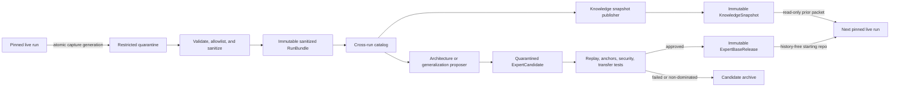

# Cross-run learning and the expert base

Status: M1–M5 implemented; M4 live CLI validation pending; M6–M10 planned. This supersedes the earlier
merged-store/starter-kit proposal.

Controlling implementation plan:
[`cross-run-knowledge-implementation/00-orchestrator-plan.md`](cross-run-knowledge-implementation/00-orchestrator-plan.md)

## Decision

Kapso should learn on two timescales:

1. **Fast evidence learning.** Every run produces an immutable, provenance-bound
   record of what was tried, what happened, and what remains unresolved.
2. **Slow procedural learning.** Only reusable code that survives independent
   tests, replay, transfer checks, and review enters a versioned expert-base
   release used to start future runs.

The system has five durable artifacts:

| Artifact | Purpose | May influence a live run? | May become startup code? |
|---|---|---:|---:|
| `ExpertScopeContract` | Defines the repo lineage's task families and domain-specific context dimensions without hardcoding them in core | Yes; all bindings validate against it | No |
| `RunBundle` | Sanitized durable evidence plus an explicit completeness frontier | No; source material only | No |
| `KnowledgeSnapshot` | Frozen, sanitized cross-run episodes, claims, and prior ideas | Yes; read-only prior evidence | No |
| `ExpertCandidate` | Isolated proposal for a reusable module change | No | Only after promotion |
| `ExpertBaseRelease` | Immutable, tested, history-free ML/AI capability repo | Yes; the run starts from it | Yes |

`ScopeRegistry` and `CrossRunTaskBinding` are strict deployment configuration,
not additional scientific artifacts. They route a task to a lineage; they do not
assert compatibility or evidence.

The core invariant is:

> Experiment memory records what happened. Knowledge claims state where an
> interpretation might apply. Expert candidates preserve possible procedures.
> Only cross-context executable evidence changes the expert base.

This realizes the human-scientist analogy without turning experience into a
benchmark/model decision tree or copying the latest winning repository.

## 1. Evidence that shaped the design

- [CoALA](https://arxiv.org/abs/2309.02427) provides the useful separation of
  episodic, semantic, and procedural memory. It is a taxonomy, not evidence that
  these should share a physical store.
- [ExpeL](https://arxiv.org/abs/2308.10144) supports retrieving both prior
  episodes and derived insights. In one HotpotQA ablation, adding Reflexion
  outputs to insight construction reduced success; the authors identify
  hallucination as a possible explanation. Kapso therefore treats independent
  acceptance of derived claims as a governance requirement, not as a result the
  paper itself establishes.
- [Voyager](https://arxiv.org/abs/2305.16291) demonstrates composable executable
  skills admitted after execution, environment feedback, and LLM
  self-verification. Its success check is not an objective verifier, so one
  successful execution is necessary evidence, not sufficient promotion evidence.
- [Agent Workflow Memory](https://arxiv.org/abs/2409.07429) demonstrates induction
  of recurring fine-grained workflows with example-specific context abstracted.
- The [memory-management study](https://arxiv.org/abs/2505.16067) shows why
  add-all is unsafe: similar inputs make agents follow retrieved outputs, so bad
  or misaligned episodes propagate errors. Admission and retrieval quality are
  correctness concerns, not just token optimizations.
- [Darwin Gödel Machine](https://arxiv.org/abs/2505.22954) supports preserving
  diverse candidate lineages rather than hill-climbing only from the current
  winner. Temporary regressions can be useful stepping stones.
- [AlphaEvolve](https://arxiv.org/abs/2506.13131) motivates staged evaluation
  and multiple metrics; [GEPA](https://arxiv.org/abs/2507.19457) motivates
  preserving candidates that are Pareto-optimal across task subsets. Kapso's
  quality/robustness/cost/portability promotion dimensions are a design decision
  inspired by those mechanisms, not an evaluated result from either paper.
- The compute-matched [TroVE re-evaluation](https://openreview.net/forum?id=7AJJgfqNEL)
  and [SWE-Skills-Bench](https://arxiv.org/abs/2603.15401) are important
  counterevidence: apparent skill gains can vanish after compute matching, most
  evaluated skills add no pass-rate lift, and version-mismatched guidance can hurt.
- The [AGENTS.md evaluation](https://arxiv.org/abs/2602.11988) finds that
  indiscriminate repository context can reduce task success while increasing
  cost. It supports keeping live context selected and measured. Encoding durable
  capability in code and tests instead of an ever-growing generated instruction
  file is Kapso's architectural choice.
- [MLE-bench](https://arxiv.org/abs/2410.07095) reinforces that contamination is
  an evaluation threat. Kapso therefore requires provenance, sanitation,
  revocation, and an untouched validation surface as governance controls.

These results motivate a two-timescale architecture; no cited work evaluates this
exact combined design across heterogeneous ML/AI tasks. They do not justify automatic
cross-domain transfer or automatic promotion of generated code.

## 2. Current Kapso authority boundaries

The existing v3 contracts are correct and remain unchanged:

| Current authority | Owns | Must not own |
|---|---|---|
| `GenericSearch.node_history` | Current campaign's contiguous executable nodes and parentage | Foreign nodes |
| `IdeaArchive` (`kapso.ideation_archive.v4`) | Current campaign batches, ideas, claims, gaps, decisions, outcomes, frozen prior packets | Foreign ideas with missing local batches |
| `CampaignEvidenceSnapshot` | Deterministic projection of the current archive and current nodes | Prior-run evidence |
| `ExperimentHistoryStore` (`kapso.experiment_history.v4`) | Strict executed projection of the current run; contiguous local node IDs | Cross-run records or unexecuted ideas |
| `RepoMemory` | Understanding of the code in one run's branches | Cross-run scientific truth |
| `RunCheckpoint` | Exact resumable state of one run | A mutable global knowledge pointer |

Consequences:

- Foreign episodes never enter `ExperimentHistoryStore`, `node_history`, the
  run checkpoint's node list, or the local evidence snapshot.
- Foreign ideas never enter `IdeaArchive` directly. A generator may use a prior
  idea as inspiration, but it creates a new local `IdeaRecord` with a new local
  batch, parent resolution, analysis, and selection.
- Foreign nodes cannot be parents, incumbents, local supported levers, or local
  gap closures.
- Local integer node IDs are display identifiers only outside their run. A
  cross-run reference is globally qualified and content addressed.
- The current `solution_embedding` remains a local convenience. Cross-run
  vectors require an explicit embedding-space identity.

The previous proposal contradicted these boundaries by adding `origin` to a
mutable merged `experiment_history.json`. It would break contiguity, archive
references, reconciliation, resume, and parent semantics. That path is rejected.

## 3. Architecture



There are two loops.

### 3.1 Scope routing and task binding

Repository location is deployment configuration, not task-family semantics and
not part of a scientific artifact's content identity. One canonical
`ScopeRegistry` maps a stable `scope_id` to exactly one expert, knowledge, and
security repository triple:

```yaml
cross_run:
  scopes:
    ml_ai:
      repositories:
        expert: "Leeroo-AI/kapso-expert"
        knowledge: "Leeroo-AI/kapso-knowledge"
        security: "Leeroo-AI/kapso-security"
```

Workloads never receive repository names. Each benchmark mode supplies only a
typed binding:

```yaml
# PostTrainBench
cross_run_binding:
  scope_id: "ml_ai"
  task_family_id: "language_model_post_training"
  task_adapter_id: "posttrain"

# RelBench
cross_run_binding:
  scope_id: "ml_ai"
  task_family_id: "relational_tabular_prediction"
  task_adapter_id: "relbench"
```

Both task families therefore share the `ml_ai` expert and knowledge lineage and
its security authority while remaining distinct task contexts. The registry
answers **where** those authorities live; `ExpertScopeContract` answers **what**
families and context dimensions it admits; the task adapter answers **how** one
family executes; and `LaunchManifest` freezes **which exact** expert, knowledge,
and denylist identities a run observed.

The repository mapping is single-sourced in the canonical Kapso configuration.
Benchmark runtime-config builders compose that registry with their own binding;
they must not copy repository coordinates into PostTrainBench/RelBench configs,
infer them from folder or repository names, query GitHub topics, or embed them in
task adapters. Repository relocation changes the trusted registry and
`GitHubPublicationRecord`, not `ExpertScopeContract`, snapshot/release content IDs,
or historical launch pins.

Resolution is fail-loud:

```text
CrossRunTaskBinding
-> ScopeRegistry[scope_id]
-> configured expert + knowledge + security repositories
-> pinned ExpertScopeContract validates task_family_id/task_adapter_id
-> exact CURRENT records and immutable releases
-> LaunchManifest
```

The resolver verifies that the repository records, expert release, knowledge
snapshot, adapter, and scope contract all name the same scope lineage. A missing
scope, unknown family, mismatched repository, or duplicate assignment fails
before network-heavy or paid work. Separate trust, license, runtime, or ownership
boundaries require a new scope and repository triple; they do not create
conditional routing inside `ml_ai`.

### 3.2 Live run loop

At launch, a trusted resolver publishes one immutable, attested `LaunchManifest`
so independently changing knowledge and expert-base pointers cannot produce a
torn pair. It contains:

```text
launch_manifest_id
scope_id + scope_contract_id
scope_repository_binding_hash
task_family_id + task_adapter_id
knowledge_snapshot_id
expert_base_release_id
knowledge/expert GitHub publication refs
embedding_space_id
dependency/runtime contract
security denylist snapshot ID + generation
```

If the pinned scope has no release, the resolver first completes the
`ExpertRepoArchitect` bootstrap pipeline and publishes validated `E0`; it never
launches a scientific run from an unstructured mutable directory.

The launcher verifies the manifest and its publisher attestation, materializes the
expert base and task adapter atomically, checks the resulting workspace tree hash,
and writes a pre-orchestrator `BootstrapPin` before the first paid action. The pin
is absorbed into `RunCheckpoint` after strategy construction; current checkpoint
state cannot exist early enough to serve this bootstrap role.
The knowledge snapshot remains read-only. The run then:

1. starts from the pinned expert-base source plus a task adapter;
2. builds a local `RepoMemory` for that actual workspace;
3. retrieves a bounded prior-knowledge packet for ideation;
4. uses v3 normally to generate, analyze, select, execute, and evaluate local ideas;
5. persists local nodes to the existing experiment store and local ideas to the
   existing archive;
6. appends execution-revision events and periodically atomically publishes a
   mutually reconcilable capture manifest so stopped runs remain harvestable.

A run never updates global knowledge or the stable expert base.

### 3.3 Cross-run evolve loop

After runs finish or stop, an offline, serialized publisher:

1. receives an atomically published run capture in access-restricted quarantine;
2. validates its checkpoint frontier, provenance, evaluation integrity, and
   allowlisted payload, then sanitizes it before global persistence;
3. commits an immutable sanitized `RunBundle` to the local content-addressed
   handoff store, superseding any older capture of the same run;
4. projects executed work into `TransferEpisode` records and unexecuted work into
   `PriorIdea` records;
5. appends review assertions and proposes evidence-linked knowledge claims;
6. resolves admission, dispute, supersession, taint, and revocation states;
7. publishes a new immutable `KnowledgeSnapshot` by compare-and-swap;
8. proposes capability or repository-architecture patches only when their
   respective evidence triggers fire;
9. validates candidates through an evaluator cascade;
10. publishes a new `ExpertBaseRelease` and compatible `LaunchManifest` only
    after their promotion and startup policies pass.

Learning is therefore fast in the catalog and intentionally slow in startup code.
At the expected scale of 10-30 runs, a healthy outcome is many useful episodes,
fewer supported claims, and perhaps only a handful of expert-base promotions.

## 4. Durable schemas

These are semantic contracts, not a commitment to one serialization library.
All documents use exact fields, canonical JSON, UTC timestamps, checksums for
referenced blobs, and fail-loud validation. For a content-addressed object, the
hash preimage is the canonical immutable payload with its ID field omitted.
Attestations sign the resulting ID and publication context and live in an outer
envelope excluded from that preimage, avoiding signature/hash recursion.
Adjudication, admission, eligibility, and revocation state live in separate
immutable catalog revisions; they never mutate a content-addressed payload.

### 4.1 `ExpertScopeContract`

```text
ExpertScopeContract
  scope_contract_id            # immutable revision identity
  scope_id
  supersedes_scope_contract_id
  purpose + explicit non-goals
  task_family_ontology
  task_family_lineage
  artifact_classes
  required_context_dimensions
  context_dimension_schemas
  context_dimension_lineage
  task_adapter_contract
  sanitation_policy_ref
  validation_policy_ref
  repository_architecture_constraints
```

The scope contract is the only framework-level declaration of what one expert
repo lineage is intended to cover. It may be narrow or broad: a single `ml_ai`
scope can include language-model post-training and relational tabular prediction,
while a deployment that needs isolation can declare separate scopes. Scope is not
inferred from folder names or benchmark conditionals. Each contract revision is
immutable, attested, and pinned by runs, bundles, snapshots, candidates, and
releases. Adding a task family publishes a reviewed successor revision; lineage
metadata keeps older episode bindings interpretable without runtime compatibility
paths or rewriting history.

A broad scope is justified only when its task families can share a release,
security, dependency, and validation envelope or have evidence-backed reusable
capabilities. Incompatible trust boundaries, runtimes, licenses, or operational
owners require separate scope lineages rather than one universal repository.

Domain-specific context keys are registered here with exact schemas. That lets a
post-training adapter bind model/tokenizer/template facts and a RelBench adapter
bind entity/schema/time-split facts without adding either vocabulary to core
cross-run code.

### 4.2 `RunBundle`

```text
RunBundle
  bundle_id                    # hash of canonical manifest
  scope_contract_id, scope_id, run_id, campaign_id
  completion_state             # complete | stopped | crashed
  capture_generation
  supersedes_bundle_id
  checkpoint_frontier
  capture_watermarks
  artifact_completeness        # present | absent_before_frontier | unavailable
  started_at, captured_at
  kapso_commit
  launch_manifest_id
  knowledge_snapshot_id
  expert_base_release_id
  task_context_binding
  artifact_environment
  capture_descriptor_ref
  checkpoint_ref
  execution_event_journal_ref
  idea_archive_ref
  experiment_history_ref
  sanitation_report_ref
  branch_snapshot_refs
  run_log_refs
  checksums
```

Every artifact is conditionally present according to `artifact_completeness`; a
crash bundle is valid only when its declared frontier is internally reconcilable.
The append-only event journal preserves failed and recovered execution revisions
that the current experiment-store projection replaces in place. Until that journal
exists, a bundle can honestly preserve only the latest durable projection.

The manifest references sanitized content-addressed blobs rather than duplicating
weights, data, repositories, and logs. Raw capture first lands in a restricted,
deletable quarantine surface. Only allowlisted output may enter the durable
cross-run object store. The current post-training scripts merely sync the results
directory; implementation must explicitly export and test an atomic capture
manifest for the local store, archive, checkpoint, event journal, selected source
snapshot, and branch frontier.

### 4.3 Context fingerprints

Score comparison and transfer applicability are different questions and use
different fingerprints.

```text
EvaluationFingerprint
  benchmark + dataset/split versions
  evaluator code/config hash
  metric + objective direction
  fidelity and fraction
  exact seed or replicate set + aggregation protocol
  judge/model version where applicable

TaskContextBinding
  scope_contract_id
  task family and capability tags
  task-adapter id
  input and target contract fingerprints
  starting artifact refs
  method and toolchain fingerprints
  dependency/runtime versions
  budget and hardware envelope
  transfer dimensions            # exact keys/types declared by the scope

ArtifactEnvironment
  kapso commit
  expert-base release
  exact task-adapter manifest id
  exact task-adapter verification receipt id
  starting-artifact ref -> content-addressed artifact id
  relevant dependency lock hash
```

An effect is mechanically comparable only when its source measurements share an
`EvaluationFingerprint`. Transfer compatibility over `TaskContextBinding`
separately classifies a source
as `exact_context`, `analogical`, or `incompatible` for the current task.
An experiment whose parent is the unmeasured baseline has no relative effect;
harvest must not reinterpret a delta against numeric zero as improvement.

This is the neutrality boundary for `KnowledgeSnapshot`: core records know only
the scope, task family, registered context dimensions, generic intervention and
outcome states, and artifact references. Adding RelBench or another ML/AI family
requires a new scope/task-family contract, adapter, sanitation policy, and
validation policy—not a new episode/snapshot schema or a core conditional.
Within a broad scope, cross-family records may be retrieved as explicit analogies,
but raw measurements are comparable only under the same evaluation fingerprint.

### 4.4 `TransferEpisode`

```text
TransferEpisode
  episode_id                   # content identity
  source                       # scope/run/campaign/node/idea/batch
  source_bundle_id
  supersedes_projection_id     # prior or episode projection of this source idea
  task_context_binding
  artifact_environment
  proposal                     # exact source proposal
  parent_episode_ref           # qualified; never a live parent
  attempts[]
    execution_revision         # exact zero-based journal revision
    captured_at
    execution_status           # completed | failed_technical | interrupted
    evaluation_status          # valid | invalid | partial | not_run
    evaluation_fingerprints[]  # every evaluator group used by this revision
    score_of_record_fingerprint_id
    comparison_status          # comparable | not_comparable | inconclusive
    measurements               # finite evaluator-declared numbers only
    source_parent_effect       # typed, direction-aligned; only if comparable
    intervention_ref           # exact branch artifact; null after pre-write failure
    intervention_structure     # coupled | isolated_by_ablation | undetermined
    feedback
    technical_difficulties
    confounders
  terminal_attempt_revision
  safe_observation_refs
  sanitation_report_id
  derivation_refs
```

One source idea/node produces one episode with an ordered, gap-free attempt list.
This matches v3 recovery, where several execution revisions share one idea and
node while the local store keeps only the latest projection. The append-only
journal reconstructs the earlier failed and interrupted attempts; a later capture
publishes a superseding episode rather than a second independent observation.
`FAILED` is deliberately not one state. A failed implementation, a valid negative
result, an invalid evaluation, and an interrupted attempt have different transfer
meaning. Partial observations are retained with explicit validity; they never
pretend to be a scored experiment.
An episode with coupled changes may inspire transfer but cannot support a causal
mechanism claim until an ablation or other identification evidence isolates it.
The projector never infers isolation from a branch diff: absent explicit evidence,
the intervention is `undetermined`. Relative effects require the exact same full
evaluation fingerprint on a measured parent and child. The stored effect includes
the source and candidate values, raw delta, objective direction, direction-aligned
delta, and an explicit unavailable uncertainty method; no uncertainty estimator is
invented.

### 4.5 `PriorIdea`

```text
PriorIdea
  prior_idea_id
  source_bundle_id
  supersedes_projection_id
  source scope/run/campaign/batch/idea
  proposal + structured descriptor + assumptions
  source_status                 # deferred | rejected | unexecuted
  source_rationale
  source_evidence_refs          # run-local provenance, not catalog IDs
  task_context_binding
  sanitation_report_id
```

A `PriorIdea` is frontier inspiration. It cannot be selected or executed directly.
Generation must produce a new local idea that cites it and passes current v3
parent resolution, hard rules, novelty analysis, and selection.
Projection is disjoint: every source idea appears exactly once. Any idea linked to
a node, including an interrupted or recoverable node, becomes a `TransferEpisode`;
only never-linked ideas may become `PriorIdea`s.
For a run with multiple capture generations, projection uses the latest admitted
supersession frontier and content-deduplicates already journaled node revisions;
partial and final bundles cannot count the same execution twice.

### 4.6 `ReviewAssertion`

```text
ReviewAssertion
  assertion_id
  subject_id                    # episode, claim, candidate, or release
  reviewer_id + reviewer_role
  rubric_version
  judgment
  rationale
  exact_evidence_refs
  supersedes_assertion_id
  review_operation_ref          # immutable registered coding-agent receipt
```

Assertions are append-only. They do not overwrite a one-line `verdict.json`.
Configured adjudication derives the active state. Unresolved disagreement yields
`disputed` or `inconclusive`, blocking exploit anchoring and expert promotion.
Reviewer identity is assigned by the configured reviewer slot and bound to an
immutable operation receipt; a model-returned `reviewer_id` is never trusted.
The framework additionally persists a `CatalogAgentOperationRecord` binding the
exact packet/template/schema/agent preimage, exact final output bytes, receipt,
and minted assertion ID. The reducer reparses the authenticated bytes, so a valid
receipt cannot be replayed to manufacture a different judgment or rationale.
It reconstructs the typed packet and compares every nested subject/evidence record
with the content-addressed catalog fact; a real ID paired with foreign bytes is
rejected. The operation embeds the full secret-free catalog configuration, whose
fingerprint must equal the immutable input delta that first published the record.
Historical model, effort, and rubric settings therefore remain verifiable after a
configuration rotation, while only current-rubric heads count toward quorum.
Independence is checked against the proposer principal recorded on each claim, so
a later role rotation cannot let that historical proposer review its own output.
At first publication, the reducer requires the operation's template and schema to
equal the running implementation and its packet to name the exact parent catalog
generation, parent facts, and active entry states. Later generations validate the
stored historical bytes and their original delta-bound configuration without
reinterpreting them through a newer prompt or schema implementation.
Attestations are stored as separate envelopes keyed to immutable payload identity,
so rotation cannot create byte-distinct objects under one content ID.

### 4.7 `KnowledgeClaim`

```text
KnowledgeClaim
  claim_id
  revision_id                   # immutable revision payload identity
  scope_contract_id
  statement
  mechanism
  applicability_predicates
  explicit_exclusions
  supporting_episode_ids
  contradicting_episode_ids
  proposal_provenance
  supersedes_revision_ids
```

Claims are semantic memory, not instructions or routing rules. A coding agent may
propose or revise them, but cannot certify them. Every claim renders with
applicability, exclusions, support, and contradictions; an unbound statement is
unrepresentable. Trust state and active review heads are derived only in
`CatalogEntryState`, so payload and reducer can never disagree.
Applicability and exclusion predicates may use only context dimensions registered
by the pinned `ExpertScopeContract`; core code contains no LLM- or tabular-specific
predicate names.
Updating evidence creates a new immutable claim revision. `claim_id`
names the lineage; `revision_id` names the exact object pinned by a snapshot.
Every revision has one `ClaimEvidenceClosure` containing the complete evaluated
episode universe, each support/contradiction/not-applicable classification and its
rationale, packet digest, and proposer receipt. A claim-proposal
`CatalogAgentOperationRecord` authenticates that closure and the claim revisions
minted from the same exact output. Reviewers receive the full closure, including
episodes the proposer marked not applicable.

The production projector currently emits `undetermined` intervention structure:
capture has no typed authority that can prove an ablation. Because admission
requires isolated support, real projected episodes remain useful evidence and
retrieval inputs but cannot admit causal mechanism claims yet. This is a safe
evidence-source boundary, not a heuristic gap; isolation may change only when a
future typed, independently validated identification fact is added.

Successor capture manifests may reference the same immutable historical journal
event as their predecessors. Each manifest must still have an exact local
derivation closure, every stored event must be referenced, and unreferenced events
are rejected; global reference uniqueness is neither required nor scientifically
correct.

### 4.8 `CatalogEntryState`

```text
CatalogEntryState
  subject_payload_id
  catalog_generation
  predecessor_state_id
  admission_state               # quarantined | admitted | disputed |
                                # superseded | revoked
  superseded_by_payload_ids
  assertion_ids
  revocation_ids
  taint_source_ids
```

This deterministic immutable projection keeps active trust state out of episode,
claim, module, and candidate payload identities. A later assertion publishes a
new catalog generation; it does not rewrite the subject. State precedence is
`revoked/tainted > superseded > disputed > admitted/quarantined`; lower-precedence
facts remain named so a revoked superseded revision retains both histories.

### 4.9 Expert artifacts

```text
ExpertModuleContract
  module_id + version
  purpose
  inputs + outputs
  preconditions + incompatibilities
  resource bounds
  dependency/license manifest
  supporting_episode_ids
  known_failure_episode_ids
  test and replay refs

ExpertRepositoryMap
  repository_map_id
  scope_contract_id
  capability_nodes[]           # stable capability ID, contract ref, owned paths,
                               # and task-family bindings
  dependency_edges[]
  task_adapter_boundary
  validation_entrypoints
  architecture_invariants

ExpertBaseReleaseManifest
  release_id                   # source tree + manifest hash
  scope_contract_id + scope_id
  lineage
    source_base_release_id?      # immutable scientific/source-byte lineage
    activation_predecessor_release_id? # exact CURRENT ordered before publication
  repository_map_ref
  module_versions
  semantic_book_digest
  source_archive_ref
  test-matrix results
  approval assertions
  contamination scanner version
  dependency lock hash
  compatibility_envelope
  publisher_attestation
```

Contracts describe capability and operating envelope. They do not say “if model X
and benchmark Y, run recipe Z.” Task identity may appear in evidence or an
explicit external adapter, never as a hidden default in the generic core.
`ExpertRepositoryMap` is the machine-readable topology authority. Capability IDs
are semantic and independent of paths, so a directory move does not sever evidence
lineage; splits and merges mint new IDs with explicit lineage.

Release lineage separates immutable scientific origin from temporal activation
ordering. Ordinary evolution requires `source_base_release_id` to equal the
authenticated `activation_predecessor_release_id`; bootstrap requires both absent.
A future clean-recovery path may separate them only through its own typed plan and
fresh authority fence, never by weakening the ordinary join.

### 4.10 `ExpertCandidateManifest`

```text
ExpertCandidateManifest
  candidate_id
  scope_contract_id
  change_kind                  # capability | repository_architecture
  source_base_release_id? + source_base_repository_map_ref?
  source_base_tree_hash
  trigger_decision_id + trigger_evidence_packet_id
  patch_ref + patch_digest
  candidate_tree_ref + candidate_tree_hash
  configuration_fingerprint
  module_contract_refs
  proposed_repository_map_ref
  semantic_book_digest
  proposer_operation_record_id
  source_dependency_ids
  ancestor_candidate_ids
  capability_lineage           # preserve evidence provenance across move/split/merge
  sanitation_report_id
```

The referenced exact source-tree, canonical patch, sanitation report, and coding-
agent operation are separately content-addressed. Bootstrap alone has no source-base
release/map and uses the canonical empty source-base tree. Validation attempts are M8
attachments and never mutate candidate identity. Failed and non-dominated
candidates remain immutable, auditable inputs to future generalization; their
active eligibility lives in `CatalogEntryState`.

The coding-agent operation retains the runner-native artifact closure, including
its native `result.json`. A separate Kapso-minted workspace receipt binds that
operation receipt to the verified source-base tree, editable pre-tree, edited tree, and
exact changed/deleted paths. The agent's schema-validated `final.json` must declare
the same paths. Kapso then regenerates repository-map/module controls and the book,
recomputes the full patch, and deterministically rescans the exact candidate bytes;
none of those authority records is agent-authored.

The output contract is role-specific. Bootstrap/restructure returns a complete
semantic topology and all complete module semantics, omitting framework-owned
IDs, references, edges, hashes, and controls. Dependency edges are derived from
module dependency IDs. Generalization returns only complete replacements for
changed module contracts; Kapso reconstructs the source-base topology with new module
references, so the agent cannot smuggle a structural change through a capability
proposal. Candidate validation reparses `final.json` and rederives the stored map,
modules, and lineage. It also reproduces the fixed mode prompt/schema and the
proof-closed prior-knowledge binding, preventing a self-consistent but
unauthorized artifact closure from substituting proposal semantics.

Preserved capability semantics are monotonic by contract, not by prompt, in both
generalization and restructuring. A changed module may add
problem signals, interfaces, safety conditions, evidence, tests, and replay
references, and advances a positive integer `vN` version, but it cannot remove
accumulated facts. Its purpose, dependency and
incompatibility graph, and resource envelope remain exact; existing dependency-
license entries cannot be removed or rewritten. A later design that needs to
relax one of these fields must introduce a typed, evidence-backed authorization
rather than silently weakening the module. Restructuring may replace path-bound
entrypoint/test/replay references for a preserved capability, but it must change
the repository structure or path interfaces. Semantic replacement instead uses a
new capability ID with explicit lineage.
Each removed entrypoint/test/replay reference must name an actually deleted path
and receive at least one same-kind replacement among actually changed paths, so
path movement cannot erase validation or replay provenance.

The proposal operation identity includes the configured principal as well as the
role-specific prompt, schema, MCP authority, trigger, ancestors, and source-base tree.
The manifest's `source_dependency_ids` contains the prior selection artifact,
source knowledge snapshot, selected record IDs, and proof record IDs in addition
to trigger dependencies. Therefore principal rotation cannot reuse another
principal's cached operation, and later taint/revocation can reach every record
that was visible to the proposer. The complete proposer authority is pinned in
the immutable operation, so principal rotation governs new proposals without
making historical candidates unreadable.

`ancestor_candidate_ids` resolve only through the immutable local candidate
store. Each selected ancestor is persisted with the child as a content-identified
input containing its manifest, scope contract, patch, exact source tree and bytes,
repository map, module contracts, workspace delta, and sanitation report. This is
the reusable proposal input. Because admitted expert trees are valid UTF-8, exact
source is encoded as model-readable text and round-trips to the verified bytes;
the manifest ID alone remains lineage metadata. M8's
candidate state supplies non-revocation, validation, and diversity eligibility
before selection.

### 4.11 `TaskAdapterManifest`

```text
TaskAdapterManifest
  task_adapter_id
  scope_contract_id
  task_family_id
  publisher_attestation
  task_evaluator
    protocol_version
    executable_path
    supported_evaluator_fingerprints[]
    metric_comparison_bindings[]
      evaluator_fingerprint + metric + objective direction
      comparison_dimension_id + positive comparison_scale
  context_binding
    consumed_dimension_ids[]
  source_tree_ref + tree_hash
  runtime
    runtime_protocol_version
    image_repository + image_manifest_digest + image_config_digest
    dependency_lock_path + dependency_lock_digest
    operating_system + architecture + architecture_variant
  sanitation_report_id
  validation_refs
```

The benchmark or an explicitly authorized publisher supplies this read-only,
pinned adapter. Kapso may change a local copy in experiment branches, but cannot
silently update the shared adapter or use it to bypass expert-release gates.

The manifest is the stable scientific identity and deliberately excludes the
rotatable publisher attestation from its content preimage. A separate
`TaskAdapterVerificationReceipt` names the exact trusted package instance and
binds the full manifest bytes, publisher evidence, archive digest, deterministic
extraction receipt, exact source tree, sanitation/validation proof bytes, and
configured verifier identity. Packages are stored by receipt, never by manifest.
A signed `TaskAdapterActivationRecord` is the only mutable logical
scope/family/adapter pointer. Fresh work resolves that active record; eligibility,
validation, launch, and resume persist a `TaskAdapterPackagePin` containing both
manifest and receipt identity, so attestation rotation cannot change replay.
Verifier rotation is explicit: one configured authority version signs new package
and activation records, historical versions remain in the trust registry while
their pins are valid, and removing a version is an auditable revocation that makes
its packages fail closed.

These three nested records are deliberately narrow. The evaluator protocol fixes
canonical request/result paths and schemas and is invoked directly without a shell;
the manifest therefore does not carry free-form arguments or duplicate schema
knobs. Its sorted evaluator-fingerprint allowlist is an exact compatibility claim
covered by package verification; source replay rejects an evaluation-tree
fingerprint absent from that attested list. Each fingerprint/metric comparison
binding is likewise package-verified and names one central promotion dimension,
repeats the required objective direction as an exact cross-check, and supplies a
finite positive task-semantic scale. Measurement identity, fidelity,
seed/replicate set, aggregation, and judge version remain in each
`EvaluationFingerprint`; preflight requires its evaluator, metric, and direction
to agree with the adapter binding. Exact compute allocations, stop rules, and
sandbox/network policy belong to the immutable replay execution request under
configured ceilings, not to the adapter's scientific identity.

Launch must prove that every evaluator identity it can place into cross-run
evidence is present in the pinned adapter allowlist. An evaluation-maintainer
transition outside that list may still serve local experimentation, but its result
is not replay-eligible until an authorized publisher verifies and activates a new
adapter package that explicitly supports the new protected evaluation-tree
fingerprint; Kapso never infers compatibility from a shared metric name.

`consumed_dimension_ids` is a sorted allowlist and may be empty. Every name must
exist in the exact scope revision and in a replay case's exact task context; the
evaluator receives no undeclared transfer dimensions. Package verification
requires `executable_path` to resolve to mode `100755`, requires the dependency
lock path to exist in the exact source tree, and recomputes its declared digest.
The image is an immutable digest rather than a mutable registry location; the
configured runtime provider later resolves that digest for execution and must
match the declared operating system and architecture before spawn.

### 4.12 `KnowledgeSnapshotManifest`

```text
KnowledgeSnapshotManifest
  snapshot_id
  scope_contract_id
  scope_id
  parent_snapshot_ids
  included_bundle_ids
  admitted_episode_ids
  admitted_prior_idea_ids
  active_claim_revision_ids
  catalog_generation
  entry_state_refs
  included_assertion_ids
  included_revocation_ids
  proof_dependency_closure_ids
  sanitation_policy_version
  retrieval_policy_version
  embedding_sidecars[]          # each names its EmbeddingSpaceId
  prompt_budget_policy
  checksums
  published_at
  publisher_attestation
```

Raw sanitized bundles are retained. The snapshot carries the complete admitted
metadata and proof dependency closure for its catalog generation; only the
query-specific prompt packet is bounded. Exact assertion and revocation closures,
not timestamps, define reproducible state.

### 4.13 `LaunchManifest`

```text
LaunchManifest
  launch_manifest_id
  launch_request_hash           # intended run/campaign/task/runtime request
  scope_id + scope_contract_id
  scope_repository_binding_hash # exact registry entry used for location routing
  task_family_id + task_adapter_id
  knowledge_snapshot_id + knowledge_publication_ref
  expert_base_release_id + expert_publication_ref
  embedding_space_id
  dependency/runtime contract
  sanitation policy generation
  security denylist snapshot ID + generation
  expected source composition hash
  publisher_attestation
```

The launch resolver creates this only after checking release/module and adapter
preconditions against the intended task and runtime. It passes the immutable ID
directly to that run; there is no scope-global launch pointer. The launcher must
match `launch_request_hash` to its own request, preventing substitution with a
validly attested manifest for another task. New runs fail before startup if the
current release is expired, unrevalidated, or incompatible.

### 4.14 `GitHubPublicationRecord`

```text
GitHubPublicationRecord
  publication_id
  artifact_kind                # knowledge_snapshot | expert_base_release
  artifact_id
  repository_node_id + repository_full_name
  commit_sha
  immutable_release_id + tag
  assets[]                     # asset id, exact name, media type, size, sha256
  release_attestation_ref
  published_at
  publisher_identity
```

This is a transport and provenance envelope, not part of the scientific or
expert-artifact content identity. Moving a byte-identical artifact to another
authorized repository publishes a new location record without changing its
`snapshot_id` or `release_id`. A launch pins the artifact identity, commit SHA,
release tag, and asset digests; it never resolves `latest` after startup.

## 5. Module responsibilities

| Module | Input | Output | Hard responsibility |
|---|---|---|---|
| `RunCaptureExporter` | Reconciled local checkpoint frontier | Atomic restricted capture | Journal revisions; publish one complete generation with watermarks and supersession |
| `CaptureValidator` | Restricted capture | Valid structural projection | Verify schema, hashes, trust, provenance, cross-artifact joins, and evaluation fingerprints |
| `SanitationGate` | Valid quarantined capture and scope policy | Allowlisted payload + report | Detect secrets, eval leakage, forbidden artifacts, licenses, unsafe paths, and taint closure before global CAS |
| `RunBundlePublisher` | Allowlisted payload | Immutable local sanitized bundle | Content-address one capture generation for M4 handoff; never interpret results or call GitHub |
| `EpisodeProjector` | Valid sanitized local store/archive | Episodes and prior ideas | Preserve exact source meaning; decompose execution/evaluation/comparison states; mint no lessons |
| `ReviewRegistry` | Reviewer assertions | Append-only adjudicated view | Preserve authorship, rubric, conflict, supersession, and audit history |
| `ClaimProposer` | Selected episodes and contradictions | Proposed/revised claims | Use a coding agent to abstract mechanisms; never admit or certify its own output |
| `CrossRunCatalog` | Bundles, projections, assertions, claims | Ordered immutable generations | Global identity, lineage, exact assertion/revocation closure, taint, supersession, and auditability |
| `TypedRecordRegistry` | Canonical record envelope | Owning `StrictContract` instance | Keep one namespace/type registry across catalog reduction, snapshot packaging, and packet access; reject unknown fields, wrong types, noncanonical shape, and identity drift without importing service-heavy modules |
| `KnowledgeSnapshotPublisher` | Catalog closure and policy | Immutable snapshot + CAS pointer | Deterministic admission, proof closure, revocation, sidecar indexing, attestation, and atomic publication |
| `GitHubArtifactResolver` | Resolved scope repositories, current pointer or artifact ID, trust roots | Verified local materialization | Resolve mutable heads only before launch or resolve a write-once artifact identity; verify the complete intent, exact Git source, immutable release/package, and attestation; cache by content identity |
| `CrossRunRetriever` | Pinned snapshot and current query | Bounded prior packet | Hard compatibility before similarity; trust/outcome/diversity balance; no current-run mutation |
| `PriorKnowledgeGate` | Pinned materialized snapshot or persisted prior packet | Read-only MCP results | Give coding-agent CLIs reproducible knowledge access; log exact record IDs, return complete records only, and seal reconstructible response digests |
| `PriorKnowledgeAdapter` | Prior packet | v3 prompt/analysis input | Keep foreign refs typed and separate from local evidence; persist exact packet in batch provenance |
| `ExpertRepoArchitect` | Scope contract, current release/map, task-family bindings, evidence | Architecture candidate with repository map | In bootstrap mode create the minimal initial topology; later propose atomic move/split/merge/refactor changes and capability lineage without mutating a stable release |
| `GeneralizationProposer` | Trigger, release, episodes/claims, selected candidate ancestors | Isolated expert candidate | Produce the smallest task-general patch and contract; preserve candidate lineage |
| `ExpertCandidateValidator` | Capability or architecture candidate and evaluator cascade | Promotion evidence | Scope conformance, contract/topology graph integrity, security, leakage, replay, fresh-task, cross-family, cost, and full-release regression checks |
| `AutonomousGitHubPublisher` | Validated knowledge, expert, or security artifact | Direct commit, immutable release, global identity, CAS pointer | Use the configured Git/`gh` identity, bind complete intent before release work, enforce expected-parent publication, and distinguish publication from activation |
| `ExpertReleasePublisher` | Approved candidate set | Immutable release + CAS pointer | Rebase/compose, compile and validate the semantic book, rerun the release matrix, publish history-free source, support revocation |
| `AuthenticatedSecurityDenylistAuthority` | Scope registry, live authenticated pointer, immutable lineage, local anti-rollback floor, exact subject tuple | Exact denylist observation | Re-resolve on every dangerous boundary; reject rollback, fork, removed revocation, substitution, corruption, or offline authorization |
| `LaunchResolver` | Scope registry, task binding, snapshot, release, adapter, runtime, trust roots | Attested launch manifest | Resolve one configured repository triple; prevent torn combinations; enforce lineage, eligibility, compatibility, freshness, and denylist state |
| `StarterWorkspaceBuilder` | Launch manifest and optional bootstrap pin | Atomic live workspace | Verify attestations; on fresh launch stage/fsync/rename, on resume verify the existing tree before workspace construction; never reuse `initial_repo` |

The catalog and expert-base release store are separate. A high-confidence episode
can immediately improve retrieval while its code remains quarantined.
`ClaimProposer`, `ExpertRepoArchitect`, and `GeneralizationProposer` use the
configured Codex or Claude Code CLI through the existing coding-agent boundary.
Direct model API use is limited to embeddings; model output never performs an
admission or promotion state transition by itself.

## 6. Retrieval and ideation-v3 integration

### 6.1 Retrieval plan

For each ideation batch, the engine first builds current-run evidence, chooses the
local policy, ranks gaps, and plans the directive. Only then does
`CrossRunRetriever` build a query from the problem, transfer context, open local
gaps, and the directive's operator descriptors. It then:

1. excludes revoked, tainted, unauthorized, and scope/task-family-incompatible
   records;
2. classifies structured transfer compatibility;
3. filters claims by state and applicability;
4. ranks within a compatibility tier by evidence quality, retrieval utility,
   semantic similarity, and recency;
5. applies diversity caps by run, lineage, approach family, and outcome;
6. selects separate positive, negative, inconclusive, and frontier slots within
   configured record and byte budgets.

Semantic similarity is a ranking hint, never an admission, truth, or sign signal.
Selected packet records render in full according to their schema; the selector
skips a whole oversized record rather than clipping its contents. Raw diffs and
logs remain addressable artifacts and are loaded only when explicitly needed.
The packet is proof-closed: selecting a claim or relative effect also selects its
required parent measurement, supporting/contradicting episodes, assertions, and
active sanitation/trust state. If that closure exceeds budget, the top-level item
is skipped rather than rendered without the evidence that makes it auditable.
Snapshot-wide catalog generations and input deltas remain in the immutable
release audit closure; they are not recursively copied into every query packet.
Query closure follows an explicit typed proof graph, so membership lists such as
all facts in a catalog generation, all outputs in a projection, or all outputs of
one coding-agent operation cannot pull unrelated siblings into the packet.
Every envelope is also parsed by the owning dependency-pure `StrictContract`, not
only rehashed. A self-consistent payload with an extra field, wrong field type, or
another namespace therefore fails both package construction and packet access.

Each selected record is keyed to immutable selection metadata containing its
exact-versus-analogical compatibility tier, outcome slot, deterministic rank,
evidence-quality and retrieval-utility inputs, recency, and per-root proof refs.
The packet identity binds this metadata together with the complete records.

Vectors are sidecars keyed by:

```text
EmbeddingSpaceId = hash(provider, model, dimensions, canonicalizer_version)
```

Search never compares vectors from different spaces. Canonical source text is
authoritative and permits deterministic re-indexing into a new snapshot.

### 6.2 Exact v3 connection

Add a new immutable `PriorKnowledgeSnapshot` beside, not inside,
`CampaignEvidenceSnapshot`.

- `GenericSearch.run` passes the pinned launch/knowledge identity and a retriever
  boundary to `IdeationEngine.run`.
- After local directive planning and before `IdeaBatch` creation, the engine
  retrieves exactly one query-specific prior snapshot. Resume uses the persisted
  packet and never calls retrieval again.
- `IdeaBatch` stores the exact prior snapshot and its source
  `knowledge_snapshot_id`.
- The batch `context_hash` includes that packet. Checkpoint state, generated
  artifact manifests, and result metadata pin only its ID and digest, avoiding
  redundant copies of untrusted prior prose.
- Generator and selector mandatory packets receive local evidence and prior
  knowledge in separately labelled sections.
- `CandidateAnalyzer` compares novelty against prior ideas/episodes as well as the
  local archive, but a foreign exact or semantic match is advisory: it may require
  an adaptation/different-context justification but cannot make a local idea
  ineligible. Hard exact-duplicate rejection remains local-campaign-only.
- `IdeaRecord` gains `prior_knowledge_refs`; existing `evidence_refs`, `claim_ids`,
  parent idea IDs, and parent node IDs remain local-only.
- A generated local idea may cite a prior episode, claim, or idea, but it gets a
  new local ID and is reanalyzed under the current problem and parent snapshot.
- Only `prior-idea`, `transfer-episode`, and `knowledge-claim-revision` records are
  citable. Sanitation, trust, revocation, operation, and other proof/control
  records remain readable for verification but cannot become scientific
  provenance.
- If implementation needs a prior diff or artifact, expose it through a separate
  read-only `prior_knowledge` gate. Do not broaden the experiment-history gate.
- `CampaignEvidenceBuilder`, `choose_policy`, local gap closure, incumbent choice,
  and experiment-memory reconciliation remain current-run-only.

Cross-run evidence can shape *what* BOOTSTRAP/EXPLORE proposes. It cannot promote
the current policy to EXPLOIT. EXPLOIT still requires a supported local lever.
A future `ADAPT_PRIOR` operator may explicitly adapt an exact or analogical prior,
but it remains an ideation operator with a new local experiment, not a foreign
experiment replay shortcut.

This prevents three subtle errors:

- a high score under another evaluator cannot become the local incumbent;
- a foreign failed experiment cannot close a local gap;
- a prior unexecuted idea cannot bypass current novelty, feasibility, or parent
  validation.

### 6.3 Connection to experiment memory

The connection is one-way at each boundary:

```text
local nodes -> local ExperimentHistoryStore -> RunBundle -> TransferEpisodes
TransferEpisodes -> prior packet -> new local ideas -> new local nodes
```

There is no store merge and no `origin == empty means current` convention. A new
run always begins with an empty local executed store even when it has rich prior
knowledge. That keeps v4's contiguous identity and resume reconciliation honest.

The clean schema change is `kapso.cross_run_knowledge.v1`, `IdeaArchive` v4
(because `IdeaBatch` persists the prior snapshot), and `GenericSearch` state v5
(v4 already existed before this bridge; v5 pins knowledge and release identities).
There are no
migration shims: pre-release v3 checkpoints are unsupported and campaigns restart
cleanly, matching the repository's no-backward-compatibility rule.

## 7. The expert-base repository

The user-visible behavior is “start each task from the expert repo,” but the
artifact is the latest pinned stable release, not the best previous run. There is
one promoted `CURRENT` expert repo per `ExpertScopeContract`. A broad `ml_ai`
scope may deliberately contain both post-training and relational predictive
modeling capabilities. A name such as `E7` means the seventh immutable version of
that one repo, not a task-specific branch. Older releases exist only for rollback
and reproducibility.

Core code assumes no source topology beyond two release artifacts:

```text
expert-base/
  EXPERT_REPO.md        generated semantic book for coding agents
  expert-release.json  attested release/module/contract manifest
  <architect-owned source and test topology>
```

Directories such as `templates/`, `training/`, `features/`, `models/`, or
`ensembling/` are scope/task-family outcomes, not framework conventions.

The base contains no datasets, weights, hidden evaluation material, experiment
memory, run logs, git history, benchmark answers, model-specific score thresholds,
or identity-named defaults.
The separately pinned task adapter is also attested, sanitized, versioned, and
validated. It supplies the task/evaluator boundary read-only; task-local changes
occur only on run branches and cannot flow back through this escape hatch.

### 7.1 Repository architecture lifecycle

`ExpertRepoArchitect` owns topology as a proposal role.

When a scope has no expert release, bootstrap mode receives the attested scope
contract, current task-family/adapter binding identities, repository constraints,
exact workspace limits, and persisted trigger evidence. Raw task repositories are
not proposal authority. Through the configured coding-agent CLI it proposes the
smallest useful initial repository:

1. capability boundaries and IDs;
2. physical source/test layout;
3. module contracts and a machine-readable repository map/dependency graph;
4. adapter boundary and fresh-task smoke harness;
5. enough validated metadata for the release publisher to generate the first
   semantic book.

The architect defines only the expert side of the adapter interface from the
scope contract. M8's fresh-task gates check it against the pinned public adapter
contract before promotion, and M9 binds the exact `TaskAdapterManifest` at launch.
Thus an interface mismatch rejects a quarantined bootstrap candidate; the
architect never certifies its own assumptions or reads task-local source.

It must not create speculative empty subsystems merely because a future task family
might need them. The proposal enters quarantine as a
`repository_architecture` candidate. Schema, dependency, sanitation, identity,
fresh-task, and review gates—not the architect itself—certify bootstrap release
`E0`. The first scientific run then pins that release.

Later releases may restructure the repo. Architecture triggers are:

- a newly admitted task family or artifact class does not fit current boundaries;
- repeated cross-module duplication suggests a shared capability;
- dependency cycles or adapter leakage reveal incorrect ownership;
- capability contracts and physical layout disagree;
- the semantic book cannot express an important composition without special cases.

A task family outside the current scope contract cannot trigger architecture
implicitly. It first requires an attested, reviewed successor scope contract that
defines its adapter, context dimensions, sanitation policy, validation policy,
and lineage to existing dimensions.

A restructure is one atomic candidate over the full tree. It may move, split,
merge, rename, or delete capabilities and must update module contracts, tests,
entrypoints, dependency edges, and repository map in the same release; publication
then regenerates the semantic book. Its
`capability_lineage` records old-to-new/split/merge relationships so historical
evidence remains interpretable; it is provenance, not a runtime compatibility
shim. Old releases remain reconstructable, while new runs see only the new shape.
A structural candidate must either accommodate an admitted scope change or show a
measured reduction in duplication, cycles, adapter leakage, or navigation cost
without release-matrix regressions. An aesthetic rearrangement alone is rejected.

For example, evidence might lead a broad `ml_ai` repo to organize capabilities as:

```text
shared/                      reproducibility, provenance, resource controls
task_families/
  language_posttraining/     data curation, formatting, training, generation
  relational_prediction/    schema analysis, features, models, validation
evaluation/                  metric contracts and integrity
artifacts/                   validation and export
```

That is illustrative, not prescribed. The architect could choose another
topology if its contracts and release-wide tests demonstrate a cleaner design.

### 7.2 Semantic book of contents

Every release includes one concise `EXPERT_REPO.md` that lets a coding agent
understand the repo before opening implementation files. It is a release-certified
semantic index, not scientific memory and not a task-to-recipe router.

It contains:

1. the repo's purpose, boundaries, and invariants;
2. a one-screen architecture and stage flow;
3. a capability index mapping problem signals to reusable capabilities;
4. each capability's inputs, outputs, preconditions, incompatibilities, entry
   point, tests, and validation envelope;
5. capability dependencies and valid compositions;
6. the task-adapter boundary and the commands that validate a fresh workspace;
7. links to known-failure and supporting-evidence IDs in the external knowledge
   snapshot.

For example:

| Problem signal | Capability | Provides | Inspect first |
|---|---|---|---|
| Train/eval formatting drift | `language.template_parity` | Validated representation contract | Module contract path from release manifest |
| Temporal/entity leakage risk | `relational.leakage_safe_split` | Validated relational split | Module contract path from release manifest |
| Repeated expensive computation | `shared.resumable_execution` | Provenance-bound resumable outputs | Module contract path from release manifest |

The source of truth is the release's `ExpertRepositoryMap` plus each promoted
module's `ExpertModuleContract`. The release publisher mechanically renders
`EXPERT_REPO.md`, validates every path, link, entrypoint, dependency,
incompatibility, test, and evidence reference against the candidate tree, and
records its digest in the release manifest. Agents never hand-edit the generated
book. This prevents drift and avoids a second `KNOWLEDGE.md`-style truth source.

The book describes **what the repo can do and how capabilities compose**. Prior
experimental conclusions—what worked, failed, or remains uncertain—stay in the
read-only `KnowledgeSnapshot` and are retrieved separately for the current task.

### 7.3 Generalization triggers

An expert candidate is proposed only for:

- a repeated difficulty across independent run lineages;
- a repeated successful mechanism in distinct transfer contexts;
- a mechanically general infrastructure/reliability fix;
- a supported claim whose executable form removes repeated work;
- a released module contradicted by new valid evidence.

Best score, file-copy frequency, and one reviewer preference are not triggers by
themselves.
The proposer may reuse a non-revoked candidate ancestor selected by relevant
mechanism, validation evidence, and lineage diversity. It never defaults to the
latest or highest-scoring failed candidate.

### 7.4 Promotion classes

| Candidate class | Minimum evidence before release |
|---|---|
| Mechanically provable infrastructure fix | Static/unit/integration gates, faithful source replay, synthetic fresh-context execution, and review |
| Behaviorally evaluated ML/AI capability | Independent supporting contexts, contradiction review, development anchors, sealed canary attestation, and review |
| Task-specific improvement | Never core; remains an episode or separately authorized, fully gated task-adapter release |
| Confounded/noisy improvement | Quarantined until resolved |
| Identity-specialized, leaking, unsafe, or unbounded-cost change | Rejected or revoked regardless of score |

“Independent” means distinct campaign lineage and a configured difference in task
family, data regime, starting artifact, or another registered transfer dimension.
Three copies of one
ancestor are one lineage, not three confirmations.

### 7.5 Evaluator cascade

Promotion proceeds from cheap and deterministic to expensive:

```text
contract/schema -> identity/secrets/license/dependency scan
-> unit/static/security tests -> synthetic fresh-task smoke
-> source-run replay -> visible development anchor suite
-> sealed promotion service -> matched-compute canary attestation
-> independent automated review -> release-wide matrix -> immutable publication
```

The proposer may inspect development anchors and their failures. It never receives
sealed examples or detailed sealed outcomes—only a signed aggregate promotion
attestation. Sealed checks are rate-limited and rotated. A separate untouched
final audit/control surface is used for release-quality and transfer-value claims
and is not fed back into candidate generation. This prevents archived failed
candidates from turning a nominal held-out suite into an adaptive hill-climbing
target.

As a Kapso policy, the decision is Pareto-aware across quality, robustness, cost,
portability, and reproducibility. A mean gain does not erase a configured hard
regression. Small gains within the measured noise floor require repeats, not
promotion optimism.

Failed and non-dominated candidates remain in the candidate archive as possible
stepping stones. They are not installed into live runs.

### 7.6 Release and rollback

Runs pin a `LaunchManifest`; component `CURRENT` pointers are publisher inputs,
not independently consumed by the launcher.
Concurrent candidates never mutate a stable release. Publication serializes,
rebases or composes candidates, reruns the complete release matrix, writes an
immutable history-free artifact, then advances `CURRENT` with compare-and-swap.
`LaunchResolver` still checks module preconditions, expiration/revalidation state,
adapter compatibility, and the intended runtime. An incompatible or stale
`CURRENT` fails before a new run rather than becoming its implicit baseline.

Scientific release-use revocation appends an immutable catalog event and becomes
effective only when the checksummed, publisher-attested successor KnowledgeSnapshot
wins `CURRENT`. V1 events are release-wide, irreversible, and classified as
`performance` or `compatibility`; context-specific incompatibility remains an exact
launch-precondition failure instead of being mislabeled as a release revocation.
Multiple findings accumulate. A review may waive one exact output for promotion,
but never reinstates the release for new launches; recovery publishes a new release
identity. Existing runs remain reproducible, and an offline pin may continue, but
its output is not promotable without a current online policy observation.

Each event names the exact `release_id`, `release_publication_id`, and deterministic
`release_activation_witness_id`. The latter is reconstructed on any host from the
release's write-once publication intent and pointer plus its write-once GitHub
activation ref; the local validation-store activation receipt is deliberately not
part of this authority. Before enforcing an event, the policy reader resolves the
historical release, matches its publication and activation witness identities, and
matches the materialized expert manifest to the event's scope contract. These three
external authority references are content-bound by the event but are not local
KnowledgeSnapshot proof objects.

These events are neither scientific `CatalogRevocation` records nor expert
lifecycle/security transitions. Their presence and exact absence are authenticated
by the observed KnowledgeSnapshot package; a local catalog commit is pending until
the snapshot activation CAS. A narrow resume/promotion policy reader may refresh
the latest projection without replacing the run's pinned scientific snapshot.
Unlike the emergency lineage, this availability policy intentionally permits an
offline pin and does not claim fail-closed fresh-host anti-rollback semantics.

A security or contamination revocation is instead added to an emergency denylist
checked at launch, resume, before agent execution, before evaluation, and before
publication. Those checks require fresh authenticated state and fail closed on
network or verification failure. The observed denylist
generation is checkpointed, and local ideas/artifacts citing newly revoked prior
references are tainted as derivatives.

The security/contamination denylist is a separate authenticated artifact lineage,
not a branch file in either scientific repository. `SecurityDenylistSnapshot`
contains one scope binding, an adjacent predecessor and generation, and the full
cumulative set of content-addressed revocations. Generation zero is empty. Every
successor may add revocations but cannot remove or rewrite them. Its exact
dependency closure includes the scope contract, predecessor, subjects, evidence,
evidence sources, and revocation identities. The release contains one canonical
content-addressed evidence bundle; its typed records, bundle identity, source IDs,
snapshot references, and checksum must form an exact set rather than an extensible
bag of opaque bytes.

Each dangerous boundary live-resolves the security repository's authenticated
`CURRENT.json`, verifies the immutable release and complete attestation closure,
and intersects the internally derived dependency subjects with the snapshot. A
private local per-scope checkpoint records repository identity, snapshot,
generation, publication, pointer digest, and authority commit. It deliberately
does not copy the cumulative revocation payload: the authenticated exact floor
snapshot plus its validated successor chain is the authority, so checkpoint size
is independent of denylist growth. A lower generation, equal-generation fork,
broken or missing predecessor, removed revocation, repository substitution,
corrupt checkpoint, or unavailable GitHub authority fails closed. A
multi-generation advance authenticates every immutable predecessor back to the
local floor; the first observation authenticates back to generation zero.
Publication and read both enforce the configured finite lineage horizon, so no
activated generation can be unreadable to a fresh host. Moving beyond that
horizon requires a reviewed scope-lineage rollover rather than silently weakening
fresh-host authentication. Checkpoint locking and fsynced atomic replacement make
concurrent observers converge. The local copy is only an anti-rollback floor and
audit record: it is never cached authorization and cannot make an offline security
decision.

## 8. GitHub publication, concurrency, and retrieval

GitHub is the central control and distribution plane, not the live query engine
and not a raw-trace data lake. Use three private repositories for each scope
lineage (or three repositories total for one broad scope):

```text
<scope>-expert/
  EXPERT_REPO.md
  expert-release.json
  expert-repository-map.json
  CURRENT.json
  <architect-owned source and tests>
  .github/workflows/validate-and-release.yml

<scope>-knowledge/
  scope-contract.json
  catalog-deltas/<catalog_generation>/
  claims/<claim_id>/<revision>.json
  snapshots/<snapshot_id>/manifest.json
  CURRENT.json
  .github/workflows/validate-and-publish.yml

<scope>-security/
  security-denylist.json
  CURRENT.json
  .github/workflows/validate-and-publish.yml
```

The split is mandatory because executable expert code, scientific-memory
artifacts, and live revocation authority have different schemas, validation,
retention, and failure semantics even though one autonomous identity writes all
three. In particular, the publisher replaces an artifact repository's complete
source tree and owns its root `CURRENT.json`; co-locating an independently moving
denylist could erase or overwrite another current channel. Knowledge records and
manifests remain small and inspectable in Git. Raw quarantine never enters
GitHub. Sanitized run-bundle audit closure and large materializations are packaged by the snapshot
publisher as release assets, not standalone pre-admission releases or Git objects;
[GitHub recommends](https://docs.github.com/en/repositories/working-with-files/managing-large-files/about-large-files-on-github)
keeping repositories small and using releases rather than regular Git for large
distribution files.

### 8.1 Immutable GitHub release units

Enable [GitHub immutable releases](https://docs.github.com/en/code-security/concepts/supply-chain-security/immutable-releases)
on all three repositories. GitHub then locks a published release's tag and assets
and generates release provenance. Publication first creates a draft, streams every
asset through the raw upload endpoint with its manifest-bound filename and media
type, verifies each returned SHA-256 digest, and only then publishes it.

An expert release tag such as `expert/E000007` points at the exact validated source
commit and carries `expert-release.json` plus its checksums. A knowledge release
tag such as `knowledge/S000025` carries:

```text
knowledge-snapshot-S000025.tar.zst    # complete semantic/proof closure
knowledge-search-S000025.tar.zst      # rebuildable search sidecars
catalog-delta-S000025.tar.zst         # new sanitized audit records
SHA256SUMS
```

A security release tag such as `security-denylist/D000025` carries the canonical
snapshot and its exact dependency/evidence closure. It uses the same write-once
publication intent, immutable release, attestation, artifact-identity ref, and
expected-parent `CURRENT.json` compare-and-swap protocol as the other artifacts.

The snapshot package is independently usable for retrieval without historical
task workspaces or traces. The catalog delta supports audit and future
reprocessing. A package may be deterministically sharded when it crosses a
configured asset-size bound; the manifest names every shard and digest. Do not
put a growing SQLite database, vector index, dataset, weights, or trace archive in
Git history.

The Git source descriptor and materialized package descriptor are independent.
The first binds every committed path, mode, size, raw-blob SHA-256, and Git blob
identity. The second binds the complete installable package, including snapshot
indexes or expert assets that need not be Git files.

Git source is a small UTF-8 code/config/document tree, not an artifact store. The
publisher submits its complete nested file closure in one Git tree request and
checks GitHub's returned tree identity against a locally reconstructed, linear-time
Git tree hash. Shipped limits admit at most 512 source entries, 8 MiB of source,
a 32 MiB encoded tree request, and 16 release assets. Configuration validation
also proves the worst-case transaction remains inside the configured GitHub
80-content-write and 900-request-point minute budgets by taking the larger of the
normal transaction and a retry that deletes and reuploads every configured asset.
Larger or binary payloads belong in manifest-bound release assets. A publication
or resolution traverses the immutable remote source closure exactly once,
verifies that every bounded blob is UTF-8, and release completion does not repeat
that bounded read.

`CURRENT.json` is only an activation/discovery pointer on the default branch. It
contains the content ID, complete publication-intent digest, immutable tag,
commit/tree identities, source and package digests, and exact asset closure. The
trusted publisher updates it from an expected base commit without force. Readers
resolve it once, verify the corresponding intent and immutable release, and pin
the result in their `LaunchManifest`.

### 8.2 Autonomous authority model

One configured GitHub identity has full read/write authority over all three
private repositories. Codex or Claude Code runs under that operating identity and may use
`git` and `gh` directly; there are no GitHub Apps, candidate PRs, protected refs,
required reviewers, or human actions between tasks. Authentication is supplied by
the external Git/`gh` credential store and is never copied into `config.yaml`,
prompts, invocation artifacts, commits, or release assets.

This deliberately treats the coding agent as a trusted autonomous operator rather
than a credential-isolated proposer. Correctness still comes from strict artifact
schemas, deterministic admission/validation, expected-parent commits, immutable
releases, content digests, attestations, and pinned launch manifests. Independent
reviewer/evaluator roles are automated coding-agent or service calls; they do not
pause for a human, and a proposer still cannot satisfy its own validation rubric.

| Principal | Authority |
|---|---|
| Autonomous coding-agent/Kapso process | Read, commit, push, tag, release, and update any configured repository |
| Launcher/resolver | Read and verify all three repositories and release assets using the same configured identity |

`AutonomousGitHubPublisher` is the normal framework path because it preserves
crash safety and compare-and-swap publication, but GitHub permissions do not
prevent the agent from acting directly. This is an accepted property of the
operator-selected trust model.

### 8.3 Read and materialization protocol

`GitHubArtifactResolver` is the framework's canonical read/verification path even
though the autonomous agent also has direct GitHub authority. For a fresh run it:

1. resolves each scientific default-branch head once and reads its `CURRENT.json`
   at that explicit commit SHA, or resolves an explicit write-once artifact
   identity; security boundaries separately live-resolve the security pointer;
2. verifies the complete publication intent, publisher identity, source base,
   exact globally bounded non-recursive Git tree closure, and every bounded raw
   blob;
3. verifies the immutable tag, release record, asset closure, and attestation,
   including the percent-encoded slash-bearing tag in its package URL;
4. downloads the expert source and materialized snapshot/search assets to staging;
5. accepts exactly one zstd frame; rejects concatenated, skippable, or trailing
   frames, PAX/GNU extension headers, hidden regular-file members, and tar special
   files in a bounded physical-header scan; charges both headers and implicit
   parent directories to the entry budget; then verifies paths, schemas,
   package/tree digests, and the snapshot's transitive proof closure;
6. atomically installs content-addressed, read-only local cache entries; and
7. emits one `LaunchManifest` binding both scientific artifacts and the exact
   live denylist floor, then writes `BootstrapPin`.

Cache roots and kind directories must be ordinary directories with no symlinked
ancestor. One advisory cache lease serializes cooperating Kapso materialization,
inspection, and pruning operations. Descriptor anchoring preserves the identity
of the directory being operated on and prevents symlink-following; canonical
placement is revalidated before exposure and before irreversible deletion.
Traversal is streamed under configured entry/byte bounds. Pruning atomically
renames a canonical entry to a hidden tombstone before deletion, so a crash leaves
reclaimable garbage rather than a partially writable canonical path. Staging and
pruning debris from a hard crash is reclaimed under the lease before committed
entry limits are enforced.

The OS account running Kapso is inside the local trust boundary. These guards
contain untrusted release bytes, reject pre-existing symlinks and corrupt state,
and coordinate Kapso processes that honor the lease. They are not a sandbox
against arbitrary code running as the same UID: such a process can rename any
user-owned ancestor, modify Kapso itself, or ptrace the verifier. Deploy a narrow
materialization service under a separate UID with root-owned, agent-read-only
cache ancestors when hostile local code is in scope.

There is no GitHub request in the scientific hot path. Resume verifies the local
tree/package against its pin and never follows `CURRENT`; only the fresh
security/contamination denylist is rechecked. Missing pointers, authorization
failures, network failures, checksum mismatches, and corrupt manifests fail before
paid work. An explicit validated `EMPTY` snapshot and validated expert release
`E0` represent the no-history state.

Knowledge lineage is linear at publication: `EMPTY` names no scientific parent,
while every nonempty snapshot names exactly the snapshot identity resolved from
the current pointer before its M2 transaction. The Git expected-parent SHA and
scientific parent snapshot ID are both checked; neither substitutes for the other.

### 8.4 Portable hybrid search

The canonical snapshot contains complete JSON records. Its rebuildable search
package contains:

```text
metadata index                 # IDs, trust, scope/context, outcome, lineage
lexical index                  # exact terms and identifiers
vectors/<EmbeddingSpaceId>     # record IDs plus compact float32 vectors
optional ANN index             # only after configured scale/latency threshold
index-manifest.json            # canonicalizer, provider, model, dimensions, hashes
```

The trusted snapshot publisher computes embeddings through the shared
`kapso.core.embeddings` OpenAI boundary. Every vector sidecar owns the complete
canonical record-input digest and one exact `EmbeddingSpaceId`; the snapshot
manifest binds the sidecar checksums. The index manifest pins the exact catalog
generation and record closure rather than the snapshot ID, avoiding a cyclic
snapshot/index identity. The reader first performs hard scope, context,
evaluation, trust, and revocation filtering; it then combines lexical and semantic
rank within compatible records, applies evidence-quality and diversity policy,
and closes the selected records over their proofs. GitHub code search is never a
knowledge-retrieval dependency. For the expected early corpus, exact cosine over
the compact vector sidecar is simpler and auditable; ANN is deliberately deferred
until measured corpus latency justifies it, and may then replace only candidate
generation.
Canonical records, not vectors or the ANN index, remain truth.

### 8.5 Coding-agent read access

All three model-assisted consumers use one `PriorKnowledgeGate` over a pinned
local materialization:

| Consumer | Reader input | Persisted result |
|---|---|---|
| Live evolve ideation | Problem, task binding, local gaps, ideation directive | `PriorKnowledgeSnapshot` stored with the `IdeaBatch` |
| Post-run `ClaimProposer` | New episodes, contradictions, existing claims | Evidence packet stored with claim-proposal provenance |
| Expert architect/generalizer | Promotion trigger, current release/map, relevant claims and episodes | Evidence packet stored in the candidate manifest |

For ideation v1, semantic search happens before the coding-agent call. The MCP
gate mounted into Codex/Claude exposes only `list_prior_knowledge` and
`get_prior_knowledge_record` over that persisted packet and its proof closure.
It does not expose the GitHub repository or an unconstrained search whose results
would escape batch provenance. Records are returned whole; a record that cannot
fit the configured proof-closed byte budgets is skipped rather than clipped. The
access packet is atomically persisted as one canonical write-once file before the
MCP process starts, and the reader validates its byte bound, digest, and exact
selected/proof membership before serving. Every selected record carries
digest-bound compatibility, outcome, rank, and proof metadata so analogical
evidence cannot be presented as exact-context evidence. M6 pre-creates and
fsyncs the audit before agent launch, strictly parses canonical unique-key JSONL,
reconstructs every response digest from the immutable packet, and binds the final
audit digest and event count into the completed call result. The MCP child has an
empty environment. The outer CLI receives only its provider credential family
and runs behind a workspace-scoped filesystem policy that denies `.env`, `/proc`,
and known credential stores. A later interactive-search protocol would need an
atomic access session whose exact
queries and returned records are sealed into the batch before selection.

### 8.6 Write flows and concurrency

Expert evolution reads pinned release `E` as its working tree and a persisted
knowledge packet from snapshot `S`. Codex/Claude edits the candidate tree, then
automated independent review and the evaluator cascade run to completion. Once
eligible, `AutonomousGitHubPublisher` prepares the exact validated tree and
immutable release off-branch, regenerates `EXPERT_REPO.md`, and activates `E+1`
with one expected-parent default-branch compare-and-swap without a human gate.

Candidate proposal itself is transactional: recompute the trigger; validate the
optional knowledge packet and stored ancestor inputs; lease the exact
source-base-minus-generated-controls tree; derive the coding-agent operation identity
from prompt, schema, MCP authority, trigger, source base, and ancestors; execute through
the lease's pinned descriptor; seal and replay the source delta; derive semantic
controls; sanitize and validate the full detached closure; successfully close and
validate the lease; then persist the quarantined candidate. Any mismatch produces no candidate and
never mutates release `E`.

Post-run learning reads pinned snapshot `S` plus newly sanitized bundles. The
coding agent emits proposed claim revisions into durable local staging.
Deterministic projection, reference validation, automated review, and adjudication
produce a catalog delta. The publisher rebuilds the complete snapshot and search
sidecars, validates proof closure, commits directly, and publishes `S+1` without a
human gate.

Publication is ordered: validate the exact Git source and materialized package;
create and verify the source commit from the expected parent without moving the
default branch; write a content-derived, write-once publication intent; bind the
exact tag ref; create/resume a draft;
upload and verify every asset; publish and verify the immutable release and
attestation; write the publication record and pointer; bind a global write-once
artifact-identity ref; create the activation commit as a child of the source; bind
that exact commit to a content-derived, write-once preparation ref; and only then
fast-forward the default branch directly from the stable expected parent to that
activation commit in the transaction's single compare-and-swap. After the CAS, bind
the same commit to a distinct write-once activation-success ref. Before any later
CAS may supersede a non-bootstrap `CURRENT`, the generic publisher must verify or
finalize that exact predecessor witness. A crash before CAS leaves an inactive but
auditable artifact; a crash after CAS is recoverable because the release is either
still the exact head or a compliant successor had to witness it before advancing.

If two publishers start from the same commit, only one expected-parent update can
succeed. A loser before immutable publication reloads the new base; a loser at the
final activation CAS retains a reproducible immutable identity but returns a typed
conflict rather than false success. The domain publisher deterministically unions
catalog inputs or rebases the expert candidate, reruns all required checks, and
publishes a successor. Correctness depends on explicit parent commits, write-once
refs, and non-force updates, not a GitHub queue.

Expert stale-resolution authenticates both the winning `CURRENT` and any losing
intent/identity. The durable terminal outcome embeds that exact remote history.
Before classifying an immutable CAS loser, it verifies the losing preparation, the
exact competing `CURRENT`, and the competitor's activation-success witness, then
rechecks that the competing head is unchanged and that no losing witness appeared.
An existing success witness always drives the content-addressed
`APPROVED -> RELEASED` receipt/transition, independent of how many successors have
since published; a stable missing witness proves the prepared CAS loser never
activated. Commit ancestry is never activation evidence because Git history cannot
prove that a branch ref once stopped at an intermediate commit.

This proof depends on one explicit trusted-agent protocol rule: all default-branch
updates and all activation-success ref creation go through the generic publisher.
Agents may possess broad repository credentials, but direct pushes or direct
success-ref writes are invalid operations. GitHub cannot atomically update two refs,
so bypassing that authority would make a self-contained witness impossible.

Archive retention and active-context budgeting remain separate. Immutable releases
retain audit history; launch caches retain only pinned active packages under a
configured policy; prompt packets remain independently bounded. GitHub is not
trusted merely because it served internally consistent bytes: publication and
launch still verify the configured publisher identity, artifact identity,
attestation, and all content digests.

## 9. Sanitation and trust

Sanitation minimizes stored sensitive surface before trying to detect leakage.

1. Persist allowlisted metrics and safe observation references; never persist
   hidden evaluation examples merely because they appeared in feedback or logs.
2. Export source from allowlisted paths. Exclude `.env`, credentials, data,
   weights, caches, logs, VCS history, hidden evaluator material, and task outputs.
3. Run deterministic scope/task-family-specific secret, path, artifact, identity,
   license, and contamination scanners. Token shingles are one signal, not the
   whole gate.
4. Treat all retrieved prose and code as untrusted input. Typed delimiters,
   explicit source/trust state, least-privilege tools, injection-specific tests,
   and no autonomous action authority reduce prompt-injection risk; they do not
   create a guaranteed instruction/data security boundary. Raw artifacts require
   explicit opt-in rather than automatic prompt inclusion.
5. An optional LLM sweep may escalate a surviving item for review; it cannot pass
   an item rejected by deterministic gates and should not receive secrets outside
   an approved boundary.
6. Scanner versions are recorded. A scanner upgrade rescans the complete active
   dependency closure before the next snapshot or release is published.
7. A late leak or vulnerability revokes the source episode and taints all derived
   claims, candidates, and releases until independently cleared.

Trust states are explicit: `quarantined`, `admitted`, `disputed`, `superseded`,
and `revoked`. A high score never raises trust by itself.

## 10. Adversarial simulation

| Scenario | Unsafe behavior in the earlier proposal | Required behavior in this design |
|---|---|---|
| Two runs publish simultaneously | Last mutable merged-store upload loses one run | Unique bundles; serialized/CAS snapshot union; wave pins one immutable snapshot |
| Autonomous agent shares GitHub authority | Malicious retrieved content can induce repository mutation or credential misuse | Explicit trusted-agent assumption; sanitize inputs, keep secret bytes out of prompts/artifacts, use immutable releases and pins, and retain complete publication provenance |
| Publication crashes after asset upload | Mutable `latest` points at an incomplete snapshot | Draft release is verified and made immutable before a separate CAS update advances `CURRENT.json` |
| Tag or asset is replaced | Same release name resolves to different startup bytes | Immutable GitHub release plus pinned commit, tag, asset IDs/digests, and attestation |
| Snapshot outgrows comfortable Git history | Vectors, traces, and databases make clone/search progressively unusable | Reviewable manifests/deltas stay in Git; sharded materializations and indexes are release assets |
| Semantic neighbor is context-incompatible | Cosine similarity transfers an attractive but invalid recipe | Structured compatibility and trust filters precede lexical/semantic rank; similarity has no authority |
| Search sidecar is stale or corrupt | Reader silently omits or misranks knowledge | Sidecar identity pins canonicalizer/embedding space and record closure; digest mismatch fails, rebuild publishes a new release |
| Duplicate node IDs | Run-local `node 0` collides and foreign parents become ambiguous | Content-addressed episode ID plus explicit run/campaign/local ID; no foreign live parentage |
| Valid negative vs technical failure | Both render as `FAILED` | Separate execution, evaluation, and comparison states; preserve valid negative evidence |
| Score improves under changed evaluator | Mechanical sign says success and anchors EXPLOIT | `not_comparable`; raw measurements retained; reviewer interpretation cannot change comparability |
| Minimize objective | `score > parent` signs the result backward | Evaluation fingerprint includes objective; effects use objective-normalized utility |
| Unmeasured baseline parent | Delta against numeric zero looks like improvement | Relative outcome is `not_comparable` until a real comparable parent measurement exists |
| Noisy small delta | One seed promotes a behavioral recipe | Estimate noise/repeat; inconclusive evidence cannot support a claim or promotion |
| Empty repo bootstrap | First task hardcodes a speculative post-training tree into the framework | Scope-driven architect proposes the smallest E0; generic gates and review certify it before experimentation |
| New task family does not fit | RelBench code is forced into LLM-shaped folders or a parallel branch | Atomic architecture candidate may move/split/merge the whole tree and records capability lineage |
| Structural edit leaves stale navigation | Coding agent follows obsolete paths in the semantic book | Release publisher regenerates the book from contracts and rejects any link/digest/graph mismatch |
| Task-family schema bias | Episode schema adds model/tokenizer fields and later needs RelBench conditionals | Scope contract registers exact context dimensions; core bundle/snapshot schemas stay unchanged |
| Registered context-dimension drift | Same-task or cosine retrieval transfers a brittle recipe | Scope-declared compatibility first; analogical evidence inspires but cannot establish a local lever |
| Old rare failure | Last-N pruning forgets it | Snapshot retains admitted metadata/proof closure; query-time retrieval bounds prompt material |
| Poisoned recent run | Recency makes it dominant | Quarantine, sanitation, trust weighting, outcome balance, and no automatic authority |
| Conflicting reviews | Last verdict file wins | Append-only assertions; conflict becomes disputed and blocks exploit/promotion |
| Renamed large-copy bug | Grep misses it; copied branch is promoted after three clones | Clean-room module extraction, resource tests, provenance-lineage counting, fresh-task smoke |
| Foreign unexecuted idea | Inserted into current archive without a local batch | Read-only `PriorIdea`; generator creates and validates a new local idea |
| Foreign exact duplicate | Global novelty check suppresses a needed replay/adaptation | Advisory adaptation justification only; hard duplicate rejection remains local-campaign-only |
| Mixed crash artifacts | Independently synced store/archive/branch files never represented one instant | Atomic capture generation at a reconciled checkpoint frontier; older generations superseded |
| Crash during seed import | Resume observes a half-copied store or kit | Staging plus hash verification, atomic rename, pin/commit marker, exact resume validation |
| Missing remote prefix | Quiet seedless spend hides auth/network failure | Explicit `EMPTY` snapshot only; all other absence/corruption fails before spend |
| Same-dimensional embedding model change | Cosine silently compares unrelated spaces | Space-qualified sidecars; cross-space comparison is unrepresentable; publish after re-index |
| Late contamination discovery | Existing derivatives remain trusted | Append revocation, propagate taint, rescan closure, publish successor snapshot/release |
| One huge run | It dominates storage, download, or context | CAS dedup; metadata-only snapshot refs; per-run/family query caps; whole-record prompt selection |
| Prior prompt injection | Episode text becomes persistent instruction | Delimiting + least privilege + injection tests + opt-in raw access reduce risk; retrieved text has no autonomous action authority |
| Forged release/pointer | Self-consistent hashes still install attacker-written startup code | Configured repository identity, GitHub release attestation, exact publisher provenance, and launcher-pinned trust roots |
| Torn startup pair | Separate `CURRENT` reads combine untested snapshot/release/adapter versions | One attested immutable `LaunchManifest` binds the complete startup identity |
| Task-adapter escape hatch | Rejected task-specific code bypasses core gates in an adapter | Pinned attested adapter manifest with the same sanitation/integrity boundary; shared adapter is read-only |
| Stable release becomes stale | New runs inherit it indefinitely | Launch compatibility/expiry check fails before startup until a compatible revalidated release exists |
| Assertion race | Timestamp watermark yields different review closure | Publisher-assigned CAS catalog generation plus exact included assertion/revocation IDs |
| Best candidate regresses one anchor | Mean score hides the regression | Pareto evidence retains candidate but blocks universal default until resolved or made optional |

Concrete loop simulation:

1. Run 1 finds an absolute-path evaluator fix. It is mechanically general, passes
   unit/integration tests, faithful replay, and a synthetic fresh-context run, and
   becomes release E1.
2. A post-training run finds a DPO recipe that improves one model/data regime. It
   becomes an episode, proposed claim, and quarantined candidate—not stable code.
3. Another run shows that recipe failing under a different pairing regime. The
   claim gains a contradiction and exclusion; no global rule is minted.
4. When relational prediction enters the scope, `ExpertRepoArchitect` proposes an
   atomic restructure into shared and task-family capabilities. It updates all
   contracts and the book, passes post-training regressions plus a relational
   fresh-task smoke, and publishes E2.
5. Relational-prediction runs independently confirm leakage-safe temporal/entity
   splitting. The capability passes source replays, a development adapter, and
   the sealed canary service, producing E3 in the same broad expert scope.
6. A later run obtains the highest score with a benchmark-specific constant and leaked
   evaluator content. Sanitation rejects it regardless of performance.
7. Concurrent runs launch from the same manifest binding E3 and S5. Both commit
   local bundles; neither mutates E3 or S5. The offline publisher combines
   their evidence.
8. One candidate improves two anchors and regresses a third. It stays on the
   candidate Pareto frontier instead of becoming the universal base.
9. A later scanner finds a leak in an old episode used by a module. The episode,
   derived claim, candidate, and release are tainted; a clean successor is
   published, and affected run outputs cannot promote further.

## 11. Measurement and stopping rules

Cross-run learning is valuable only if it improves matched outcomes. Record:

- score/utility after fixed run budget, with noise and fidelity;
- time and cost to first valid evaluation and first competitive result;
- repeated-discovery rate and avoided repeated failures;
- prior records retrieved, cited, contradicted, and later judged useful;
- expert-module activation and successful reuse by independent lineage;
- semantic-book navigation success, stale-link failures, and unnecessary file
  exploration by coding agents;
- architecture churn, dependency cycles, adapter leakage, and cross-family reuse;
- anchor regressions, contamination findings, revocations, and rollback time;
- GitHub publication conflicts, orphan releases, materialization bytes/cache hits,
  verification failures, and time from approved candidate to active pin;
- total prompt bytes, retrieval latency, and expert-base maintenance cost.

Use periodic no-knowledge and prior-release controls under matched compute. Expert
promotion compares against the source-base control release, not against an underfunded
baseline. If a snapshot or module does not earn its token, latency, and validation
cost, it should leave the active view while remaining auditable.

Source replay instantiates that matched-compute rule as one immutable common
case with two named legs: the candidate tree and its current source-base-control
tree. The common case owns the exact historical task-adapter package, complete
root-to-tip `RunBundle` byte lineage, evaluation fingerprints, and captured
starting-artifact byte closures. Preparation independently reprojects every
bundle generation instead of trusting a provider's projection. Neither leg may
vary those inputs. Its matched-compute identity explicitly binds the source
execution revision, every evaluation fingerprint, the score-of-record
fingerprint, task context and materialization receipt, starting artifacts,
adapter source tree, evaluator ABI, context allowlist, and immutable runtime
proof. It also binds a content-addressed compute envelope: exact execution
provider/protocol/sandbox versions, equal per-leg resource and output ceilings,
accelerator class/count, and a deterministic counterbalanced leg order. The
envelope contains no outcome, observed-use, task-domain, candidate, or source-base
fields. Source-base/candidate tree identities remain the deliberate experimental
variable and are not part of that shared binding. Scientific repetition remains
defined by the evaluation fingerprints; neither infrastructure recovery nor an
observed first leg may add an accepted trial. One monotonic deadline and
aggregate entry/byte budget cover
the candidate, source base, adapters, every retained bundle generation, and contexts;
duplicate content counts once and conflicting bytes under one identity fail.
The self-validating prepared closure binds its exact settings and selection and
contains both expert trees and every input byte; a sandbox may not resolve an ID
or follow a mutable pointer. Preparation observes `CURRENT` before and after
materialization, but is evidence rather than a lease. A changed `CURRENT`
produces no executable request: preflight publishes and returns the terminal
content-addressed authority-invalidation state through validation-head CAS. The
source-base-not-current candidate cannot simply be retried: evolution must create a
rebased successor candidate with a new identity and enroll it against the current
source base.
The executor must later reserve an unchanged valid head and, immediately before
process spawn, re-observe `CURRENT`, candidate/release revocation, and every pinned
adapter package's verifier authority, trust, and revocation state before publishing
its receipt against that reservation.

Receipt reduction is a separate factual boundary. A live journal session first
rereads and revalidates the exact complete four-event schedule and mints a detached
store/process-bound runtime capability; no durable completion marker exists beside
the create-only event chain. The reducer labels control and candidate from leg
identity, pairs fingerprints and replicates by exact ID, embeds the adapter's
verified metric-to-dimension scale authority, and records candidate-minus-control,
direction-aligned, and scale-normalized aggregate effects. The immutable receipt
binds every journal event and separately records the reservation and request
dependency projections so its expanded exact closure is self-validating, but owns
no threshold, winner, pass/fail, noise estimate, or promotion state. Those remain
the responsibility of a later policy decision under fresh publication authority.

That policy decision first reduces the factual receipt without publication
authority. It receives the runtime-only `PreparedExpertSourceReplayRequest`,
requires the receipt's full request projection and case identities to match,
then checks every complete fingerprint against the source episode's terminal
attempt and every metric binding against the verified historical task-adapter
manifest. It accepts only the central validation policy explicitly named by the
derived exact request, then applies the request-pinned hard-regression bound to every
governed case/fingerprint row using the receipt's already direction-aligned,
scale-normalized effect. Any effect strictly below the negative bound fails the
source stage; equality passes, and no gain in another row may compensate. The
score-of-record fingerprint remains the case's primary reporting result, not an
exemption for auxiliary quality, cost, robustness, portability, or
reproducibility constraints. Consequently a complete factual receipt produces
only `passed` or `candidate_failed`; technical incompleteness produces no
scientific decision. Noise-floor gains, replicate sufficiency, and independent
context counts are retained for later promotion evidence aggregation. The
content-addressed decision binds the exact receipt and validation policy, while
fresh GitHub, denylist, verifier, and validation-head authority is checked only
when publishing that decision into the validation state machine.

Validation history is an ordered typed stage-result prefix rather than an
evaluator-only evidence list. Each accepted reference binds its exact stage to a
stage-specific result-record namespace, and transition replay proves the same
canonical prefix against the attempt's stage plan. Ordinary automated stages use
signed evaluator result records. Source replay uses its own result record binding
the factual receipt, deterministic decision, and final fresh-publication fence;
it never synthesizes an evaluator run or attestation.
The final fence is distinct from every per-leg spawn fence and carries no
invocation allocation. Its exact denylist observation expands every execution
event and nested spawn, adapter, verifier, provider-handle, and prior authority
dependency; the self-contained source result binds that fence and its factual
and policy inputs to the reserved validation attempt and authorization head.

That reservation is an immutable operation alias bound atomically to the existing
authorization transition, not a second validation state or expiring lease. The
unchanged head keeps preflight reconstruction deterministic after a crash. One
head admits one exact request; identical retries replay the same reservation and
a different request conflicts. Reservation versus invalidation serializes through
the validation journal, while final receipt publication still compare-and-swaps
the same authorization head. Any local execution lock is only a cost optimization,
never publication authority.

Admission takes the runtime-only prepared closure, not an independently mintable
request contract. It reconstructs that closure at the boundary, so a request with
self-consistent IDs but substituted lineage, episode, context, artifact, adapter,
source-base, or candidate facts cannot reserve execution.

Execution is one create-only hash-chained journal per reservation, with exactly
four positions per scheduled leg: allocation, spawn commitment, raw result
receipt, and typed result acceptance. The spawn commitment is the at-most-once
boundary: it contains the invocation-bound fresh authority, exact provider key,
and evaluator request, and a provider can run only from the nonserializable
capability returned after that event is fsynced. Therefore a crash after the
commit may sacrifice availability but can never repeat the scientific trial.
Fresh external observations and the spawn append are one coordinator-owned call,
so callers cannot retain a checked fence and commit it after authority changes.
The execution capability privately invokes the exact resolved provider once and
the journal accepts only its runtime-sealed, session-owned completion; raw process
objects and result bytes are not admissible evidence.
Raw result bytes are bounded and immutably published before their receipt event;
acceptance reparses those bytes against the persisted request. A restart may
resume an allocation or deterministic result acceptance, but a bare spawn tail is
permanently interrupted and only an accepted result permits the next leg.

## 12. Final disposition of the earlier proposal

Retain:

- frozen per-wave knowledge;
- provenance-bound positive and negative episodes;
- advisory, outcome-aware similarity rather than duplicate suppression;
- contamination and defect gates;
- no foreign parentage and no benchmark/model decision tree;
- dead-run capture and matched transfer KPIs.

Modify:

- last-N pruning -> immutable archive, complete trusted metadata snapshot, and
  bounded query-specific packet;
- one-line verdict -> append-only review assertions and adjudication;
- shingle/grep-only gates -> versioned layered sanitation and taint propagation;
- copied starter-kit examples -> quarantined candidates and immutable expert-base
  releases;
- fixed post-training repository/schema -> scope contract, domain-neutral context
  binding, and architect-owned topology;
- “no generalization” -> generalization may propose, but never certify;
- seed copy -> atomic, pinned workspace materialization;
- generic mutable remote prefixes -> separately protected GitHub expert and
  knowledge repositories with immutable releases and content-pinned local reads.

Reject:

- a mutable merged `experiment_history.json`;
- `origin == empty means current` identity semantics;
- putting foreign executed or unexecuted records into current v3 authorities;
- same-task raw-score anchors without evaluation equivalence;
- promoting copied best-branch code or counting correlated copies as evidence;
- hardcoded model/tokenizer or relational-schema fields in core cross-run records;
- treating the initial repository layout or semantic book as permanently fixed;
- passing a raw GitHub credential, `git push`, or unrestricted GitHub API to a
  coding-agent subprocess;
- storing growing vector indexes, databases, or raw task traces in Git history;
- using GitHub code search as the semantic-memory reader;
- live intra-wave knowledge mutation;
- silently treating a missing or corrupt remote as an empty knowledge state;
- any backward-compatibility path that revives ideation-v2 prompts or the rejected
  merged-store design.

## 13. Design boundary

This document defines the target architecture and invariants. The
[controlling orchestrator plan](cross-run-knowledge-implementation/00-orchestrator-plan.md)
splits implementation into independently reviewable modules in this order:

1. contracts, canonical identity, and strict configuration;
2. GitHub control plane and verified local materialization;
3. run capture, quarantine, sanitation, and bundles;
4. catalog projection, assertions, claims, and admission;
5. standalone snapshots, hybrid search, and the read-only knowledge gate;
6. ideation-v3 and current-run memory integration;
7. expert candidates, repository architecture, and semantic-book compilation;
8. expert validation, composition, release, and revocation;
9. launch resolution, transactional bootstrap, and resume; and
10. system rollout, failure injection, production validation, and legacy deletion.

The scope and bootstrap layers prevent the first benchmark from hardcoding the
framework's ontology. Capability or structural evolution should ship only after
the applicable replay/anchor suite can reject task-specialized, incompatible, or
contaminated candidates.
