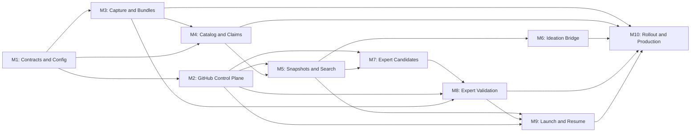
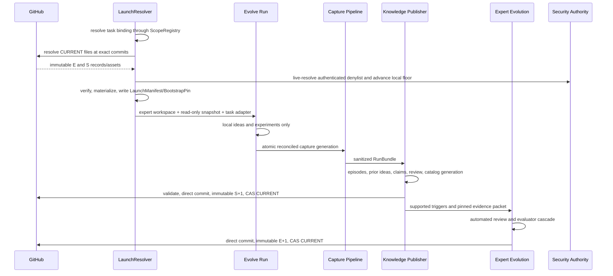

# Cross-run knowledge and expert evolution — orchestrator plan

Status: **M1–M7 implemented and independently reviewed; M4 live Codex validation
pending; M8 in progress; M9–M10 remain in sequence**

Design authority:
[`../cross-run-knowledge-design.md`](../cross-run-knowledge-design.md)

This is the controlling implementation plan for cross-run scientific memory,
GitHub-backed expert releases, and transactional task startup. It coordinates ten
module plans, freezes shared contracts, assigns high-conflict files, and owns the
dependency order. Module plans may refine internal work, but they may not change a
shared schema, authority boundary, durable write order, or release protocol without
first updating this plan.

## Outcome

Every evolve run starts from one attested `LaunchManifest` binding:

- one typed task binding resolved through the canonical `ScopeRegistry`;
- an immutable `ExpertBaseRelease` from a private GitHub expert repository;
- an immutable, locally materialized `KnowledgeSnapshot` from a private GitHub
  knowledge repository;
- a freshly authenticated `SecurityDenylistSnapshot` from a dedicated private
  security repository, backed by a durable local anti-rollback floor;
- one task adapter and `ExpertScopeContract`;
- exact runtime/dependency state and security-denylist snapshot/generation; and
- content digests sufficient for offline resume verification.

During the run, prior knowledge is read-only and local experiment/idea memory
remains authoritative for the current task. After a safe capture, an offline
pipeline publishes sanitized evidence, derives episodes and prior ideas, proposes
reviewable claims through Codex or Claude Code, and may publish a successor
knowledge release. A separate, slower pipeline may propose and validate expert
capability or repository-architecture changes before publishing a successor expert
release.

GitHub is the central control and distribution plane. It is not the query engine,
not the live experiment store, and not a raw-trace data lake.

## Planning structure

| ID | Module plan | Responsibility | Depends on |
|---|---|---|---|
| M1 | [`01-contracts-and-config.md`](01-contracts-and-config.md) | Domain-neutral schemas, canonical identity, scope registry/bindings, strict config | — |
| M2 | [`02-github-control-plane.md`](02-github-control-plane.md) | Autonomous direct GitHub publication, immutable releases, verified cache | M1 |
| M3 | [`03-run-capture-and-bundles.md`](03-run-capture-and-bundles.md) | Atomic capture, execution journal, quarantine, sanitation, local immutable `RunBundle` | M1 |
| M4 | [`04-catalog-episodes-and-claims.md`](04-catalog-episodes-and-claims.md) | Episode/prior-idea projection, assertions, claims, catalog generations | M1, M3 |
| M5 | [`05-snapshots-search-and-reader.md`](05-snapshots-search-and-reader.md) | Snapshot packaging, embeddings/indexes, retrieval, read-only MCP gate | M1, M2, M4 |
| M6 | [`06-ideation-and-memory-bridge.md`](06-ideation-and-memory-bridge.md) | Ideation-v3 provenance, prior packets, local-memory separation | M1, M5 |
| M7 | [`07-expert-candidates-and-architecture.md`](07-expert-candidates-and-architecture.md) | Bootstrap architect, generalization triggers, candidates, semantic book | M1, M2, M5 |
| M8 | [`08-expert-validation-and-release.md`](08-expert-validation-and-release.md) | Evaluator cascade, review, composition, immutable expert publication | M2, M3, M7 |
| M9 | [`09-launch-bootstrap-and-resume.md`](09-launch-bootstrap-and-resume.md) | Launch resolution, task adapter, workspace materialization, resume/revocation | M2, M5, M8 |
| M10 | [`10-system-rollout-and-production-validation.md`](10-system-rollout-and-production-validation.md) | CLI/operations, failure injection, real GitHub E2E, legacy deletion | M3–M9 |

These plans group transactional responsibilities rather than individual classes.
Splitting them further would put one invariant under several owners; combining
them would make reviews too large to validate independently.

## Dependency graph



After M1 freezes contracts, M2 and M3 may proceed in parallel. M6 and M7 may
proceed in parallel after M5. M9 begins only when both
artifact release paths exist. M10 is the sole owner of activation and removal of
superseded startup behavior.

## Shared contract freeze

Status: **complete and frozen by M1**

M1 must land these exact semantic contracts before dependent modules begin:

```text
ScopeRepositorySettings
CrossRunTaskBindingSettings
ExpertScopeContract
TaskContextBinding
EvaluationFingerprint
ArtifactEnvironment
CaptureManifest
RunBundle
TransferEpisode
PriorIdea
ReviewAssertion
KnowledgeClaim
CatalogEntryState
KnowledgeSnapshotManifest
PriorKnowledgeSnapshot
ExpertModuleContract
ExpertRepositoryMap
ExpertCandidateManifest
ExpertCandidateEligibilityDecision
ExpertValidationAttempt
ExpertEvaluatorRun
ExpertEvaluatorAttestation
ExpertCandidateValidationState
ExpertBaseReleaseManifest
TaskAdapterManifest
TaskAdapterPackagePin
TaskAdapterVerificationReceipt
TaskAdapterActivationRecord
SecurityDenylistRevocation
SecurityDenylistSnapshot
GitHubPublicationRecord
LaunchManifest
BootstrapPin
```

The freeze covers:

- exact required/optional fields and enum values;
- canonical JSON and content-ID preimages;
- global versus run-local identifier rules;
- scope-to-repository routing and workload-binding validation;
- scope-contract and context-dimension validation;
- evaluation-comparability semantics;
- immutable payload versus mutable catalog-state separation;
- supersession, lineage, revocation, and taint references;
- proof-closure requirements;
- GitHub location records outside scientific content identity; and
- strict persisted shapes with no migration or compatibility readers.

Any contract change updates all serializers, fixtures, content hashes, module
plans, and design text in the same change. Pre-release artifacts using the old
shape are discarded or re-derived.

## Proposed package boundary

Cross-run behavior is framework-wide and must not live under GenericSearch:

```text
src/kapso/cross_run/
  __init__.py
  canonical.py
  contracts.py
  record_contracts.py
  record_registry.py
  settings.py
  security_denylist.py
  github/
    command.py
    publisher.py
    resolver.py
    materializer.py
  capture/
    journal.py
    exporter.py
    validator.py
    sanitation.py
    bundle.py
    pipeline.py
    evaluation_evidence.py
    git_evidence.py
    provenance.py
    safety.py
  git_command.py
  catalog/
    store.py
    projector.py
    assertions.py
    claims.py
    admission.py
  knowledge/
    package.py
    index.py
    retrieval.py
    publisher.py
    access.py
  expert/
    triggers.py
    architect.py
    generalizer.py
    candidates.py
    book.py
    workspace.py
    validation.py
    publisher.py
  launch/
    resolver.py
    workspace.py
    revocation.py
```

The existing `kapso.knowledge_base` is a wiki/research subsystem. It is not
renamed, merged into, or treated as the cross-run scientific catalog. Shared code
is extracted only when both consumers have demonstrated the same contract.

## File ownership

| Surface | Primary owner | Rule |
|---|---|---|
| `cross_run/contracts.py`, canonical IDs, scope registry/config composition, strict settings | M1 | Other modules import; they do not redefine schemas or repository mappings |
| Framework GitHub/`gh`/Git command boundary and local artifact cache | M2 | Other framework modules use this boundary; the fully authorized coding agent may also invoke GitHub directly |
| `ExperimentHistoryStore` journal additions and capture hooks | M3 | M6 reads local authorities but does not change capture ordering |
| Cross-run catalog, assertions, claims, admission state | M4 | Snapshot code consumes immutable generations only |
| Shared embeddings extraction, dependency-pure typed record registry, search package, prior-knowledge MCP gate | M5 | M6 only mounts and persists reader output |
| `generic/ideation/`, `generic/strategy.py`, `IdeaArchive`, Generic checkpoint projection | M6 | Sole owner of live ideation integration |
| Expert architect/generalizer prompts, repository map, book compiler | M7 | M8 validates; it does not regenerate proposals |
| Expert evaluator cascade, fresh spawn authority, authenticated security denylist, and release assembly | M8 | Sole owner of executable validation and stable expert publication policy |
| `Kapso.evolve`, CLI launch options, benchmark scope bindings/runners, `ExperimentWorkspace`, `RunCheckpoint`, bootstrap pin | M9 | Sole owner until M10 deletes superseded startup code |
| End-to-end fixtures, workflow templates, operational docs, legacy deletion | M10 | Starts after all live paths are complete |

## Configuration authority

All tunable values are added once under `cross_run` in
`src/kapso/config.yaml`. `load_config()`/`load_effective_config()` validate and
thread them to cross-run call sites. `load_mode_config()` remains a workload-only
projection: global cross-run operator settings never enter the scientific campaign
resume fingerprint. M9 threads the typed effective config into launch separately.
New code must not read environment variables and must not duplicate defaults in
dataclasses or modules.

Configuration groups are:

```text
cross_run.scopes
cross_run.github
cross_run.capture
cross_run.sanitation
cross_run.catalog
cross_run.knowledge
cross_run.knowledge.embeddings
cross_run.knowledge.retrieval
cross_run.expert
cross_run.expert.validation
cross_run.launch
cross_run.production_validation
```

Repository coordinates, paths, budgets, thresholds, model/CLI selection,
timeouts, branch/tag conventions, shard sizes, cache retention, and validation
schedules belong there. Secrets do not. Git/`gh`, the official OpenAI SDK, Codex,
and Claude Code use their own externally configured authentication mechanisms.
Repository coordinates occur only under `cross_run.scopes`; workload modes carry
only `cross_run_binding.scope_id/task_family_id/task_adapter_id`.

## Provider and authority boundaries

```text
Reasoning or code proposal
  -> CodingAgentCallRunner
       -> Codex CLI | Claude Code

Semantic vectors
  -> shared OpenAIEmbeddingProvider
       -> official OpenAI embeddings endpoint

GitHub transport
  -> AutonomousGitHubPublisher or fully authorized coding agent
       -> git credential helper | authenticated gh
```

Hard rules:

- no cross-run module calls a direct generative model API;
- `ClaimProposer`, `ExpertRepoArchitect`, and `GeneralizationProposer` use the
  existing Codex/Claude coding-agent boundary;
- the only direct OpenAI model call is the embeddings endpoint;
- coding-agent subprocesses may use external Git/`gh` authentication but never
  receive the OpenAI embedding credential as prompt/config/artifact content;
- an agent may invoke raw GitHub writes under the explicit trusted autonomous
  operating model; the framework publisher remains the crash-safe normal path;
- deterministic validators and trusted review own admission and promotion;
- GitHub `CURRENT.json` is discovery only; launches pin immutable identities;
- all external command failures propagate and no fallback backend is selected;
- raw or malformed model output never becomes a durable object; and
- no message bound for a model is truncated. Budgeting selects or skips complete
  records before prompt construction.

## Delivery waves

### Wave 1 — domain and identity

Deliver M1:

- strict schemas and canonical JSON;
- content-addressed IDs and attestation envelopes;
- domain-neutral context binding;
- single-sourced scope registry and typed workload bindings;
- config structure and validation; and
- round-trip/corruption/hash tests.

Gate: all later artifacts can be represented without importing GitHub, Generic,
or a coding-agent adapter.

### Wave 2 — transport and capture

Deliver M2 and M3:

- fakeable Git/`gh` boundary and expected-parent direct-write protocol;
- autonomous commit and immutable-release transaction primitives;
- verified transactional local cache;
- atomic run capture and execution-revision journal;
- deterministic validation and sanitation; and
- immutable sanitized `RunBundle`.

Gate: a stopped synthetic run can be captured, sanitized, committed to the local
immutable bundle store, reopened, and verified byte-for-byte without an LLM.

### Wave 3 — evidence catalog

Deliver M4:

- disjoint episode/prior-idea projection;
- append-only reviews and catalog generations;
- coding-agent claim proposals with exact evidence provenance;
- deterministic admission/dispute/revocation state; and
- concurrency-safe catalog deltas.

Gate: fixed bundles deterministically produce the same catalog generation under
input reordering and concurrent retry.

### Wave 4 — knowledge product

Deliver M5:

- standalone snapshot and proof closure;
- canonical lexical/metadata index and embedding-space sidecars;
- structured-filter-first hybrid retrieval;
- deterministic packet/diversity budgets;
- read-only `PriorKnowledgeGate`; and
- immutable knowledge release publication.

Gate: a clean machine with only a pinned release can answer retrieval queries
without historical workspaces, raw traces, or GitHub access.

### Wave 5 — live ideation bridge

Status: **implemented**. M9 supplies the verified launch runtime; M10 activates the
GitHub-backed path as the sole production path.

Deliver M6:

- prior packet retrieval after local directive planning;
- exact packet persistence in `IdeaBatch` provenance;
- Codex/Claude MCP read access to the persisted packet;
- advisory cross-run novelty and adaptation analysis;
- strict separation from local parents/incumbents/gaps; and
- new-only IdeaArchive and Generic checkpoint shapes.

Gate: a resumed ideation batch observes exactly the prior records it originally
used and performs no new retrieval.

### Wave 6 — expert proposal plane

Deliver M7:

- empty-scope `E0` architecture proposal;
- evidence-backed capability and architecture triggers;
- isolated expert candidates and repository-map lineage;
- deterministic semantic-book compilation; and
- validated handoff to autonomous direct publication.

Gate: a coding agent can propose and write a complete candidate autonomously, but
it becomes an active release only after the automated validation state machine and
immutable publication complete.

### Wave 7 — expert validation and release

Deliver M8:

- ordered evaluator cascade;
- replay/fresh-task/cross-family/release-matrix evidence;
- sealed-canary and reviewer assertion boundaries;
- rebase/compose with full revalidation; and
- immutable expert release publication.

Gate: only an approved exact tree can produce a new immutable expert release.
Every replay spawn additionally requires a fresh authenticated, non-rollback
security observation over its complete internally derived dependency closure.

### Wave 8 — transactional launch

Deliver M9:

- one launch resolver across expert/snapshot/adapter/runtime;
- verified staging and atomic workspace construction;
- pre-orchestrator bootstrap pin;
- strict resume and fresh denylist checks; and
- removal of the `initial_repo`/starter-selection path from the active design.

Gate: no paid/model action can occur before the launch identity and local trees
are durably pinned.

### Wave 9 — activation

Deliver M10:

- operational CLI commands and docs;
- failure injection at every durable/GitHub boundary;
- real private-repository production tests;
- Codex/Claude/OpenAI credentialed smokes;
- RelBench-shaped and language-post-training-shaped scenario replays; and
- deletion of every superseded schema, prompt, startup path, and fixture.

Gate: the GitHub-backed path is the sole supported path and all production
acceptance tests pass.

## End-to-end system flow



## Global invariants

1. Tasks provide scope/family/adapter identities, never repository coordinates;
   one canonical registry resolves the expert/knowledge/security repository triple.
2. A run consumes one immutable launch identity and never follows `CURRENT`.
3. Foreign evidence never enters local `node_history`, `IdeaArchive` authorities,
   local parents/incumbents, or `ExperimentHistoryStore`.
4. Every capture generation represents one mutually reconciled frontier.
5. Raw quarantine is deletable and never enters GitHub.
6. Every source idea projects exactly once: node-linked to `TransferEpisode`,
   never-linked to `PriorIdea`.
7. Technical failure, invalid evaluation, negative result, interruption, and
   incomparability remain distinct.
8. A claim is unrepresentable without applicability, exclusions, evidence, and
   contradiction sets.
9. Coding agents propose; deterministic code and trusted review admit or promote.
10. Snapshot packages include the complete semantic and proof closure required by
   readers; archival traces are not a runtime dependency.
11. Structured compatibility/trust filtering precedes semantic similarity.
12. Embeddings and ANN indexes are rebuildable sidecars, never truth.
13. Prompt budgets skip complete records and never clip model-bound content.
14. Coding-agent CLIs may use external Git/`gh` authentication; credential bytes
    and the OpenAI embedding credential never enter prompts or artifacts.
15. GitHub release tags/assets are immutable before `CURRENT.json` advances.
16. Autonomous publishers use explicit parent commits and non-force updates.
17. A crash may leave an inactive orphan release, never a partial active release.
18. Expert capability IDs are semantic and path-independent; splits/merges record
    lineage without compatibility shims.
19. `EXPERT_REPO.md` is generated from the repository map and module contracts.
20. Resume verifies the original local materialization and refreshes only the
    security/contamination denylist.
21. A denylist checkpoint is an anti-rollback floor, never offline authorization;
    every dangerous boundary live-resolves and authenticates current state.
22. Missing, unauthorized, corrupt, stale, or incompatible remote state fails
    before spend; only explicit `EMPTY`/`E0` represents no history.

## Test strategy

Each module owns focused unit/contract tests. M10 owns cross-module failure
injection and credentialed production tests.

| Layer | Purpose |
|---|---|
| Contract tests | Strict schemas, canonical bytes, IDs, lineage, predicates |
| Store tests | Atomic persistence, CAS conflicts, corruption, supersession |
| GitHub boundary tests | Exact argv/API shapes, ref protection, release ordering, digest verification |
| Capture tests | Frontier joins, crash generations, sanitation, journal attempts |
| Catalog tests | Projection disjointness, review conflicts, taint/revocation closure |
| Retrieval tests | Compatibility first, embedding spaces, hybrid rank, proof closure, whole-record budgets |
| Ideation tests | Prior packet provenance, local/foreign authority separation, resume |
| Expert tests | Trigger evidence, architecture map, book generation, evaluator cascade |
| Launch tests | Torn-pair prevention, atomic materialization, bootstrap pin, denylist |
| Scenario replay | Empty scope, concurrent runs, RelBench family addition, contradiction, revocation |
| Production E2E | Real private GitHub releases, real CLI agent, real embeddings, clean-machine launch |

Required adversarial fixtures include:

- two publishers racing from the same base commit;
- release asset upload followed by process death before pointer advancement;
- tag/asset digest substitution;
- poisoned record asking an agent to expose GitHub/OpenAI credentials;
- corrupt and stale search sidecars;
- same-dimensional embeddings from different spaces;
- coupled intervention falsely presented as causal evidence;
- interrupted idea with multiple execution revisions;
- task-family context outside the pinned scope contract;
- architecture candidate that only renames folders;
- candidate passing mean metrics while violating one hard regression; and
- offline resume after the remote `CURRENT` has advanced.

## No-backward-compatibility cleanup

This is a direct replacement. M10 deletes, rather than adapts:

- pre-cross-run Generic checkpoint and IdeaArchive persisted shapes;
- any merged/global `experiment_history.json` prototype;
- starter-repository selection and `initial_repo` workspace seeding in the active
  evolve path;
- any direct coding-agent GitHub credential/write path;
- duplicate embedding providers after the shared provider extraction;
- legacy config aliases, optional fallback readers, and migration fixtures; and
- docs describing a different authority or startup flow.

No dual writes, shadow publication, legacy parsers, deprecated aliases, or
runtime format negotiation remain.

## Definition of complete

The implementation is complete only when:

- every module plan's definition of done passes;
- the progress ledger identifies the exact commits and validation evidence;
- a clean machine can materialize and use pinned expert/knowledge releases and
  authenticate the live security lineage;
- PostTrainBench and RelBench resolve through distinct task bindings to the same
  configured `ml_ai` repository triple without duplicating repository names;
- ideation resume performs no unrecorded cross-run retrieval;
- a stopped/crashed run can be harvested from its last reconciled frontier;
- catalog and release races preserve all admitted evidence;
- coding agents use the configured Git/`gh` identity without copying credentials
  into prompts, artifacts, config, or logs;
- all three repositories allow autonomous direct publication and enforce
  immutable releases;
- immutable GitHub publication and attestation verification work in production;
- the old startup and persistence paths are absent; and
- full tests pass after legacy deletion.

## Decision log

| ID | Decision | Reason |
|---|---|---|
| D1 | Use ten module plans | Match transaction boundaries and keep high-conflict files singly owned |
| D2 | Create `kapso.cross_run` | Cross-run behavior spans strategies and must not inherit Generic assumptions |
| D3 | Keep `kapso.knowledge_base` separate | Wiki/research knowledge is not experiment evidence or scientific truth |
| D4 | Use three GitHub repositories per scope | Expert code, scientific memory, and live revocation authority have different structures and failure semantics; each publisher owns one complete tree and one root current pointer |
| D5 | Keep large packages/indexes in immutable release assets | Avoid unbounded Git history and keep clean-machine materialization simple |
| D6 | Keep GitHub locations outside content identity | Preserve artifact identity across authorized relocation |
| D7 | Use one fully authorized external Git/`gh` identity | The operator explicitly trusts autonomous agents to read and write all configured repositories without human gates |
| D8 | Semantic search runs locally over a pinned package | Avoid mutable remote queries and make retrieval reproducible |
| D9 | Prefetch ideation knowledge, then expose packet-only MCP reads | Give CLI agents reader access without unrecorded dynamic retrieval |
| D10 | Use exact cosine before ANN | Keep the early corpus simple; add deterministic ANN only after measured threshold |
| D11 | Publish immutable release before updating `CURRENT.json` | Crash leaves an orphan, not a broken active pointer |
| D12 | Coding agents propose claims/code; policies certify | A model cannot grant authority to its own output |
| D13 | Remove old formats and startup paths directly | Pre-release development has no compatibility obligation |
| D14 | Route repositories by scope, never by benchmark | One registry keeps locations single-sourced while scope contracts and task adapters retain semantic separation |
| D15 | Keep cross-run operator settings outside the existing campaign fingerprint | Capture, retrieval, publication, and cache knobs do not redefine scientific campaign identity; each cross-run artifact records its relevant configuration projection, and M9 binds those projections through `LaunchManifest` |
| D16 | Bind publication twice: pre-release intent, then global artifact identity | A durable intent makes release retries exact; a write-once identity keeps every immutable artifact resolvable after `CURRENT` advances or loses a race |
| D17 | Describe Git source and materialized packages independently | Snapshot indexes and split expert assets need not be Git files, while both closures must remain exact and verifiable |
| D18 | Treat immutable publication and `CURRENT` activation as distinct outcomes | A final CAS loser remains auditable and reproducible but must not be reported as the active artifact |
| D19 | Keep one dependency-pure typed record registry across catalog and knowledge boundaries | Content hashes prove identity, while owning strict parsers additionally prove exact schema and keep MCP startup free of service-side effects |
| D20 | Publish local snapshot directories with atomic no-replace semantics | A concurrent writer must retain ownership of a destination created during the staging window |

## Progress ledger

| Module | Status | Implementation reference | Validation reference | Blocker |
|---|---|---|---|---|
| M1 Contracts and Config | Complete | `kapso.cross_run.{canonical,contracts,settings}`, `kapso.core.config`, canonical `cross_run` config | 63 focused + 89 affected integration tests; installed-package/config/GitHub/import-boundary production checks; four `fable` max-reasoning reviews | — |
| M2 GitHub Control Plane | Complete | `kapso.cross_run.git_refs`, `kapso.cross_run.github`, strict GitHub/cache config | 203 focused + 4 affected tests; Black, diff, and standalone `gpt-5.6-sol` xhigh approval | — |
| M3 Run Capture and Bundles | Complete | `kapso.cross_run.capture`, `kapso.cross_run.git_command`, journal-integrated `ExperimentHistoryStore`, checkpoint/archive/orchestrator capture seams | 415 affected integration tests plus 131 final focused tests; compile/diff gates; standalone `gpt-5.6-sol` xhigh approval | M9 composes and activates the pinned runtime context |
| M4 Catalog, Episodes, Claims | Implemented; live CLI pending | `kapso.cross_run.catalog` | 175 focused M4 tests; 377 complete cross-run tests; adversarial provenance, successor projection, configuration rotation, deterministic store, and service integration coverage; standalone `gpt-5.6-sol` xhigh approval | Authenticated Codex account usage limit; typed isolation evidence intentionally absent |
| M5 Snapshots, Search, Reader | Implemented; release-use projection added | `kapso.core.embeddings`, `kapso.cross_run.{record_contracts,record_registry,knowledge}`, `kapso.gated_mcp.gates.prior_knowledge_gate` | Existing M5 coverage plus deterministic, proof-closed, non-retrieval release-use projection tests; malformed-schema, typed-proof, index corruption, compatibility, proof-budget, silent MCP import, no-replace materialization, and M2 publication coverage; independent reviewer found no remaining P0–P2 issues | Authenticated release-use policy reader and live embedding/GitHub production validation remain M8/M10 |
| M6 Ideation and Memory Bridge | Implemented; independent hardening approved | `generic.ideation` v4 archive, Generic v5 checkpoint, `IdeationCrossRunRuntime`, structured coding-agent packet/MCP boundary | 451 cross-run/knowledge tests; 167 ideation/checkpoint tests (1 unrelated skip); matched empty-memory/negative-prior E2E; real stdio MCP handshake; real Codex policy parse; independent reviewer found no remaining P0–P2 issues | Exact external `gpt-5.6-sol` xhigh replay is quota-blocked; M9 constructs the runtime and M10 provisions `bubblewrap`/`socat` plus authenticated CLI policy probes |
| M7 Expert Candidates and Architecture | Complete; independent correctness review approved | `kapso.cross_run.expert.{triggers,candidates,sanitation,book,store,workspace,proposal,proposal_contract,architect,generalizer}`, fixed role prompts, `kapso.execution.coding_agents.{structured_call,workspace_delta,operation_receipt}`, exact source/materialization, durable deltas, complete agent artifacts, semantic MCP/audit replay | 152 final focused proposal/closure/store/workspace/contract/book/agent tests plus broad deterministic cross-run/expert/ideation pass; lease-before-persist atomicity, fixed role authority, pinned historical proposer authority, model-readable exact ancestors, monotonic preserved semantics, structural restructure enforcement, prior-record taint closure, compile/format/diff gates; final independent reviewer found no P0–P2 correctness defects | — |
| M8 Expert Validation and Release | In progress: validation, authenticated composition, deterministic release assembly/publication, emergency lifecycle revocation, exact proof-edge and lineage semantics, and release-use event/projection contracts complete | `kapso.cross_run.expert.{validation,validation_store,review,review_stage,replay_stage,replay_execution_store,task_evaluation_preflight,task_evaluation_reservation,task_evaluation_execution,task_evaluation_execution_store,task_evaluation_docker_provider,promotion_contracts,promotion_plan,promotion_evidence,promotion_stage_contracts,promotion_stage,promotion_decision_contracts,promotion,promotion_authority_contracts,promotion_authority,composition_contracts,composition_base,composition_base_provider,composition_source,composition,composition_candidate,composition_admission_authority,composition_admission_contracts,composition_admission,release_contracts,release,publisher,revocation_contracts,revocation}` plus shared catalog, knowledge, GitHub materialization, task-adapter, security, process, and config authorities | Existing M8 coverage plus strict release-use event schema, cumulative catalog reduction, deterministic snapshot projection, no admission/taint/lifecycle mixing, and fresh-host trust-boundary review | Authenticated release-use event author/reader, enforcement, and clean forward recovery |
| M9 Launch, Bootstrap, Resume | Planned | — | — | M5, M8 |
| M10 Rollout and Production Validation | Planned | — | — | M3–M9 |

## Plan-maintenance protocol

For every implementation change:

1. identify the owning module;
2. confirm prerequisites and frozen contracts;
3. update that module's checklist and focused tests;
4. record shared-contract or ordering changes here before implementation;
5. commit the coherent module slice with its tests and docs;
6. update the progress ledger with the commit and validation command; and
7. run all gates for the current delivery wave.

This file coordinates implementation. Detailed class-level tasks live only in the
module plans.
