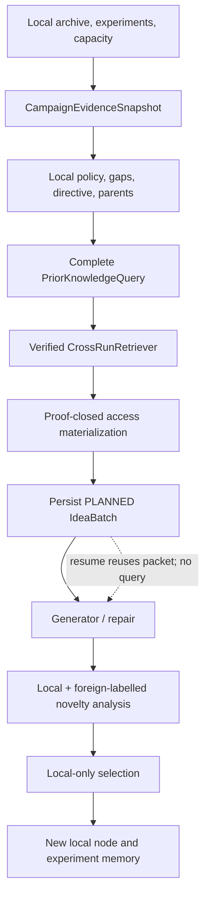

# M6 — ideation-v3 and local-memory bridge

Parent plan: [`00-orchestrator-plan.md`](00-orchestrator-plan.md)

Depends on: M1 and M5.

Status: **implemented and independently approved**. Runtime construction remains
owned by M9 and sole-path activation/legacy deletion remains owned by M10.

## Objective

Connect one pinned `KnowledgeSnapshot` to live ideation without merging foreign
ideas/experiments into current-run authorities. Persist the exact prior packet used
by every batch so generation, analysis, selection, and resume are reproducible.

## Owned responsibilities

- New-only IdeaArchive and Generic checkpoint schemas.
- Prior retrieval placement in `IdeationEngine` transaction ordering.
- `PriorKnowledgeSnapshot` and foreign-reference provenance on batches/ideas.
- Separate local-evidence and prior-knowledge prompt sections.
- Cross-run advisory novelty/adaptation analysis.
- Packet-only MCP reader mounting for Codex/Claude ideation roles.
- Strict resume/reconciliation across checkpoint, archive, and prior packet.

## Proposed code surface

```text
src/kapso/execution/search_strategies/generic/ideation/
  types.py
  archive.py
  evidence.py
  analyzer.py
  generator.py
  selector.py
  engine.py
  prior_knowledge.py

src/kapso/execution/search_strategies/generic/
  strategy.py

src/kapso/execution/coding_agents/
  structured_call.py

src/kapso/gated_mcp/
  server.py
  gates/prior_knowledge_gate.py

src/kapso/execution/search_strategies/generic/prompts/
  ideation_v3_candidate.md
  ideation_v3_selector.md

tests/
  test_prior_knowledge_ideation_types.py
  test_prior_knowledge_ideation_engine.py
  test_prior_knowledge_analysis.py
  test_prior_knowledge_resume.py
  test_cross_run_ideation_integration.py
```

## Persisted shape changes

- [x] Replace `kapso.ideation_archive.v3` with the one new archive shape containing
      a source snapshot ID and exact `PriorKnowledgeSnapshot` on each applicable
      `IdeaBatch`.
- [x] Add typed `prior_knowledge_refs` to `IdeaRecord`; keep local `evidence_refs`,
      claim IDs, parent idea IDs, and node IDs local-only.
- [x] Add launch/scope/snapshot/expert-release identities to the Generic strategy
      state and context hash.
- [x] Replace the current Generic checkpoint schema directly; old checkpoints fail
      with an explicit restart requirement.
- [x] Update every serializer, fixture, prompt artifact, result manifest, and
      reconciliation test in the same changes.
- [x] Add no migration, dual reader, missing-field default, or compatibility alias.

## Engine transaction ordering

For a new batch:

1. reconcile checkpoint, `IdeaArchive`, `ExperimentHistoryStore`, and node history;
2. build current `CampaignEvidenceSnapshot`;
3. choose local BOOTSTRAP/EXPLORE/EXPLOIT policy, gaps, parent, and directive;
4. build the cross-run query from problem, pinned `TaskContextBinding`, local gaps,
   and directive;
5. retrieve exactly one proof-closed `PriorKnowledgeSnapshot` from M5;
6. create/persist the planned `IdeaBatch` with both local evidence and prior packet;
7. generate/analyze/select using those frozen inputs;
8. persist selected local idea before node creation; and
9. continue the existing implementation/evaluation path.

- [x] If retrieval fails, the batch is not created and no model call starts.
- [x] If the configured snapshot is explicit `EMPTY`, persist an explicit empty
      prior packet with its real identity/digest.
- [x] Resume loads the persisted packet and never searches the snapshot again for
      that batch.
- [x] Context hashes include full packet identity/content, not a clipped rendering.

## Prompt and CLI integration

- [x] Render local current-run evidence and foreign prior knowledge in separately
      labelled mandatory sections.
- [x] Preserve complete selected records; packet budgeting happened before prompt
      construction.
- [x] State that foreign scores are not local incumbents, foreign failures do not
      close local gaps, and foreign records cannot be parents.
- [x] Mount M5's `PriorKnowledgeGate` into generator and selector Codex/Claude CLI
      configurations against the persisted packet.
- [x] Expose only packet list/get tools; implementation raw artifacts remain behind
      a separate future read-only gate.
- [x] Persist MCP access audits with the normal coding-agent invocation artifacts;
      the immutable packet reconstructs every returned record from its logged ID.
- [x] Pre-create/fsync the MCP audit before launch, require canonical unique-key
      JSONL, recompute each response digest from the packet, and bind the final
      audit digest/event count into the completed coding-agent result.
- [x] Give each outer CLI only its own credential family; the MCP child receives
      an empty environment. Do not pass GitHub or embedding credentials.
- [x] Run Codex with a custom workspace/minimal filesystem profile and Claude
      with fail-closed sandboxing plus explicit Read denies for `.env`, `/proc`,
      and credential stores.

Claude runs in `--safe-mode` with empty settings sources, not `--bare`: bare mode
rejects the externally supplied Claude Code OAuth token. Production activation is
still gated on M10's authenticated policy-recognition and denied-read probes,
because Claude print mode silently ignores settings that fail its own validation.

## Analysis and selection semantics

- [x] Compute exact/descriptor/embedding neighbors against both local ideas and
      eligible prior records, but label their origins.
- [x] Keep hard exact-duplicate rejection local-campaign-only.
- [x] A close foreign record may require an explicit adaptation or changed-context
      rationale; it cannot make the local idea ineligible by itself.
- [x] Cross-run evidence may influence BOOTSTRAP/EXPLORE proposals but cannot move
      local policy to EXPLOIT.
- [x] EXPLOIT still requires a supported local lever under the current evidence
      snapshot.
- [x] Selector criticism may cite prior records but must create/select one new local
      idea with valid local parent/artifact/capacity references.
- [x] Generated foreign-reference IDs are validated against the persisted packet's
      citable scientific subset: prior ideas, transfer episodes, and knowledge-claim
      revisions. Control and proof records remain inspectable but cannot become
      idea/decision provenance.

## Implemented module responsibilities

| Module | Exact responsibility |
|---|---|
| `IdeationCrossRunRuntime` | Bind one verified retriever and optional query embedder to the immutable launch identity and its exact embedding space; build the complete post-directive query |
| `IdeationEngine` | Retrieve before batch creation, persist the exact access materialization, reuse it on resume, and thread it unchanged through generation, repair, analysis, and selection |
| `IdeaArchive` v4 | Validate packet membership and keep global prior content IDs separate from all run-local IDs |
| `CandidateGenerator` | Present separately labelled local and foreign sections; mint only new local ideas and require typed prior citations plus adaptation rationale |
| `CandidateAnalyzer` | Compute separately typed foreign exact/descriptor/semantic matches; foreign matches produce advisory flags, never local duplicate authority |
| `CandidateSelector` | Select only eligible local ideas while preserving the selected idea's foreign provenance |
| `SubprocessCodingAgentCallRunner` | Persist packet/config/audit artifacts, mount exactly two read-only MCP tools, broker a per-CLI credential allowlist, enforce filesystem restrictions, and bind the canonical MCP audit into the result |
| `PriorKnowledgeGate` | Serve complete packet members only; append and fsync operation-, packet-, tool-, ID-, and reconstructible-response-digest-bound audit events |
| `GenericSearch` v5 state | Project and reconcile the pinned cross-run identity; include query-embedding cost and duration in phase telemetry |

The batch stores the complete content-addressed
`PriorKnowledgeAccessMaterialization`, rather than a filesystem pointer. This
makes archive recovery self-contained, binds proof records into the context hash,
and avoids a second mutable store. M5's byte budget bounds that duplication.
When a deferred idea resurfaces in a later batch, its citations remain validated
against its immutable origin batch. The new selection records only foreign
records from the new batch's packet; it never rebinds inherited provenance.



## Authority separation

The only connection is:

```text
local store/archive -> RunBundle -> cross-run snapshot
cross-run snapshot -> prior packet -> new local idea -> new local node
```

M6 must prove that foreign records never enter:

- `GenericSearch.node_history`;
- `ExperimentHistoryStore`;
- local evidence claims/gap closure/incumbent computation;
- local parent resolution;
- local `IdeaArchive` as foreign batches or foreign ideas; or
- checkpoint node prefixes.

A new local idea may cite a prior record but always receives a new local ID,
analysis, decision, node link, and evaluation.

## Tests

- Empty snapshot, positive prior, negative prior, contradiction, analogical prior,
  incompatible prior, and foreign unexecuted-idea fixtures.
- Verify directive planning precedes retrieval and retrieval precedes batch/model
  calls.
- Crash after packet persistence, generation, analysis, selection, and node link;
  resume must reuse exact prior content and issue no duplicate query.
- Reject a checkpoint/archive packet digest mismatch.
- Prove no foreign ID is accepted as local parent, node, claim, gap resolution, or
  incumbent.
- Prove global exact duplicate remains advisory while local exact duplicate remains
  a hard rule.
- Verify EXPLOIT cannot be anchored by cross-run support alone.
- Verify Codex and Claude configurations both mount packet-only MCP tools while
  receiving only their own provider-authentication family, never GitHub,
  embedding, or unrelated credentials.
- Verify the real stdio MCP handshake, error response, canonical audit, response
  reconstruction, duplicate-key rejection, and cached-result audit binding.
- Verify the real CLI parsers accept the generated Codex/Claude security policy;
  authenticated tool-use probes remain part of M10 production validation.
- End-to-end deterministic run: prior failure changes the generated/selected local
  idea while the executed store still begins empty.

## Definition of done

- Every ideation batch is reproducible from its local evidence, prior packet, and
  coding-agent artifacts.
- Resume never re-queries prior knowledge for completed batch phases.
- Local and foreign authorities are mechanically unmergeable.
- Both supported coding-agent CLIs can inspect full selected prior records through
  MCP.
- No pre-cross-run archive/checkpoint path remains.

The Claude policy intentionally sets `sandbox.failIfUnavailable`. A host without
`bubblewrap` and `socat` cannot start Claude ideation; M10 provisions those OS
dependencies and proves both the allowed packet read and denied secret reads on
the exact installed CLI build before activation, rather than weakening or merely
assuming the boundary.

## Non-goals

- Publishing snapshots or generating embeddings.
- Dynamic full-snapshot search from inside a model call.
- Expert candidate generation/promotion.
- Changing local policy, budget, fidelity, or evaluator authority.
