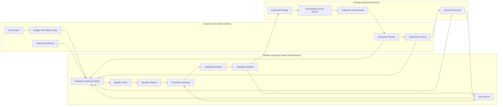
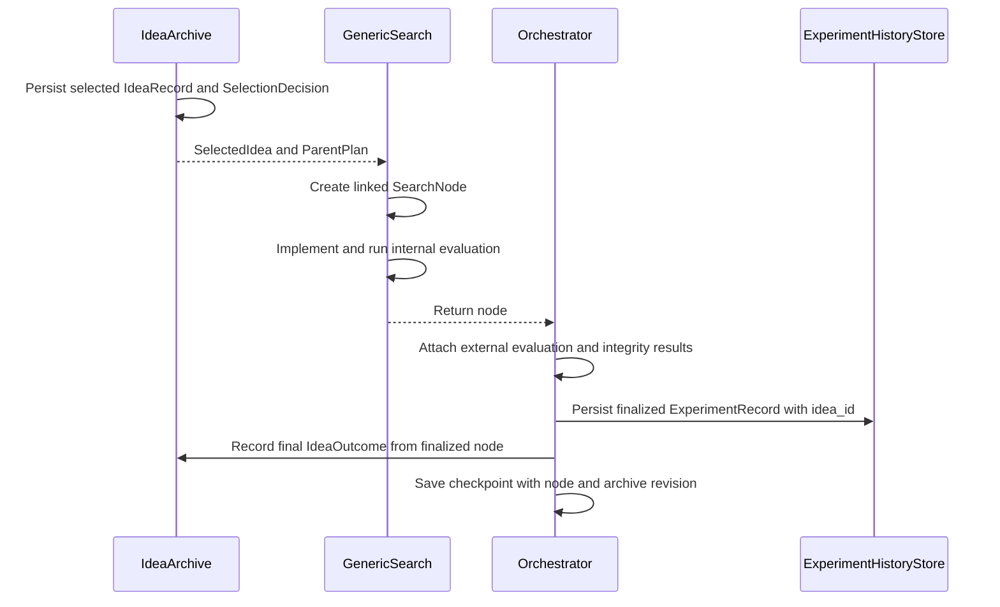
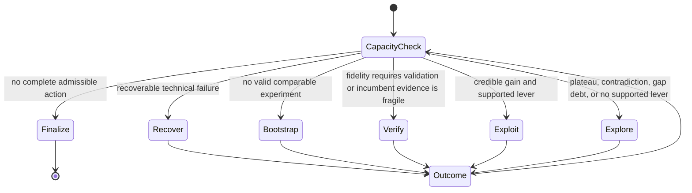

# Ideation v3 — evidence-directed exploration and exploitation

Status: **design proposal**

This document specifies the intended architecture and system flow for Kapso's
next ideation system. It supersedes the scheduling and persistence portions of
`worktree-posttrainbench:docs/research/ideation-v2-design.md`, while retaining
that proposal's strongest mechanisms: operator diversity, persistent candidate
pools, measured-gap coverage, embedding-based duplicate alarms, and
evidence-grounded selection.

Implementation planning is deliberately out of scope. The purpose of this
document is to establish stable responsibilities, contracts, invariants, and
end-to-end behavior before choosing files, phases, or migrations.

## Executive decision

Kapso should use a **small, durable idea population controlled by a
deterministic evidence policy**.

The system does not try to maximize an abstract novelty score. It tries to
maximize delivery-validated improvement per unit of constrained experiment
capacity by:

1. recognizing whether the campaign needs bootstrap, recovery, verification,
   exploitation, or exploration;
2. generating candidates through distinct proposal operators;
3. retaining every candidate and its provenance;
4. treating semantic similarity only as a duplicate warning;
5. grounding causal claims and evaluation gaps in recorded evidence;
6. selecting one executable candidate under hard capacity and validation
   constraints; and
7. linking the selected idea to its experiment and observed outcome.

Kapso should not add MCTS, UCB, reinforcement learning, or a large population
scheduler at this stage. A typical campaign provides too few expensive
observations to estimate those policies reliably. Better proposal operators,
evidence quality, and lifecycle integrity are higher-leverage.

## Decisions relative to ideation v2

| Ideation v2 mechanism | Decision in v3 |
|---|---|
| Improve proposal operators before adding search-policy complexity | Retain |
| Persist selected and unselected candidates | Retain in a separate `IdeaArchive` |
| Use embeddings to detect repeated ideas | Retain as a warning, never a value or novelty score |
| Reserve a candidate for a measured gap | Retain, prioritized by impact and uncertainty rather than age alone |
| Audit selector diagnoses against score evidence | Retain and make it a structured selection output |
| Replace static ensemble personas with stance-specific briefs | Retain as operator briefs; task priors remain optional constraints |
| Derive `EXPLORE`, `EXPLOIT`, and `FINAL_GAMBLE` from experiment count | Replace with the evidence state machine; remove `FINAL_GAMBLE` |
| Estimate remaining full runs inside ideation | Reject; consume the existing fidelity/budget capacity contract |
| Keep every losing candidate on its associated experiment record | Reject; ideas and experiments have different lifecycles |
| Search similarity over selected and unselected text stored on experiments | Reject; expose separate idea and experiment retrieval |
| Never regenerate a collapsed candidate pool | Replace with one bounded diversity-repair round |
| Discard or rederive older stores on upgrade | Reject; version and migrate without deleting provenance |

## The design in one diagram



## Scope and boundaries

Ideation begins after the orchestrator admits another search action and ends
when a selected idea has been durably linked to an experiment node. It consumes
campaign evidence and capacity; it does not own either.

The following boundaries are mandatory:

- **Budget and fidelity own capacity.** Ideation consumes a capacity read model.
  It does not estimate full-run duration, alter the finalization reserve, or
  admit work independently.
- **SearchNode/checkpoint owns canonical executed state.** Scores, feedback,
  branches, failures, and evaluation attempts remain on executed nodes.
  `ExperimentHistoryStore` remains the durable retrieval projection exposed to
  ideation agents; it does not become a second search-state authority.
- **Idea history owns proposals.** Generated, rejected, selected, and
  not-yet-executed candidates remain idea records.
- **Evaluation owns truth.** An LLM may identify an assumption or propose a
  test, but only recorded evaluation evidence can mark a gap tested or close a
  claim.
- **GenericSearch remains the strategy.** Ideation is an internal subsystem,
  not a competing search strategy or a second orchestrator.
- **The LLM proposes and criticizes. Deterministic code enforces.** Capacity,
  schema validity, lifecycle transitions, exact duplicates, evidence status,
  and resume behavior are not prompt responsibilities.

## Connection to the current system

V3 is an internal replacement for the current solution-generation seam, not a
new top-level execution path.

### Current call flow

Today one generic-search iteration is effectively:

```text
GenericSearch.run()
  -> _select_parent()
  -> _generate_solution()
       -> optional _generate_solution_ensemble()
       -> optional _select_from_candidates()
       -> returns one solution string
  -> create SearchNode(solution)
  -> _implement()
  -> integrity check, feedback, evaluation-attempt recording
  -> append node_history
  -> return node to Orchestrator
  -> external candidate evaluation
  -> ExperimentHistoryStore.add_experiment(node)
  -> checkpoint strategy state
```

Candidate generation and selection are currently ephemeral. Only the selected
solution string crosses the `SearchNode` boundary; unselected candidates,
selector reasoning, duplicate facts, and the generation context disappear.

### V3 call flow

The revised iteration is:

```text
GenericSearch.run()
  -> IdeationEngine.select(evidence, capacity)
       -> persist IdeaBatch
       -> generate or resurface IdeaRecords
       -> analyze and persist the candidate pool
       -> select and persist SelectionDecision
       -> returns SelectedIdea + immutable ParentPlan
  -> ExperimentBridge.create_node(selected_idea, parent_plan)
       -> SearchNode.idea_id = selected_idea.idea_id
       -> SearchNode.selection_batch_id = current_batch.batch_id
  -> existing _implement(), integrity, feedback, and evaluation flow
  -> append node_history
  -> return node to Orchestrator
  -> existing external candidate evaluation
  -> existing ExperimentHistoryStore.add_experiment(node)
  -> OutcomeRecorder.record_finalized(node)
  -> checkpoint strategy state and archive revision
```

Everything after node creation remains the existing experiment lifecycle. The
new subsystem changes how the solution and its parent are chosen, and preserves
the decision that led to the node.

### Mapping current methods to v3 responsibilities

| Current seam | V3 connection |
|---|---|
| `GenericSearch.run()` | Remains the iteration entry point and calls `IdeationEngine` instead of asking directly for one solution string |
| `_generate_solution()` | Becomes the single-member `CandidateGenerator` adapter; existing read-only agent setup and repository tooling are reused |
| `_generate_solution_ensemble()` | Remains the fan-out mechanism but returns structured `IdeaRecord` proposals instead of an ephemeral list of strings |
| `_select_from_candidates()` | Becomes the LLM-critic portion of `CandidateSelector`; deterministic eligibility runs before it and structured decision persistence follows it |
| `_build_ideation_prompt()` | Receives the frozen evidence snapshot, search directive, operator brief, prior-idea context, and capacity summary |
| `_select_parent()` | Stops making the iteration's single parent decision before ideation; its branch-resolution logic moves behind `ParentPlan` after candidate selection |
| `materialize_ref()` | Is reused to give each operator a read-only view of its concrete parent ref |
| `SearchNode` construction | Adds stable `idea_id` and `selection_batch_id` links; the solution text remains copied onto the node for standalone readability |
| Existing implementation and feedback methods | Remain unchanged in responsibility and operate on the selected idea's solution |
| `GenericSearch.dump_state()/load_state()` | Add active batch/archive references and validate idea-to-node links; the archive itself remains separately versioned and atomic |
| `Orchestrator._evaluate_candidates()` | Remains the point at which external evaluation is attached before an outcome is considered final |
| `ExperimentHistoryStore.add_experiment()` | Continues projecting each finalized node into agent-queryable executed memory, now including the idea link |

These are final responsibility boundaries. They do not require a one-to-one
class extraction during the first implementation change.

### Parent resolution and repository context

Current ideation selects one parent before generation and runs every ensemble
member in the same materialized worktree. V3 allows operators to propose from
different parent plans without making branch lineage ambiguous:

1. The policy determines the allowed parent plans from `node_history`.
2. The parent resolver converts each plan into an immutable
   `(branch_name, node_id, git_ref)` snapshot before generation.
3. Each operator brief names one concrete implementation parent.
4. The generator reads that parent's materialized ref. Members using the same
   ref may share a read-only view; members using different refs receive
   separate read-only views.
5. The selected candidate carries its frozen parent snapshot into
   `ExperimentBridge`.
6. Node lineage, implementation base, diff base, and feedback base all use that
   same snapshot, preserving the current ref-correctness guarantee.

For `CROSSOVER`, one branch is still the implementation parent. Other ideas or
experiments are cited sources, not additional Git parents.

### Prompt and MCP connection

Current ideation agents decide for themselves whether to call the
`experiment_history` MCP tools. V3 makes the minimum causal context mandatory:

- `CampaignEvidenceBuilder` pushes the incumbent, latest attempt, linked ideas,
  relevant negative results, and open gaps directly into every member prompt;
- the existing `experiment_history` gate remains available for drill-down into
  executed experiments; and
- a separate `idea_history` retrieval surface provides prior generated,
  deferred, rejected, and evaluated ideas.

This ensures every ensemble member sees the same essential evidence, including
members that do not have equivalent MCP access, while preserving tools for
deeper inspection.

The raw "Feedback from Previous Iteration" prompt block may remain during
compatibility rollout, but the evidence snapshot becomes the authoritative
structured representation. Eventually the raw block should be treated only as
supporting narrative so it cannot override measured evidence.

## Connection to experiment memory

`ExperimentHistoryStore` and `IdeaArchive` are complementary projections over
different lifecycles:

| Store | Question answered | Written when | Contains |
|---|---|---|---|
| Search strategy checkpoint (`node_history`) | What is the canonical executable campaign state? | At normal checkpoint boundaries | Full `SearchNode` state, lineage, evaluation attempts, fidelity, telemetry |
| `ExperimentHistoryStore` | What was actually implemented and what happened? | After the orchestrator finishes candidate evaluation | Agent-queryable `ExperimentRecord` projections |
| `IdeaArchive` | What was considered, why was it selected or deferred, and what hypothesis did it express? | Before and throughout ideation; linked again after outcome | Batches, all ideas, descriptors, embeddings, analysis, decisions, idea outcomes |

They must not be collapsed into one JSON document. An unselected idea has no
score, branch, or implementation outcome, while an experiment must never appear
to have implemented an unselected candidate.

### Join keys

The join is explicit and bidirectional:

```text
IdeaRecord.experiment_node_id?  <->  SearchNode.idea_id?
                                      |
                                      v
                               ExperimentRecord.idea_id?

SearchNode.selection_batch_id?  ->   IdeaBatch.batch_id
```

The link fields are optional only for backward compatibility. Every experiment
created through v3 must have a non-null `idea_id` and `selection_batch_id`.

`SearchNode.solution` and `ExperimentRecord.solution` remain snapshots of the
selected proposal. Consumers should not need the idea archive merely to
understand an old experiment. The ID link adds provenance; it does not replace
existing readable fields.

### Write ordering

The required ordering prevents partial state from being misinterpreted:



The outcome recorder runs after orchestrator-side evaluation because that is
when metrics and validity are final. If experiment-memory persistence succeeds
but the idea-outcome write fails, resume reconstructs the missing outcome from
the linked node or experiment record. It must not rerun the experiment.

### Executed-memory projection

`ExperimentRecord` remains an executed-only record. Its v3 projection needs the
minimum additional provenance and comparison fields:

```text
ExperimentRecord
  existing fields...
  idea_id?
  selection_batch_id?
  parent_node_id?
  parent_branch_name?
  objective_direction
  normalized_utility?
  build_fidelity
  eval_fidelity
  evaluation_attempts[]
  duration_seconds?
  cost_usd?
```

Raw score remains intact. `normalized_utility` or an equivalent explicit
objective-direction argument makes `get_top_experiments()` correct for both
maximization and minimization. Parent selection and delivery selection continue
to use canonical `node_history`; this projection is for retrieval, evidence
assembly, and audit.

Experiment semantic search continues to index executed content such as the
selected solution, observed feedback, technical difficulties, and outcome.
Idea semantic search indexes the proposal, descriptor, assumptions, and
selection history. Similarity is never combined by taking a maximum across the
two stores.

### MCP retrieval behavior

The existing experiment-memory tools keep their executed-only meaning:

```text
get_top_experiments
get_recent_experiments
search_similar_experiments
```

Their result format should add `idea_id`, parent, fidelity, validation status,
and objective-aware utility where available. New idea-memory tools remain
separate:

```text
get_recent_ideas
search_similar_ideas
get_idea_lineage
list_evaluation_gaps
```

This gives the model an unambiguous distinction:

- "Experiment 7" means code ran and produced recorded evidence.
- "Idea A42, deferred" means it was considered but never fairly tested.
- "Idea A17 -> Experiment 7" means the original hypothesis and its observed
  execution are linked.

### Checkpoint and reconciliation

The idea archive is not duplicated inside the run checkpoint. The strategy
checkpoint stores only:

```text
active_ideation_batch_id?
idea_archive_schema_version
idea_archive_revision
```

Each linked `SearchNode` independently stores `idea_id` and
`selection_batch_id`. On resume:

1. load and validate the archive;
2. load `node_history`;
3. verify every v3 node's idea and batch links;
4. reconcile a `SELECTED` idea with no node through the idempotent bridge;
5. reconcile a completed node with no idea outcome from the node's immutable
   evaluation data; and
6. fail loudly on conflicting links rather than choosing one store silently.

Legacy checkpoints and experiment records remain readable with null idea
links. A deterministic migration may create one `LEGACY_EXECUTED` idea from an
old record's selected `solution`, using a provenance marker such as
`legacy_experiment_projection`. It must not invent an old candidate pool,
operator, selector reasoning, or rejected ideas.

## Design principles

### 1. Separate ideas from experiments

An idea can exist without an experiment. It may be rejected, duplicated,
deferred, selected immediately before a crash, or combined with another idea.
Conversely, an experiment records what was actually implemented and evaluated.

Storing losing candidates as fields on an executed experiment breaks that
lifecycle and creates false similarity: an experiment could appear related
because of a rejected idea it never implemented. `IdeaRecord` and `SearchNode`
must therefore be separate entities connected by an optional explicit link.

### 2. State responds to evidence, not iteration number

"Explore early, exploit late" is a useful prior, not a policy. A late campaign
may need exploration after a plateau. An early campaign may need immediate
verification after a suspicious gain. A technical failure may require recovery
without generating a new hypothesis.

The policy uses campaign evidence, delivery risk, and executable capacity to
choose behavior.

### 3. Diversity is operational, not linguistic

Different wording or personas do not constitute different ideas. Diversity is
measured through proposal operator, intervention target, mechanism, parent
choice, and expected observable effect.

Embeddings can identify semantic neighbors, but do not determine whether an
idea is useful, surprising, or genuinely new in the scientific sense.

### 4. Every causal claim needs an evidence state

Feedback frequently mixes observation and explanation. The system must retain
the distinction:

- observation: "validation score fell from A to B";
- hypothesis: "the fall was caused by distribution mismatch";
- test: "evaluate the affected language slices"; and
- conclusion: established only after the test produces interpretable evidence.

Selectors may use hypotheses, but must label them as supported, contradicted,
or insufficient.

### 5. Preserve an incumbent before seeking upside

A risky experiment is harmless only when a delivery-grade incumbent is already
banked and finalization capacity is protected. "One run remains" does not by
itself justify a gamble.

### 6. Recovery is not ideation

A dependency error, timeout, malformed output, or incomplete implementation
does not disprove the selected hypothesis. Recover the same idea and branch
when feasible. Generate a new idea only after the original intervention was
implemented sufficiently to produce interpretable evidence, or when recovery
is no longer justified.

## Core vocabulary

### Campaign utility

All score comparisons use normalized utility:

```text
utility(score) = score       when the objective is maximized
utility(score) = -score      when the objective is minimized
```

This prevents history retrieval, parent selection, and policy logic from
silently assuming that larger raw values are always better.

### Delivery-grade incumbent

The best candidate that has passed the evaluation tier required for final
delivery. A proxy-only, partial, invalid, non-reproducible, or surprising result
is not delivery-grade even when its score is highest.

### Credible improvement

An improvement whose normalized delta exceeds the current noise threshold and
whose evaluation is comparable to the incumbent. The evidence builder derives
the threshold from repeated measurements when available; otherwise it records
that confidence is provisional rather than inventing precision.

### Evaluation gap

An important uncertainty about where or whether the solution works: language,
format, difficulty, subgroup, seed stability, holdout behavior, deployment
fidelity, or another measured task axis.

### Idea descriptor

A structured description of what the proposal changes. At minimum it includes:

- approach family;
- intervention target;
- mechanism;
- parent plan;
- expected observable effect; and
- targeted evaluation gaps.

Evaluation gaps and idea descriptors are separate. The first describes missing
knowledge about performance; the second describes diversity in proposed
interventions.

## Policy state machine

The policy emits one `PolicyDecision` for each admitted ideation batch. The
decision order is deterministic. The operator planner turns that decision into
the final `SearchDirective` consumed by generators and selectors.



### Decision precedence

| Priority | Mode | Trigger | Primary intent |
|---|---|---|---|
| 1 | `FINALIZE` | No complete action fits while preserving delivery obligations | Return or validate the best deliverable result |
| 2 | `RECOVER` | The last selected idea lacks a fair evaluation because of a recoverable technical failure | Complete the existing intervention without changing its hypothesis |
| 3 | `BOOTSTRAP` | No valid comparable experiment exists | Establish a credible baseline and independent starting mechanisms |
| 4 | `VERIFY` | Fidelity requires promotion, or a result needed for the next decision is proxy-only, fragile, surprising, or contradictory | Determine whether the gain is real and deliverable |
| 5 | `EXPLOIT` | A credible gain exists and at least one causal lever is supported | Refine or compose around demonstrated signal |
| 6 | `EXPLORE` | Plateau, unsupported diagnosis, diversity collapse, high gap debt, or no demonstrated lever | Search a meaningfully different mechanism or reduce important uncertainty |

`FINALIZE` is a terminal action, not an ideation stance. If a delivery-grade
incumbent is banked and capacity permits one complete comparable experiment,
the policy may admit an **opportunity probe**. That probe still uses `EXPLOIT`
or `EXPLORE`; it is not a special "final gamble" mode.

An opportunity probe is admitted only when:

```text
delivery-grade incumbent exists
AND implementation + comparable evaluation fits outside reserve
AND completion probability is acceptable
AND expected positive utility justifies its cost
```

Novelty is not a terminal tie-breaker.

## Search directive

The composed directive is immutable for one batch:

```text
SearchDirective
  mode
  reasons[]
  evidence_snapshot_id
  capacity_snapshot_id
  allowed_parent_plans[]
  operator_briefs[]
  reserved_gap_id?
  candidate_quota
  repair_quota
  validation_requirements[]
  terminal_constraints
```

Generators and selectors receive the same directive. They cannot silently
reinterpret the campaign mode or reserve.

## Proposal operators

Operators describe how to produce an idea, not how to word the prompt. The
operator planner chooses a small set with deliberately different mechanisms.

| Operator | Purpose | Typical parent |
|---|---|---|
| `INDEPENDENT_DRAFT` | Establish a credible implementation from task evidence | Baseline |
| `TARGET_GAP` | Reduce a high-impact measured uncertainty or directly address it | Best or baseline |
| `ATOMIC_REFINE` | Change one diagnosed lever around a credible incumbent | Best valid |
| `ABLATE` | Remove or isolate a component to test causal contribution | Specific experiment |
| `MECHANISM_SHIFT` | Change approach family when the current family plateaus | Baseline or distinct elite |
| `CROSSOVER` | Apply a compatible mechanism from another promising lineage | One implementation parent plus explicit source ideas |
| `VERIFY` | Replicate, widen, or raise fidelity without changing the hypothesis | Incumbent |
| `RECOVER` | Complete the same idea after a technical failure | Failed experiment branch |

The planner may use task-specific priors, but priors constrain operators rather
than replacing them with static personas.

### Parent plans

The current global `best` or `baseline` policy is insufficient once operators
have different purposes. A directive therefore carries an explicit plan:

```text
ParentPlan.kind =
  BEST_VALID
  BASELINE
  SPECIFIC_EXPERIMENT
  RECOVER_BRANCH
```

`CROSSOVER` still has one Git implementation parent. Other ideas or experiments
are read-only sources whose relevant mechanism must be stated explicitly. This
preserves unambiguous branch lineage.

## Evidence system

### Campaign evidence snapshot

The `CampaignEvidenceBuilder` produces an immutable snapshot from:

- successful and failed experiments;
- normalized score trace and validation tiers;
- evaluation attempts and slice metrics;
- feedback and claimed diagnoses;
- parent and branch lineage;
- idea outcomes and rejected candidates;
- open evaluation gaps;
- repository state and available artifacts; and
- the capacity snapshot supplied by fidelity/budget policy.

The snapshot contains facts and labeled inferences. It never rewrites source
records.

### How previous work reaches the next ideation batch

The evidence builder assembles prior work in layers so the generator sees the
campaign's causal history without receiving an undifferentiated transcript:

1. **Causal spine:** the delivery incumbent, its linked selected idea, its
   parent lineage, and the latest attempted idea and outcome.
2. **Distinct evidence:** the best valid experiment from each materially
   different descriptor family, including negative results that rule out a
   mechanism.
3. **Relevant executed neighbors:** experiments retrieved by implementation
   and outcome similarity, labeled with actual score, validation tier, parent,
   and failure status.
4. **Relevant archived ideas:** unexecuted or previously deferred ideas
   retrieved separately, labeled with their original selection/rejection
   reason and nearest executed evidence.
5. **Open uncertainty:** the highest-priority evaluation gaps and unresolved or
   contradicted claims.

An executed experiment is always displayed with the `IdeaRecord` that caused
it, when the link exists. This gives the next generator both the original
hypothesis and the observed result instead of showing score text without
intent.

Archived ideas may be reconsidered directly; they do not need to be
regenerated. A prior idea is eligible for resurfacing only when it was never
fairly evaluated and at least one relevant condition changed, such as new
evidence, a new parent, improved feasibility, available capacity, or resolution
of the reason it was deferred. The current batch records why it was resurfaced.

Experiment similarity and idea similarity remain separate retrievals. Their
results are joined through explicit IDs, never by taking a maximum similarity
over unrelated selected and unselected text.

### Evidence claims

```text
EvidenceClaim
  claim_id
  statement
  kind = OBSERVATION | HYPOTHESIS | CONSTRAINT
  status = SUPPORTED | CONTRADICTED | INSUFFICIENT
  source_refs[]
  affected_idea_ids[]
  affected_experiment_ids[]
  updated_at
```

The evidence builder may derive status from structured results. An LLM critic
may recommend a status, but deterministic validation must reject nonexistent or
incompatible references.

### Evaluation gaps

```text
EvaluationGap
  gap_id
  axis
  description
  state = OPEN | INCONCLUSIVE | CLOSED
  evidence_refs[]
  impact
  uncertainty
  estimated_cost
  deferral_count
  opened_at
  last_considered_at?
  closure_reason?
```

Only an evaluation outcome may transition `OPEN` to `INCONCLUSIVE` or `CLOSED`.
`CLOSED` means the evaluation supplied enough evidence to resolve the stated
uncertainty; `INCONCLUSIVE` means a test ran but could not resolve it. Merely
selecting or implementing a targeted idea does not change the gap state.

Gap priority is deterministic:

```text
priority = impact × evidence_confidence × uncertainty_reduction / estimated_cost
```

When one factor is unavailable, the record remains explicitly uncalibrated and
uses conservative defaults. Age and deferral count break ties and prevent
starvation; they do not make a low-impact gap automatically dominant.

One candidate slot is reserved for the highest-priority actionable gap when a
meaningful gap exists. The selector may defer that candidate, but must record a
reason. Repeated deferral increases debt until the system either executes a
test or closes/deprioritizes the gap with evidence.

## Durable idea model

### Idea batch

```text
IdeaBatch
  schema_version
  batch_id
  campaign_id
  iteration_index
  context_hash
  evidence_snapshot_id
  directive
  generated_idea_ids[]
  considered_idea_ids[]
  analysis
  selection
  status = PLANNED | GENERATED | ANALYZED | SELECTED | BRIDGED |
           COMPLETED | ABANDONED
  created_at
  updated_at
```

### Idea record

```text
IdeaRecord
  schema_version
  idea_id
  origin_batch_id
  selected_in_batch_id?
  proposal
  operator
  descriptor
  parent_idea_ids[]
  parent_experiment_ids[]
  target_gap_ids[]
  claims[]
  expected_observations[]
  predicted_gain?
  predicted_cost?
  confidence?
  embedding?
  nearest_neighbors[]
  exact_duplicate_of?
  similarity_flags[]
  status = GENERATED | INVALID | DEFERRED | REJECTED | SELECTED |
           IMPLEMENTING | EVALUATED | FAILED_TECHNICAL | ABANDONED
  selection_reason?
  rejection_reason?
  experiment_node_id?
  outcome?
```

### Idea outcome

```text
IdeaOutcome
  evaluation_status = NOT_RUN | VALID | INVALID | INCONCLUSIVE
  implementation_status
  normalized_delta?
  validation_tier?
  actual_cost?
  actual_duration?
  gap_effects[]
  supported_claim_ids[]
  contradicted_claim_ids[]
```

The archive is campaign-local, versioned, atomically persisted, and migrated in
place. Old records are preserved; upgrades must not discard or silently
rederive historical decisions.

## Candidate generation and analysis

### Independent generation

Each ensemble member receives:

- the same campaign evidence snapshot;
- the same capacity constraints;
- one distinct operator brief;
- relevant prior ideas and executed experiments, clearly labeled; and
- a structured response schema.

Members generate independently before seeing other members' candidates. This
prevents early anchoring and makes operator diversity observable.

The considered pool is the union of newly generated candidates and any prior
ideas deliberately resurfaced by the evidence policy. Eligible candidates not
selected in the current batch become `DEFERRED`, not automatically `REJECTED`.
`REJECTED` is reserved for an explicit conclusion that the proposal should not
be reconsidered without materially new evidence.

### Candidate requirements

Every valid candidate states:

1. the intervention and intended parent;
2. why it is appropriate for the directive mode;
3. which evidence supports it;
4. which claims remain assumptions;
5. its expected observable effect;
6. how it will be evaluated;
7. approximate implementation/evaluation cost; and
8. which existing idea or experiment is most similar, if any.

Candidate cost is an advisory resource class or estimate, not admission
authority. The analyzer uses the fidelity/budget capacity provider's measured
cost model to decide whether implementation and comparable evaluation fit.

### Analysis pipeline

Analysis is deterministic where possible:

1. validate the candidate schema;
2. reject impossible parent or artifact references;
3. mark exact duplicates ineligible while retaining their records;
4. calculate embedding neighbors across the idea archive;
5. compare structured descriptors;
6. verify cited evidence and flag unsupported causal claims;
7. check feasibility against capacity and validation requirements;
8. summarize operator and descriptor coverage; and
9. persist analysis before selection.

Semantic similarity is an alarm, not a score and not an automatic rejection.
An idea may legitimately revisit a prior mechanism with new evidence, a
different parent, or a decisive test. Such an override must be explicit.

If fewer than two valid, meaningfully distinct candidates survive and the
directive is not `RECOVER` or `VERIFY`, the analyzer may request one bounded
repair generation targeted at the missing operator or descriptor. There is no
unbounded regeneration loop.

## Selection contract

The selector combines an LLM critic with deterministic eligibility rules.

### Hard rules

A candidate is ineligible when:

- it cannot complete within the capacity contract;
- its required comparable evaluation cannot complete;
- its parent or required artifact does not exist;
- it violates a delivery or finalization constraint;
- it depends on a contradicted claim without proposing a new test;
- it is an exact duplicate without an explicit changed condition; or
- its output schema or provenance is invalid.

The LLM cannot override these rules.

### Selection output

```text
SelectionDecision
  selected_idea_id
  fallback_idea_ids[]
  diagnosis_audit[]
  hard_rule_results[]
  expected_benefit
  expected_cost
  gap_decisions[]
  duplicate_overrides[]
  decision_summary
```

For every material causal statement, `diagnosis_audit` quotes or references the
claim and labels it `SUPPORTED`, `CONTRADICTED`, or `INSUFFICIENT` against the
campaign evidence snapshot.

The selector optimizes credible expected utility under capacity. Novelty may
explain why a candidate broadens coverage, but it is never added to the score.

## End-to-end system flow

```mermaid
sequenceDiagram
    participant O as Orchestrator
    participant F as Fidelity and Budget
    participant G as GenericSearch
    participant I as IdeationEngine
    participant A as IdeaArchive
    participant X as Experiment Lifecycle
    participant H as Experiment History

    O->>F: Request next admissible action
    F-->>O: CapacitySnapshot and fidelity contract
    O->>G: Run admitted search iteration
    G->>I: Ideate with campaign context and capacity
    I->>H: Read executed evidence
    I->>A: Read prior ideas, batches, and gaps
    I->>I: Build evidence and SearchDirective
    I->>A: Persist batch as PLANNED
    I->>I: Generate independent operator candidates
    I->>A: Persist considered pool; mark batch GENERATED
    I->>I: Analyze validity, similarity, evidence, and feasibility
    I->>A: Persist analysis as ANALYZED
    I->>I: Select candidate and fallbacks
    I->>A: Persist decision as SELECTED
    I-->>G: Selected IdeaRecord and ParentPlan
    G->>X: Idempotently create SearchNode and branch
    X->>A: Link experiment node; mark BRIDGED and IMPLEMENTING
    X->>X: Implement, evaluate, and debug if technical
    X-->>O: Return linked SearchNode
    O->>O: Attach external evaluation and integrity results
    O->>H: Persist executed experiment result
    O->>A: Persist IdeaOutcome
    A-->>I: Updated evidence for next iteration
```

### Detailed iteration

1. **Admit capacity.** Fidelity/budget policy decides whether another complete
   action fits and supplies the required evaluation profile.
2. **Freeze evidence.** Build one immutable campaign snapshot. Every candidate
   and selection decision in the batch refers to this snapshot.
3. **Choose mode.** Apply the state-machine precedence and emit a directive.
4. **Persist intent.** Create the batch in `PLANNED` state before invoking a
   generator.
5. **Assemble candidates.** Resurface eligible prior ideas, assign distinct
   operator briefs, and collect new structured proposals independently.
6. **Persist the population.** Save the considered pool, including invalid,
   deferred, and eventually rejected candidates.
7. **Analyze.** Compute duplicate facts, descriptor coverage, evidence audits,
   feasibility, and gap relevance.
8. **Repair once if necessary.** Replace missing diversity only when the repair
   quota permits it.
9. **Select.** Apply hard rules, then evidence-grounded comparative judgment.
10. **Persist the decision.** Save the selected idea and ordered fallbacks
    before creating a branch or changing code.
11. **Bridge idempotently.** Create exactly one `SearchNode` from the selected
    idea and record both identifiers.
12. **Execute.** Existing implementation, debugging, fidelity, and evaluation
    machinery owns the experiment.
13. **Classify the result.** Distinguish technical failure, invalid evidence,
    inconclusive evidence, and valid hypothesis outcome.
14. **Update evidence.** Attach the outcome to the idea, update claims and gaps,
    and make the new evidence visible to the next iteration.

## Persistence and resume semantics

The archive is written at explicit transaction boundaries. Resume never
regenerates work that has already crossed a boundary.

| Last durable state | Resume behavior |
|---|---|
| No batch | Build a new evidence snapshot and batch |
| `PLANNED` | Resume candidate generation with the same directive when context still matches |
| `GENERATED` | Reuse candidates and run analysis; do not regenerate |
| `ANALYZED` | Reuse analysis and run selection |
| `SELECTED` | Idempotently create or find the linked experiment node |
| `BRIDGED` / `IMPLEMENTING` | Delegate to the existing experiment resume/recovery lifecycle |
| Experiment completed, outcome missing | Reconstruct the outcome from the linked immutable experiment record |
| `COMPLETED` | No ideation work remains for the batch |

`context_hash` covers the evidence snapshot, capacity snapshot, directive, model
configuration, prompt version, and relevant repository ref. If those inputs
change before execution, the prior batch is marked `ABANDONED`; it is retained
for provenance and a new batch is created. It is never silently overwritten.

Identity operations are idempotent:

- one `batch_id` identifies one frozen ideation context;
- one `idea_id` identifies one proposal version;
- one selected idea links to at most one experiment node;
- retrying the bridge returns the existing node; and
- outcome recording is append-safe and does not duplicate evaluation effects.

## Module responsibilities

These are responsibility boundaries, not a requirement that every row become a
separate file or class.

| Component | Owns | Must not own |
|---|---|---|
| `IdeationEngine` | Batch orchestration and transaction ordering | Budget admission, experiment execution, score truth |
| `CampaignEvidenceBuilder` | Immutable normalized evidence snapshots | Mutating source records or inventing measurements |
| `EvidenceLedger` | Claims, gaps, provenance, evidence-state transitions | Candidate ranking or branch selection |
| `ExperimentCapacityProvider` | Remaining capacity, fidelity contract, reserve, completion feasibility | Idea generation or semantic ranking |
| `IdeaArchive` | Idea batches, candidates, embeddings, decisions, outcomes, migrations | Executed score authority or Git lifecycle |
| `IdeationPolicy` | Pure mode and terminal decision from evidence and capacity | LLM calls or persistence side effects |
| `OperatorPlanner` | Distinct operator briefs, descriptor coverage, gap reservation | Final candidate selection |
| `CandidateGenerator` | Independent structured proposals | Comparing candidates or declaring evidence true |
| `CandidateAnalyzer` | Validation, similarity facts, feasibility, evidence references, bounded repair requests | Utility judgment beyond hard eligibility |
| `CandidateSelector` | Comparative judgment, diagnosis audit, selected idea, fallbacks | Overriding hard rules or rewriting evidence |
| `ExperimentBridge` | Parent realization, SearchNode creation, branch linkage, idempotency | Candidate generation or result interpretation |
| `OutcomeRecorder` | Idea/experiment linkage, failure classification, realized delta, claim and gap effects | Retrospectively editing the original proposal |

## History and retrieval surfaces

Executed and proposed work require separate queries:

```text
search_experiments(query, filters)
  -> implemented solutions, evaluation evidence, branches, outcomes

search_ideas(query, filters)
  -> generated proposals with explicit selected/rejected/evaluated status

get_idea_lineage(idea_id)
  -> source ideas, parent experiments, selected experiment, outcome

list_evaluation_gaps(state, priority)
  -> typed gaps and evidence references
```

An ideation agent may receive these through an MCP tool or a context packet. The
transport is an implementation decision; the semantic separation is not.

## Behavior under representative campaigns

### Cold start

`BOOTSTRAP` produces a credible baseline, an independent mechanism, a
measurement-oriented candidate, and a deliberately different approach family.
All survive in the archive even though only one is executed.

### Strong improvement

A gain above the noise threshold with a supported mechanism triggers
`EXPLOIT`. Candidate operators include atomic refinement and ablation, while a
gap-targeted slot and a distinct counterproposal protect against tunnel vision.

### Candidate-family collapse

If candidates differ only lexically, descriptor and similarity analysis marks
the batch collapsed. One repair round targets a missing mechanism. If collapse
persists, the system may choose the strongest eligible candidate but records
the diversity failure as campaign evidence.

### Contradictory feedback

When narrative feedback conflicts with the score trace or slice results, the
claim is marked `CONTRADICTED`. Candidates depending on that diagnosis become
ineligible unless their purpose is to gather evidence that can resolve the
contradiction.

### Known language or subgroup gap

The gap receives a reserved proposal slot based on impact and uncertainty. A
promising exploit may still win selection, but the deferral is recorded. Debt
increases until the gap is tested or explicitly deprioritized with evidence.
This prevents indefinite neglect without blindly displacing a winning idea.

### Proxy overfitting

When proxy and delivery-grade results diverge, or an improvement is implausibly
large, the policy enters `VERIFY`. It replicates or widens evaluation before
spending capacity on another refinement.

### Technical failure

A recoverable coding or environment failure enters `RECOVER` with the same
idea and branch. The idea's hypothesis remains unjudged. A completed
implementation that produces no gain is instead valid negative evidence.

### End of campaign

Without a delivery-grade incumbent, remaining capacity is spent on validation
and finalization. With one banked, another candidate is considered only when a
complete comparable evaluation fits outside the reserve and has positive
expected value. Otherwise the campaign finalizes.

## Failure handling

| Failure | Classification | Response |
|---|---|---|
| Generator timeout or malformed response | Ideation technical failure | Retry within the configured call policy; retain batch identity |
| One ensemble member fails | Partial generation | Continue only if candidate quota and required operator coverage remain valid |
| All candidates invalid | Batch failure | Use the single repair allowance, then surface a typed failure |
| Selector fails | Selection technical failure | Retry selection over the persisted analyzed pool; never regenerate implicitly |
| Branch creation fails | Bridge technical failure | Retry idempotently from `SELECTED` state |
| Implementation error | Experiment technical failure | Recover same idea when feasible |
| Invalid or incomparable evaluation | Inconclusive outcome | Do not update hypothesis value or close gaps |
| Valid experiment loses | Negative hypothesis evidence | Record outcome and reconsider mode |
| Archive write fails | Control-plane failure | Do not advance lifecycle state or start implementation |

## Observability

Every batch should make the following reconstructable without reading model
transcripts:

- why the policy chose its mode;
- which operators were requested and produced;
- which evidence snapshot every claim referenced;
- exact and semantic duplicate facts;
- why each candidate was invalid, rejected, deferred, or selected;
- why a high-priority gap was deferred;
- which parent and branch implemented the idea;
- whether failure was technical or hypothesis-level; and
- predicted versus realized gain, cost, duration, and validation tier.

Recommended campaign metrics:

- best delivery-validated utility per wall-clock time and cost;
- candidate exact-duplicate and descriptor-collapse rate;
- unique useful descriptor coverage;
- high-impact gap debt and closure rate;
- predicted-versus-realized gain and cost calibration;
- selector diagnosis contradiction rate;
- proxy-to-delivery generalization gap;
- technical versus hypothesis failure rate; and
- crash/resume consistency.

No top-line "novelty score" is required.

## Acceptance criteria for the design

The eventual implementation conforms to this design only if all of the
following hold:

1. Every generated candidate is durably queryable whether or not it was
   selected.
2. Ideas and executed experiments have separate records and similarity
   searches.
3. A selected idea is persisted before branch or node creation.
4. Resume does not silently regenerate or reselect a completed batch stage.
5. Search comparisons respect maximize and minimize objectives.
6. Capacity and finalization decisions come from fidelity/budget authority,
   not an ideation-side runtime estimate.
7. `RECOVER`, `VERIFY`, `EXPLOIT`, and `EXPLORE` are distinguishable from
   persisted evidence and outcomes.
8. Only evaluation evidence can close an evaluation gap.
9. Duplicate similarity is observable but is neither a novelty reward nor an
   unconditional rejection rule.
10. The selector cannot choose a candidate that fails capacity, lineage,
    evidence, or validation hard rules.
11. Technical failure does not automatically count as negative hypothesis
    evidence.
12. A terminal opportunity probe cannot consume protected finalization
    capacity.

## Explicit non-goals

- MCTS, UCB, novelty search, or reinforcement learning inside a campaign.
- A global scalar novelty objective.
- LLM-controlled budget or fidelity decisions.
- Unbounded candidate regeneration.
- Running multiple expensive experiments concurrently by default.
- Treating prompt prose as verified evaluation coverage.
- Replacing existing Git experiment isolation or evaluation machinery.
- Learning a cross-campaign policy before enough calibrated outcome data
  exists.

## Deferred extensions

These extensions become reasonable only after the core lifecycle produces
reliable data:

- cross-campaign calibration of operator success by task and campaign state;
- adaptive candidate quotas based on measured generation value;
- multi-parent or population scheduling for campaigns with much larger budgets;
- cheap probe racing when the task exposes a demonstrably predictive proxy;
- learned gap-priority or candidate-value models; and
- configurable embedding thresholds calibrated per model and domain.

## Research basis

The design borrows selectively from prior systems while adapting them to
Kapso's short, expensive campaign horizon:

- [AIRA](https://arxiv.org/abs/2507.02554): proposal operators and their
  interaction can matter more than search-policy sophistication at small
  budgets.
- [MLE-STAR](https://arxiv.org/abs/2506.15692): ablation-guided, targeted
  refinement is preferable to undirected iteration.
- [PlanSearch](https://arxiv.org/abs/2409.03733): diverse plans before code can
  broaden the solution space.
- [AlphaEvolve](https://storage.googleapis.com/deepmind-media/DeepMind.com/Blog/alphaevolve-a-gemini-powered-coding-agent-for-designing-advanced-algorithms/AlphaEvolve.pdf)
  and [FunSearch](https://www.nature.com/articles/s41586-023-06924-6): persistent
  populations and operational diversity can preserve useful lineages.
- [The Ideation–Execution Gap](https://arxiv.org/abs/2506.20803): pre-execution
  assessments of LLM-generated novelty and value can change substantially
  after real execution, motivating outcome-linked idea records rather than
  trusting self-reported novelty.
- [Can LLMs Generate Novel Research Ideas?](https://arxiv.org/abs/2409.04109):
  idea generation and idea evaluation are distinct problems, and diversity
  must be managed explicitly.

The resulting architecture intentionally borrows archives, operators,
ablation, and evidence targeting without importing a heavyweight population
search policy that Kapso's experiment horizon cannot support.
