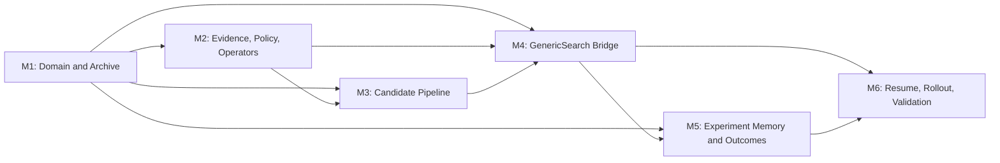
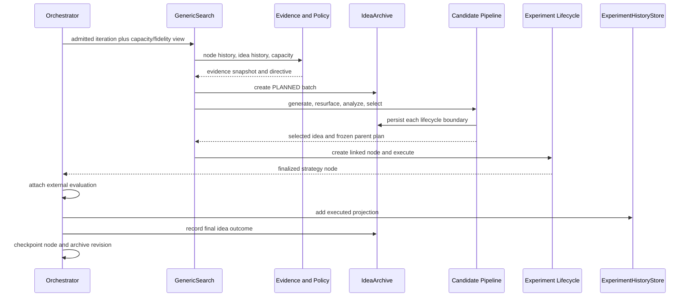

# Ideation v3 implementation — orchestrator plan

Status: **implementation in progress — M1 through M3 complete**

Design authority: [`../ideation-v3-design.md`](../ideation-v3-design.md)

This is the controlling implementation plan for ideation v3. It coordinates
six module plans, records cross-module decisions, defines integration gates,
and is the only plan allowed to change dependency order or shared contracts.

The module plans are executable work packages. They may refine internal tasks,
but a change to a shared type, lifecycle transition, write ordering, or module
boundary must first be recorded here.

## Outcome

Replace GenericSearch's ephemeral "generate one solution string" stage with a
durable, evidence-directed ideation pipeline while preserving:

- orchestrator authority over budget and fidelity;
- SearchNode/checkpoint authority over executable campaign state;
- existing implementation, evaluation-integrity, and feedback behavior;
- ExperimentHistoryStore as the executed-memory projection;
- ref-correct Git lineage; and
- strict resume of v3 campaign state only.

All generative and judgment calls use Codex CLI or Claude Code. Direct OpenAI
API access is limited to the embedding provider authenticated by
`OPENAI_API_KEY`; no ideation chat, completions, or responses call is permitted.

## Planning structure

| ID | Module plan | Responsibility | Depends on |
|---|---|---|---|
| M1 | [`01-domain-and-archive.md`](01-domain-and-archive.md) | Shared types, lifecycle rules, atomic `IdeaArchive` | — |
| M2 | [`02-evidence-policy-and-operators.md`](02-evidence-policy-and-operators.md) | Evidence snapshots, gaps, state policy, operator and parent plans | M1 |
| M3 | [`03-candidate-pipeline.md`](03-candidate-pipeline.md) | Generation adapters, analysis, duplicate alarms, bounded repair, selection | M1, M2 |
| M4 | [`04-generic-search-bridge.md`](04-generic-search-bridge.md) | `IdeationEngine`, GenericSearch integration, parent materialization, node linkage | M1, M2, M3 |
| M5 | [`05-experiment-memory-and-outcomes.md`](05-experiment-memory-and-outcomes.md) | Experiment projection, idea/experiment retrieval, finalized outcome write-back | M1; integrates after M4 |
| M6 | [`06-resume-rollout-and-validation.md`](06-resume-rollout-and-validation.md) | Checkpoint reconciliation, superseded-code removal, end-to-end tests, activation | M1–M5 |

The plans intentionally group strongly coupled responsibilities. Creating one
plan per class would distribute single invariants across too many owners and
make integration harder to reason about.

## Dependency graph



M2 and the additive, M1-dependent portion of M5 may be developed in parallel.
M3 starts when M2's contracts are stable. M4 is the first point at which v3
can execute a real experiment. M6 begins only after the live write path is
complete.

## Shared contract freeze

M1 must land these names and semantics before dependent implementation begins:

```text
IdeaId
IdeaBatchId
IdeaRecord
IdeaBatch
IdeaDescriptor
IdeaOutcome
EvidenceClaim
EvaluationGap
CampaignEvidenceSnapshot
IdeationCapacityView
PolicyDecision
SearchDirective
OperatorBrief
ParentPlan
CandidateAnalysis
SelectionDecision
CodingAgentCallRequest
CodingAgentCallResult
EmbeddingRecord
EmbeddingTelemetry
```

The freeze covers:

- ID stability and JSON representation;
- enum values and legal lifecycle transitions;
- optional versus required fields;
- objective-normalized utility semantics;
- `origin_batch_id` versus `selected_in_batch_id`;
- idea-to-node and batch-to-node join keys; and
- strict persisted-shape behavior.

Contract changes require a decision recorded below and an immediate update of
all callers, persisted fixtures, and tests. No compatibility adapter is added.

`IdeationCapacityView` is a read-only adapter over the existing
`BudgetSnapshot`, `FidelityDecision`, and fidelity timing authority. It must not
introduce an ideation-owned runtime estimator or reserve calculation.

## Proposed package boundary

Keep v3 internal to GenericSearch until another strategy needs it:

```text
src/kapso/execution/search_strategies/generic/ideation/
  __init__.py
  types.py
  archive.py
  evidence.py
  policy.py
  operators.py
  generator.py
  embeddings.py
  analyzer.py
  selector.py
  engine.py
  outcomes.py
```

This avoids prematurely making strategy-specific assumptions part of Kapso's
global execution API. Shared promotion can happen later from demonstrated use.

## File ownership during implementation

To prevent parallel plans from repeatedly editing the same high-conflict files:

| Surface | Primary owner | Rule |
|---|---|---|
| New `generic/ideation/` types and archive | M1 | Dependent plans import; they do not redefine |
| `evidence.py`, `policy.py`, `operators.py` | M2 | Pure logic; no strategy mutation |
| Generator/analyzer/selector and ideation prompts | M3 | No direct `GenericSearch.run()` edits |
| `generic/strategy.py`, parent resolution, SearchNode link fields | M4 | Sole owner until M4 integration lands |
| Experiment store, experiment MCP gate, idea-history MCP wiring, orchestrator outcome hook | M5 | Sole owner of cross-store write order |
| Checkpoint reconciliation, legacy deletion, full integration fixtures | M6 | Starts after M4 and M5 to avoid overlapping scaffolding |

When sequential work requires a later module to touch an earlier owner's file,
the later plan records the exact integration edit and tests it against the
earlier module's contract.

## Delivery strategy

Use small mergeable slices, but ship only one authoritative ideation path. The
module commits may temporarily leave unconnected new code while dependencies
land; once M4 connects v3, it directly replaces the old generator/selector
path. M6 deletes every superseded method, prompt, config field, fixture, and
test before end-to-end validation.

Do not add a live shadow mode that doubles coding-agent generation cost. Use
deterministic fixtures, captured candidate pools, and offline replay for
comparisons.

### AI and embedding provider boundary

```text
Reasoning, generation, and judgment
  -> CodingAgentCallRunner
       -> Codex CLI
       -> Claude Code

Semantic vectors
  -> OpenAIEmbeddingProvider
       -> official OpenAI embeddings endpoint
       -> official SDK default credential discovery
```

Hard rules:

- no ideation module calls `LLMBackend.llm_completion`, LiteLLM, Responses API,
  Chat Completions, or another direct generative API;
- generator, repair, selector, and optional model-assisted extraction all use
  the coding-agent runner contract;
- candidate and selector roles both accept `cli: codex|claude_code`;
- coding-agent subprocesses do not inherit `OPENAI_API_KEY` merely because the
  orchestrator needs it for embeddings;
- the embedding provider uses the official OpenAI SDK, defaults to
  `text-embedding-3-small`, and is configurable;
- embeddings are stored with provider, model, dimensions, and input hash so
  stale or incompatible vectors are never compared;
- ideation code never reads credentials or environment variables; outer
  startup and the official SDK own credential discovery;
- missing credentials or an embedding API failure propagates, while an
  explicitly disabled embedding provider runs exact and descriptor checks; and
- embedding telemetry is attributed separately from CLI-agent cost.

## Integration waves

### Wave 1 — persistence substrate

Deliver M1:

- immutable JSON-compatible domain types;
- transition validation;
- strict, atomic archive;
- idempotent mutation operations;
- archive query primitives; and
- corruption and round-trip tests.

Gate: the archive can represent the full design lifecycle without any model or
GenericSearch dependency.

### Wave 2 — deterministic decision plane

Deliver M2 and the additive schema portion of M5:

- evidence normalization;
- maximize/minimize correctness;
- claim and gap state transitions;
- deterministic policy precedence;
- operator and parent-plan construction;
- required idea linkage fields on executed records; and
- strict new experiment-store shape.

Gate: frozen fixtures deterministically produce expected modes, gap priorities,
and directives.

### Wave 3 — candidate plane

Deliver M3:

- structured generator results;
- Codex/Claude CLI runner parity for generator and selector roles;
- OpenAI embedding provider with explicit enablement and local cosine search;
- independent operator briefs;
- archived-idea resurfacing;
- exact duplicate and semantic-neighbor facts;
- feasibility and evidence checks;
- one bounded repair request; and
- structured selector decision with ordered candidate fallbacks; selector-call
  failure itself propagates without choosing a winner.

Gate: captured pools can be analyzed and selected without starting an
experiment, and every considered idea is persisted.

### Wave 4 — live search bridge

Deliver M4:

- engine transaction ordering;
- current agent adapters reused through the candidate interface;
- per-candidate parent snapshots;
- selected idea persisted before node creation;
- linked SearchNode construction; and
- existing implementation/evaluation path unchanged after the bridge.

Gate: one v3 iteration produces the same valid executed node shape plus stable
idea provenance.

### Wave 5 — outcome loop

Complete M5:

- finalized experiment projection carries idea links;
- outcome update runs after orchestrator-side evaluation;
- experiment and idea retrieval remain separate;
- missing outcome can be reconstructed idempotently; and
- MCP output labels executed versus proposed work unambiguously.

Gate: `IdeaRecord -> SearchNode -> ExperimentRecord -> IdeaOutcome` is
reconstructable after process restart.

### Wave 6 — reliability and activation

Deliver M6:

- checkpoint/archive reconciliation;
- strict checkpoint/archive reconciliation;
- deletion of superseded ideation and persistence code;
- failure-injection tests at every transaction boundary;
- abstract run 16/17/19 scenario replays;
- end-to-end v3 opt-in test; and
- default-switch evidence report.

Gate: all acceptance criteria from the design document pass before `v3`
becomes the default.

## Parallel execution guidance

The safe parallelization pattern is:

1. M1 runs alone until the contract freeze is reviewed.
2. M2 and M5's additive ExperimentRecord/schema work may run in parallel.
3. M3 starts after M2; M5 may continue on retrieval tests without touching the
   orchestrator hook.
4. M4 integrates the completed M1–M3 surfaces and owns `strategy.py`.
5. M5 then adds the live orchestrator outcome hook against M4's stable node
   links.
6. M6 runs as the integration/reliability owner after all write paths land.

Prefer one reviewable change set per module. If M5 is split, use one additive
memory-schema change and one later outcome-hook change under the same plan.
Never run M4 and M6 edits to `strategy.py` concurrently.

## Cross-module system flow



## Global invariants

All module plans must preserve these invariants:

1. A generated candidate is persisted before it can be selected.
2. A selected idea and decision are persisted before a SearchNode is created.
3. Every v3 SearchNode has exactly one `idea_id` and one
   `selection_batch_id`.
4. One idea links to at most one experiment node; recovery reuses that node.
5. Experiment memory contains only work that reached the experiment lifecycle.
6. Idea memory never supplies score truth independently of linked evaluation.
7. Budget/fidelity code is the only admission and runtime-estimation authority.
8. Parent branch, parent node, materialized ref, diff base, and feedback base
   describe the same immutable parent snapshot.
9. Technical failure does not update hypothesis value or close an evaluation
   gap.
10. An invalid or incomparable evaluation cannot update normalized utility.
11. Semantic similarity is an observation, not a reward or hard rejection.
12. Resume reuses durable work and fails loudly on conflicting links.
13. Every generative or judgment call is traceable to a Codex or Claude Code
    CLI invocation; embeddings are the only direct model API call.
14. `OPENAI_API_KEY` is never persisted, logged, or forwarded to coding-agent
    subprocesses by the ideation subsystem.

## Test strategy

Each module owns unit tests; M6 owns integration and failure-injection tests.

### Required test layers

| Layer | Purpose |
|---|---|
| Domain tests | Serialization, validation, state transitions, stable IDs |
| Store tests | Atomic writes, revision checks, strict parsing, corruption handling |
| Pure-policy tests | Mode precedence, utility direction, gap priority, operator allocation |
| Candidate tests | Structured parsing, duplicate alarms, repair quota, selector hard rules |
| Bridge tests | Parent-ref correctness, node linkage, idempotent creation |
| Memory tests | Executed-only projection, idea links, objective-aware retrieval |
| Resume tests | Crash at every durable boundary and deterministic recovery |
| Scenario replay | Cold start, collapse, contradiction, subgroup gap, proxy divergence, terminal reserve |
| End-to-end | One opt-in v3 run using mocked agents and deterministic evaluator |

### Required adversarial fixtures

- minimizing objective where raw descending order is wrong;
- semantically similar idea with a materially different parent/test;
- exact duplicate with cosmetic rewording;
- all ensemble members returning one approach family;
- selected idea persisted immediately before a crash;
- experiment persisted immediately before idea outcome write;
- invalid evaluation that appears to improve the score;
- technical failure followed by successful recovery;
- high-impact gap repeatedly deferred; and
- delivery-grade incumbent with insufficient capacity for another comparable
  run.

## Definition of complete

The implementation is complete only when:

- all design acceptance criteria pass;
- every module plan's definition of done is satisfied;
- incompatible pre-v3 state fails loudly or is explicitly discarded;
- no legacy ideation code, prompt, config field, or test remains;
- the candidate population and selector decision survive a crash;
- experiment and idea retrieval never conflate proposed and executed work;
- benchmark scenario replay demonstrates the intended state transitions; and
- documentation for configuration, storage, and operator behavior is updated.

## Decision log

| ID | Decision | Reason |
|---|---|---|
| D1 | Keep v3 strategy-local under `generic/ideation/` | Avoid premature global API surface |
| D2 | Use six implementation plans | Match coupling and reduce coordination overhead |
| D3 | Keep archive separate from checkpoint and experiment JSON | Avoid mixed lifecycles and dual-write authority |
| D4 | Use explicit link IDs rather than embedded candidate pools | Preserve provenance without contaminating experiment records |
| D5 | Replace legacy ideation directly; no runtime compatibility mode | The repository is pre-release and carries no legacy weight |
| D6 | Persist outcomes after orchestrator candidate evaluation | External metrics and validity must be attached first |
| D7 | Give `strategy.py` to M4 and `orchestrator.py` write ordering to M5 | Minimize high-conflict parallel edits |
| D8 | Use Codex/Claude Code CLIs for every AI reasoning call | Reuse existing agent execution, tool, auth, timeout, and telemetry boundaries |
| D9 | Use direct OpenAI API only through a narrow embedding provider | Embeddings are mechanical similarity features, not generative judgment |
| D10 | Default idea embeddings to `text-embedding-3-small` | Duplicate alarms favor low cost; the model remains configurable and versioned |
| D11 | Use one exact archive schema identity, not per-record versions | Strict replacement needs one accepted shape and no migration branches |
| D12 | Freeze resolved parent provenance and per-candidate dispositions in the domain | Generation and selection must be reproducible without reconstructing hidden choices |
| D13 | Make recoverable technical failure a zero-generation execution action | Recovery resumes the same linked idea and node; generating a replacement would corrupt one-idea/one-node provenance |
| D14 | Fail loudly on coding-agent, embedding, parsing, and selector errors | Synthetic candidates, automatic embedding degradation, and fallback winners hide broken evidence and make replay non-equivalent |
| D15 | Append at most one repair candidate while a generated batch is still unanalyzed | Preserve the durable initial population while making repair resumable without reopening an analyzed lifecycle state |
| D16 | Permit unresolved model-claimed claim IDs only while an idea is generated, invalid, or abandoned | Preserve semantically invalid structured output for audit while preventing any dangling claim reference from reaching a selectable lifecycle state |

## Progress ledger

Update this table as implementation work lands. Do not use prose status buried
inside module plans as the campaign-level source of truth.

| Module | Status | Implementation reference | Validation reference | Blocker |
|---|---|---|---|---|
| M1 Domain and Archive | Complete | `generic/ideation/types.py`, `archive.py` | 22 current archive/domain tests | — |
| M2 Evidence, Policy, Operators | Complete | `generic/ideation/evidence.py`, `policy.py`, `operators.py` | 21 focused tests; 41 cumulative | — |
| M3 Candidate Pipeline | Complete | `generic/ideation/coding_agents.py`, `generator.py`, `embeddings.py`, `analyzer.py`, `selector.py` | 38 dedicated plus 2 archive integration tests; 81 cumulative | — |
| M4 GenericSearch Bridge | Not started | — | — | M1–M3 |
| M5 Experiment Memory and Outcomes | Not started | — | — | M1; live integration waits for M4 |
| M6 Resume, Rollout, Validation | Not started | — | — | M1–M5 |

## Plan-maintenance protocol

For every implementation change:

1. identify the owning module plan;
2. confirm its prerequisites are complete;
3. update the module checklist and tests;
4. record any cross-contract decision in this file before coding it;
5. update the progress ledger with the commit or pull request; and
6. run the integration gates for the current wave.

This file coordinates work. It should not duplicate the detailed task lists in
the module plans.
