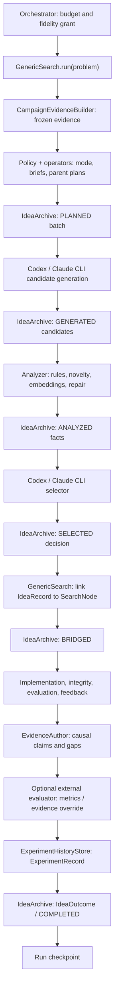

# Ideation v3 — implemented system

Status: **implemented and activated as the sole Generic ideation path**

This is the concise implementation reference. The longer
[`ideation-v3-design.md`](ideation-v3-design.md) preserves design rationale and
the [`ideation-v3-implementation/`](ideation-v3-implementation/) directory owns
module delivery history and validation ownership.

## System flow



The ordering is intentional. Selection is durable before execution starts;
executed memory is durable before the final idea outcome; the checkpoint is
last. Resume reconciles any valid interruption between these writes.

## Module responsibilities

| Module | Owns | Does not own |
|---|---|---|
| `CampaignEvidenceBuilder` | Immutable, objective-aware executed evidence; claims and gaps | Policy or model judgment |
| `choose_policy` | Deterministic precedence for finalize, recover, verify, explore, exploit | Persistence or capacity invention |
| Operator planner | Candidate quota, distinct intervention descriptors, gap reservation, parent plans | Final selection |
| `CandidateGenerator` | Independent structured proposals through CLI roles | Candidate comparison |
| `CandidateAnalyzer` | Schema/evidence/capacity rules, exact and descriptor duplicates, embedding neighbors, one bounded repair request | Overriding hard rules with predicted utility |
| `CandidateSelector` | Structured comparative judgment, rejection audit, winner and fallbacks | Selecting an ineligible idea |
| `EvidenceAuthor` | Read-only coding-agent review of the full code diff and evaluation record; strict causal claims and open/targeted gaps | Inferring causality from score alone |
| `IdeaArchive` | Atomic proposal lifecycle, optimistic revisions, embeddings, decisions, links, outcomes | Executed score authority or Git mutation |
| `IdeationEngine` | Phase ordering and phase-exact resume | Experiment implementation |
| `GenericSearch` | Capacity adapter, Git parent resolution, inline node bridge, implementation/evaluation handoff, reconciliation | Budget/fidelity authority |
| `ExperimentHistoryStore` | Atomic, strict, executed-only projection; persisted full-solution embeddings and cosine retrieval | Unexecuted candidates |
| `OrchestratorAgent` | Budget/fidelity authority, external evaluation, ExperimentRecord → IdeaOutcome → checkpoint ordering | Ideation policy |
| Evaluator evidence adapter | Mechanical validation and atomic write-back of built-in or externally overridden evidence | Authoring causal judgments |

## Selection and novelty

Novelty is evidence, not a scalar reward and not different wording.

- Exact proposal duplicates without changed conditions are ineligible.
- Descriptor equality flags the same approach family, intervention target,
  mechanism, and expected effect.
- OpenAI embeddings provide semantic-neighbor facts; they never decide value.
- Distinct operator briefs force intervention-level diversity before generation.
- If eligible descriptor diversity is below the configured minimum, exactly one
  repair call targets a missing descriptor. There is no unbounded retry loop.
- The selector sees hard-rule results and may only choose an eligible candidate.

Explore/exploit is state-driven. A plateau or unresolved high-value gap can
trigger exploration late; credible progress can trigger exploitation early;
suspicious gains or proxy divergence trigger verification; technical failures
trigger same-node recovery. Iteration number alone never chooses the mode.

Recovery preserves identity and accounting: it increments
`SearchNode.execution_revision`, reuses the linked idea and node, and adds the
new attempt's ideation, implementation, feedback, and evidence-author
telemetry to the existing phase totals. Node duration and cost therefore
describe the full idea execution history, including failed attempts.

## Parent and execution identity

Every operator uses one `ParentPlan`: `baseline`, `best_valid`,
`specific_experiment`, or `recover_branch`. Before generation it becomes a
`ResolvedParentSnapshot` containing node, branch, Git, materialization, diff,
and feedback refs. The selected snapshot is immutable across generation,
implementation, diffing, feedback, checkpoint, and resume.

The durable join is:

```text
IdeaBatch.batch_id
  -> SelectionDecision.selected_idea_id
  -> IdeaRecord.idea_id + selected_in_batch_id + experiment_node_id
  -> SearchNode.idea_id + selection_batch_id + node_id
  -> ExperimentRecord.idea_id + selection_batch_id + node_id
  -> IdeaRecord.outcome
```

## Memory boundaries

| Authority | Question |
|---|---|
| Run checkpoint / `SearchNode` | What executable campaign state exists? |
| `IdeaArchive` | What was considered, why, from which parent, and what happened to it? |
| `ExperimentHistoryStore` | What was actually executed and measured? |
| `RepoMemory` | What does this exact branch know about the repository? |

Unselected ideas never enter experiment memory. Candidate/repair packets carry
the complete proposal archive; the selector receives the current eligible pool
and its analyses, including archived candidates deliberately resurfaced into
that pool. No idea-history MCP gate is needed. Experiment MCP tools retain
executed-only semantics. Experiment records use the strict
`kapso.experiment_history.v4` shape; each executed solution is embedded once,
reconciliation reuses that vector, and a store without an embedding backend is
explicitly recency-only.

## Evaluator evidence write-back

Scores determine utility, never causality. After a successful integrity-valid
Generic evaluation, a default read-only Codex call reviews the complete code
diff, evaluation output, and feedback and publishes
`external_evaluation_metadata.ideation_evidence` with the exact keys `claims`,
`open_gaps`, and `targeted_gap_updates`. Every non-empty finding must cite the
exact diff reference and an exact evaluation-output or feedback reference.
Claims and targeted gap updates additionally require a current registered
evaluation attempt; an unregistered run may only author open gaps. Empty lists
are valid.

The call uses a deterministic operation ID and durable result artifacts. Its
latest operation and artifact paths are recorded under the externally reserved
`ideation_evidence_author` metadata key, and its cost, duration, call count, and
token counts are attributed to the node's `evidence_author` phase. A caller
owned iteration evaluator may explicitly replace `ideation_evidence`; ordinary
metadata merges around the built-in evidence, and it may not replace
`ideation_evidence_author`.

The adapter mechanically creates content-addressed claim and gap IDs tied to
the current idea and experiment node. Claims may be `supported` or
`contradicted`; new gaps are `open`; an existing gap may move from `open` to
`inconclusive` or `closed` only when the selected idea explicitly targeted it.
The outcome, claims, gaps, idea state, and batch state commit in one archive
revision. `IdeaOutcome.gap_effects` contains the exact affected gap IDs.
Replay accepts only monotonic descendants: accumulated sources and experiment
provenance, newer timestamps, higher deferral counts, and legal gap-state
transitions. Changed immutable identity, removed provenance, reversed claim
classification, or regressed gap state is an identity conflict.

When a directive reserves a gap but selection chooses an idea that does not
target it, that open gap's deferral count and consideration timestamp advance
atomically with the selection. This is the only mechanism that creates gap
debt; the next evidence snapshot can therefore emit `SUPPORTED_LEVER` or
`GAP_DEBT`, and policy can move to `EXPLOIT` or gap-directed `EXPLORE` without
guessing from a score.

## AI and credential boundary

- Candidate, repair, selector, and evidence-author reasoning uses `codex` or
  `claude` CLI.
- Each call has a deterministic operation ID and durable `result.json`; a
  completed operation replays without another model call. Prompt, schema, CLI,
  model, effort, tools, and timeout are pinned in its artifacts, so reusing an
  operation ID with changed invocation semantics fails loudly.
- Within ideation, only `OpenAIEmbeddingProvider` calls a direct model API;
  executed-memory indexing uses the shared `LLMBackend` embedding role.
- Cached vectors require exact provider, model, dimensions, and canonical-input
  hash equality.
- The outer process/official SDK owns OpenAI credential discovery. Ideation code
  never reads `.env`, and CLI subprocesses explicitly exclude
  `OPENAI_API_KEY`.
- Provider, schema, timeout, and selector failures propagate. Disabling
  embeddings is explicit configuration, not an automatic degradation path.

## Resume and reconciliation

The exact Generic checkpoint includes schema/campaign/archive identity and
revision, active batch, strict node history, iteration/errors, integrity state,
and evaluator transition state. Pre-v3 state is unsupported.

Within a batch:

- `PLANNED` resumes generation;
- `GENERATED` reuses the persisted pool and resumes analysis;
- `ANALYZED` resumes selection;
- `SELECTED` reuses the decision and bridges it; and
- `BRIDGED` reconstructs the same-node recoverable execution when necessary.

Across stores, reconciliation can recreate a missing `ExperimentRecord`, build
a checkpoint node from a strict record, or write a missing `IdeaOutcome`. It is
idempotent. Changed problem/iteration/frozen parent context, non-contiguous IDs,
or conflicting links fail loudly.

`ExperimentRecord` carries phase telemetry as well as total cost and duration,
so store-ahead reconstruction preserves the complete accounting basis. When a
`BRIDGED` idea exists before any experiment record, reconciliation reconstructs
the already durable generation, embedding, and selector telemetry from its
batch before same-node recovery.

## Canonical configuration

Modes select one profile:

```yaml
ideation_profile: DEFAULT
search_strategy:
  type: generic
  params:
    implementation_model: us.anthropic.claude-opus-4-6-v1
    implementation_timeout: 600
    implementation_gates: [research, repo_memory, leeroopedia]
```

The profile itself exists only in `src/kapso/config.yaml:ideation_profiles` and
owns all ideation settings. Generic accepts the exact injected `ideation`
shape; deleted fields and pre-v3 aliases are errors.

## Validation evidence

`tests/test_ideation_v3_integration.py` executes a real policy/operator/
generator/analyzer/embedding/selector/archive/Generic bridge, then the real
orchestrator persistence ordering. It captures a stale `BRIDGED` checkpoint,
advances experiment memory and the archive to `COMPLETED`, reloads both stores,
and reconciles twice while asserting no duplicate batch, idea, node, record,
outcome, CLI call, or embedding call.

Focused unit suites cover strict domain/archive schemas, evidence and policy,
operators, CLI adapters and replay, embeddings, analysis, selection, outcomes,
parent refs, checkpoint corruption, durable operation replay, `GENERATED` and
`ANALYZED` resume, the `SELECTED` bridge, and `BRIDGED` reconciliation.

## Validation boundary

The automated E2E uses deterministic boundaries so crash/replay behavior is
repeatable. Activation also ran a credentialed ideation transaction with the
configured Codex and Claude Code CLIs plus the real OpenAI embedding provider:
two independently generated candidates passed deterministic analysis, the
persisted `ANALYZED` batch resumed without regenerating or re-embedding, and a
real Codex selector advanced it to `SELECTED`.

That smoke validates ideation, credentials, schemas, network access, artifacts,
and phase-exact resume. Benchmark implementation and evaluator availability
remain deployment concerns and are exercised by their own campaign smoke runs,
not by the ideation module's portable test suite.

The built-in evidence-author boundary was also exercised through the configured
live Codex CLI against a complete synthetic diff/evaluation packet. The strict
schema and provenance checks accepted a conservative result with no causal
claim and one open gap, demonstrating that abstention survives the real CLI
path rather than being replaced by score narration.
