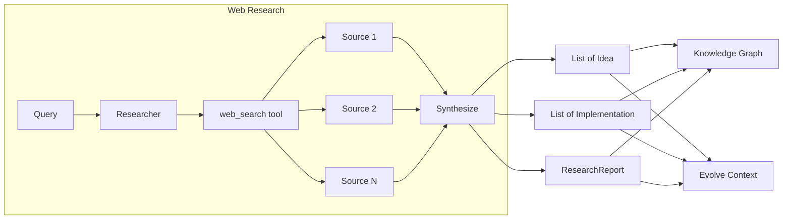

Kapso includes a powerful web research system that gathers domain knowledge from the public web. This is useful when your Knowledge Graph doesn't have the information you need, or when you want fresh implementation references.

## Overview

The research system uses OpenAI's `web_search` tool with reasoning capabilities to:

1. **Search the web** for authoritative sources on your topic
2. **Cross-validate** claims across multiple sources
3. **Synthesize** findings into structured results
4. **Return** typed results based on mode:
   - `List[Idea]` for idea mode
   - `List[Implementation]` for implementation mode
   - `ResearchReport` for study mode
   - `ResearchFindings` for multiple modes (e.g., `["idea", "implementation"]`)



## Research Modes

The research system supports three modes, each optimized for different use cases:

| Mode | Description | Returns | Best For |
|------|-------------|---------|----------|
| `idea` | Conceptual understanding, principles, trade-offs | `List[Idea]` | Learning new domains, understanding best practices |
| `implementation` | Code examples, APIs, libraries, configuration | `List[Implementation]` | Building features, finding working code |
| `study` | Comprehensive research report (academic style) | `ResearchReport` | Deep understanding, literature review |
| `["idea", "implementation"]` | Multiple modes in one call | `ResearchFindings` | Getting both ideas and code in one request |

## Research Depth

Control the thoroughness of research:

| Depth | Reasoning Effort | Use Case |
|-------|------------------|----------|
| `light` | Medium | Quick answers, well-documented topics |
| `deep` | High | Complex topics, thorough research needed |

## Basic Usage

### Idea Mode

```python
from src.kapso import Kapso

kapso = Kapso()

# Research ideas - returns List[Idea]
ideas = kapso.research(
    "QLoRA fine-tuning best practices for LLaMA models",
    mode="idea",
    top_k=10,
    depth="deep",
)

for idea in ideas:
    print(idea.query)      # Original query
    print(idea.source)     # URL
    print(idea.content)    # Full content with sections
    print(idea.to_string())  # Formatted for LLM context
```

### Implementation Mode

```python
from src.kapso import Kapso

kapso = Kapso()

# Research implementations - returns List[Implementation]
implementations = kapso.research(
    "unsloth FastLanguageModel example",
    mode="implementation",
    top_k=5,
    depth="deep",
)

for impl in implementations:
    print(impl.query)      # Original query
    print(impl.source)     # URL
    print(impl.content)    # Full content with code snippet
    print(impl.to_string())  # Formatted for LLM context
```

### Study Mode

```python
from src.kapso import Kapso

kapso = Kapso()

# Research report - returns ResearchReport
report = kapso.research(
    "Comparison of LoRA, QLoRA, and full fine-tuning",
    mode="study",
    depth="deep",
)

print(report.query)      # Original query
print(report.content)    # Full academic-style report
print(report.to_string())  # Formatted for LLM context
```

### Multiple Modes

```python
from src.kapso import Kapso

kapso = Kapso()

# Research with multiple modes - returns ResearchFindings
findings = kapso.research(
    "QLoRA fine-tuning best practices",
    mode=["idea", "implementation"],
    top_k=5,
)

# Access results
for idea in findings.ideas:
    print(idea.to_string())

for impl in findings.implementations:
    print(impl.to_string())

# Use combined results as context
print(findings.to_string())
```

## Research → Evolve (Add Context)

Use research results to provide additional context during solution building:

```python
from src.kapso import Kapso

kapso = Kapso()

# Research with multiple modes
findings = kapso.research(
    "unsloth FastLanguageModel example",
    mode=["idea", "implementation"],
    top_k=5,
)

# Use research as context for evolve
# Download dataset first (e.g., from HuggingFace)
# from datasets import load_dataset
# dataset = load_dataset("theatticusproject/cuad")
# dataset.save_to_disk("./data/cuad_dataset")
solution = kapso.evolve(
    goal="Fine-tune a model with Unsloth + LoRA",
    context=[findings.to_string()],
    output_path="./models/unsloth_v1",
)
```

## Research → Learn (Ingest into KG)

Permanently add research findings to your Knowledge Graph:

```python
from src.kapso import Kapso

kapso = Kapso()

# Research with multiple modes
findings = kapso.research(
    "LoRA rank selection best practices",
    mode=["idea", "implementation"],
    top_k=5,
)

# Ingest all results into Knowledge Graph
kapso.learn(
    *findings.ideas,
    *findings.implementations,
    wiki_dir="data/wikis",
)

# Or learn from a study report
report = kapso.research(
    "LoRA rank selection best practices",
    mode="study",
)
kapso.learn(report, wiki_dir="data/wikis")
```

## Source Quality

The research system prioritizes sources in this order:

1. **Official documentation** — Maintainers, standards bodies
2. **Original papers** — arXiv, peer-reviewed publications
3. **Major vendors** — OpenAI, Google, Meta, Microsoft, NVIDIA
4. **Well-known engineers** — Established track record

Sources that are de-prioritized:
- SEO content farms
- Generic blog posts without evidence
- Single-source claims without corroboration

## Output Format

### Idea Content Sections

Each `Idea` contains structured content with:
- Description
- How to Apply
- When to Use
- Why Related
- Trade-offs
- Examples
- Prerequisites
- Related Concepts

### Implementation Content Sections

Each `Implementation` contains structured content with:
- Description
- Why Related
- When to Use
- Code Snippet
- Dependencies
- Configuration Options
- Trade-offs
- Common Pitfalls
- Performance Notes

### Study Report Sections

`ResearchReport` contains a full academic-style report with:
- Key Takeaways
- Abstract
- Introduction
- Background
- Literature Review
- Methodology Comparison
- Implementation Guide
- Evaluation & Benchmarks
- Limitations
- Conclusion
- References

## Configuration

The research system uses OpenAI's Responses API. Ensure you have:

```bash
# .env
OPENAI_API_KEY=your-openai-api-key
```

The default model is `gpt-5.2` with web search capabilities.

## API Reference

### `Kapso.research()`

```python
def research(
    self,
    query: str,
    *,
    mode: Union[str, List[str]],  # Required - single mode or list
    top_k: int = 5,  # For idea/implementation modes
    depth: Literal["light", "deep"] = "deep",
) -> Union[List[Idea], List[Implementation], ResearchReport, ResearchFindings]:
    """
    Perform deep public web research.
    
    Args:
        query: What to research (be specific)
        mode: Research mode (required). Can be:
            - Single mode: "idea", "implementation", or "study"
            - List of modes: ["idea", "implementation"]
        top_k: Max results for idea/implementation modes
        depth: How thorough - light (faster) or deep (more comprehensive)
    
    Returns:
        - List[Idea] if mode="idea"
        - List[Implementation] if mode="implementation"
        - ResearchReport if mode="study"
        - ResearchFindings if mode is a list
    """
```

### Data Classes

```python
@dataclass
class Idea:
    query: str    # Original research query
    source: str   # URL where this idea came from
    content: str  # Full content with sections
    
    def to_string(self) -> str:
        """Format for use as context in evolve()"""
    
    def to_dict(self) -> Dict[str, Any]:
        """Convert to dictionary"""

@dataclass
class Implementation:
    query: str    # Original research query
    source: str   # URL where this implementation came from
    content: str  # Full content with code snippet
    
    def to_string(self) -> str:
        """Format for use as context in evolve()"""
    
    def to_dict(self) -> Dict[str, Any]:
        """Convert to dictionary"""

@dataclass
class ResearchReport:
    query: str    # Original research query
    content: str  # Full markdown report
    
    def to_string(self) -> str:
        """Format for use as context in evolve()"""
    
    def to_dict(self) -> Dict[str, Any]:
        """Convert to dictionary"""

@dataclass
class ResearchFindings:
    query: str                              # Original research query
    ideas: List[Idea]                       # Ideas (if idea mode was run)
    implementations: List[Implementation]   # Implementations (if implementation mode was run)
    report: Optional[ResearchReport]        # Report (if study mode was run)
    
    def to_string(self) -> str:
        """Format all findings for use as context in evolve()"""
    
    def to_dict(self) -> Dict[str, Any]:
        """Convert to dictionary"""
```

## Next Steps

<CardGroup cols={2}>
  <Card title="Learning Pipeline" icon="graduation-cap" href="/docs/knowledge/learning-pipeline">
    Learn how to ingest research into your Knowledge Graph
  </Card>
  <Card title="Evolve System" icon="flask" href="/docs/evolve/overview">
    Use research context to build better solutions
  </Card>
</CardGroup>
