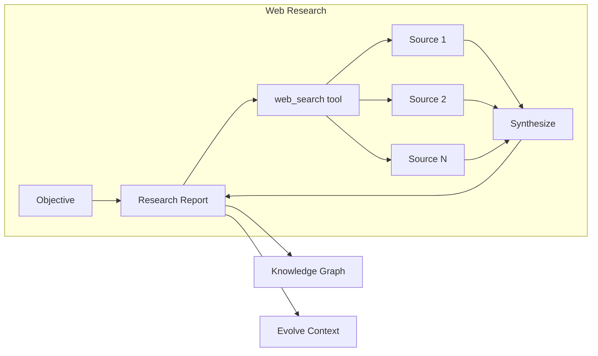

Kapso includes a powerful web research system that gathers domain knowledge from the public web. This is useful when your Knowledge Graph doesn't have the information you need, or when you want fresh implementation references.

## Overview

The research system uses OpenAI's `web_search` tool with reasoning capabilities to:

1. **Search the web** for authoritative sources on your topic
2. **Cross-validate** claims across multiple sources
3. **Synthesize** findings into a structured markdown report
4. **Return** a `Source.Research` object that can be ingested into the Knowledge Graph



## Research Modes

The research system supports three modes, each optimized for different use cases:

| Mode | Description | Best For |
|------|-------------|----------|
| `idea` | Conceptual understanding, principles, trade-offs | Learning new domains, understanding best practices |
| `implementation` | Code examples, APIs, libraries, configuration | Building features, finding working code |
| `both` | Combined principles + implementation | Complete understanding before building |

## Research Depth

Control the thoroughness of research:

| Depth | Reasoning Effort | Use Case |
|-------|------------------|----------|
| `light` | Medium | Quick answers, well-documented topics |
| `deep` | High | Complex topics, thorough research needed |

## Basic Usage

### Quick Research

```python
from src.kapso import Kapso

kapso = Kapso()

# Research best practices
research = kapso.research(
    "QLoRA fine-tuning best practices for LLaMA models",
    mode="both",
    depth="deep",
)

# View the report
print(research.report_markdown)
```

### Research → Evolve (Add Context)

Use research results to provide additional context during solution building:

```python
from src.kapso import Kapso

kapso = Kapso()

# Research implementation details
research = kapso.research(
    "unsloth FastLanguageModel example",
    mode="implementation",
    depth="deep",
)

# Use research as context for evolve
solution = kapso.evolve(
    goal="Fine-tune a model with Unsloth + LoRA",
    additional_context=research.to_context_string(),
    output_path="./models/unsloth_v1",
)
```

### Research → Learn (Ingest into KG)

Permanently add research findings to your Knowledge Graph:

```python
from src.kapso import Kapso, Source

kapso = Kapso()

# Research a topic
research = kapso.research(
    "LoRA rank selection best practices",
    mode="idea",
    depth="deep",
)

# Ingest into Knowledge Graph
kapso.learn(research, wiki_dir="data/wikis")
```

## Source Quality

The research system prioritizes sources in this order:

1. **Official documentation** — Maintainers, standards bodies
2. **Original papers** — arXiv, peer-reviewed publications
3. **Major vendors** — OpenAI, Google, Meta, Microsoft, NVIDIA
4. **Well-known engineers** — Established track record

Sources that are de-prioritized:
- SEO content farms
- Generic blog posts without evidence
- Single-source claims without corroboration

## Output Format

Research reports are structured markdown with:

### Idea Mode
- `## Summary` — Key takeaways (5-10 bullets)
- `## Key sources (ranked)` — Best sources with URLs and trust reasons
- `## Core concepts` — Fundamental principles
- `## Trade-offs` — Important decisions and their implications
- `## Common pitfalls` — What to avoid

### Implementation Mode
- `## Summary` — Key takeaways
- `## Top sources (ranked)` — Best sources with GitHub stats
- `## Recommended approach` — Step-by-step implementation
- `## Key APIs / libraries` — Tools and dependencies
- `## Configuration & knobs` — Important settings
- `## Minimal example` — Working code snippet
- `## Error handling & debugging` — Common issues

### Both Mode
Combines both formats with clearly separated sections.

## Configuration

The research system uses OpenAI's Responses API. Ensure you have:

```bash
# .env
OPENAI_API_KEY=your-openai-api-key
```

The default model is `gpt-5` with web search capabilities.

## API Reference

### `Kapso.research()`

```python
def research(
    self,
    objective: str,
    *,
    mode: Literal["idea", "implementation", "both"] = "both",
    depth: Literal["light", "deep"] = "deep",
) -> Source.Research:
    """
    Perform deep public web research.
    
    Args:
        objective: What to research (be specific)
        mode: Research focus - ideas, implementation, or both
        depth: How thorough - light (faster) or deep (more comprehensive)
    
    Returns:
        Source.Research with report_markdown and to_context_string()
    """
```

### `Source.Research`

```python
@dataclass
class Research:
    objective: str           # Original research query
    mode: str               # "idea" | "implementation" | "both"
    report_markdown: str    # Full research report
    
    def to_context_string(self) -> str:
        """Format for use as additional_context in evolve()"""
```

## Next Steps

<CardGroup cols={2}>
  <Card title="Learning Pipeline" icon="graduation-cap" href="/docs/knowledge/learning-pipeline">
    Learn how to ingest research into your Knowledge Graph
  </Card>
  <Card title="Evolve System" icon="flask" href="/docs/evolve/overview">
    Use research context to build better solutions
  </Card>
</CardGroup>
