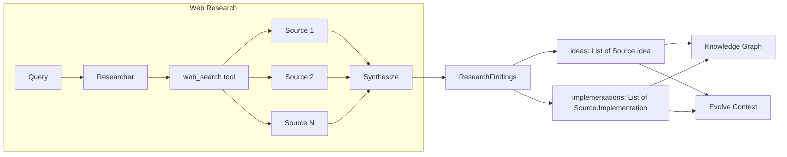

Kapso includes a powerful web research system that gathers domain knowledge from the public web. This is useful when your Knowledge Graph doesn't have the information you need, or when you want fresh implementation references.

## Overview

The research system uses OpenAI's `web_search` tool with reasoning capabilities to:

1. **Search the web** for authoritative sources on your topic
2. **Cross-validate** claims across multiple sources
3. **Synthesize** findings into structured results
4. **Return** `ResearchFindings` containing ideas and implementations



## Research Modes

The research system supports three modes:

| Mode | Description | Returns |
|------|-------------|---------|
| `idea` | Conceptual understanding, principles, trade-offs | Ideas only |
| `implementation` | Code examples, APIs, libraries, configuration | Implementations only |
| `both` | Both ideas and implementations (default) | Both |

## Research Depth

Control the thoroughness of research:

| Depth | Reasoning Effort | Use Case |
|-------|------------------|----------|
| `light` | Medium | Quick answers, well-documented topics |
| `deep` | High | Complex topics, thorough research needed |

## Basic Usage

```python
from src.kapso import Kapso

kapso = Kapso()

# Research returns ResearchFindings
# mode: "idea" | "implementation" | "both" (default: "both")
# depth: "light" | "deep" (default: "deep")

findings = kapso.research(
    "QLoRA fine-tuning best practices for LLaMA models",
    mode="both",
    depth="deep",
)

# Access results
for idea in findings.ideas:
    print(idea.query)      # Original query
    print(idea.source)     # URL
    print(idea.content)    # Full content with sections
    print(idea.to_string())  # Formatted for LLM context

for impl in findings.implementations:
    print(impl.query)      # Original query
    print(impl.source)     # URL
    print(impl.content)    # Full content with code snippet
    print(impl.to_string())  # Formatted for LLM context
```

### Idea Mode Only

```python
findings = kapso.research(
    "QLoRA fine-tuning best practices",
    mode="idea",
    depth="deep",
)

for idea in findings.ideas:
    print(idea.to_string())
```

### Implementation Mode Only

```python
findings = kapso.research(
    "unsloth FastLanguageModel example",
    mode="implementation",
    depth="deep",
)

for impl in findings.implementations:
    print(impl.to_string())
```

## Research → Evolve (Add Context)

Use research results to provide additional context during solution building:

```python
from src.kapso import Kapso

kapso = Kapso()

# Research
findings = kapso.research(
    "unsloth FastLanguageModel example",
    mode="both",
    depth="deep",
)

# Use research as context for evolve
solution = kapso.evolve(
    goal="Fine-tune a model with Unsloth + LoRA",
    context=[findings.to_string()],
    output_path="./models/unsloth_v1",
)
```

## Research → Learn (Ingest into KG)

Permanently add research findings to your Knowledge Graph:

```python
from src.kapso import Kapso

kapso = Kapso()

# Research
findings = kapso.research(
    "LoRA rank selection best practices",
    mode="both",
    depth="deep",
)

# Ingest all results into Knowledge Graph
kapso.learn(
    *findings.ideas,
    *findings.implementations,
    wiki_dir="data/wikis",
)
```

## Source Quality

The research system prioritizes sources in this order:

1. **Official documentation** — Maintainers, standards bodies
2. **Original papers** — arXiv, peer-reviewed publications
3. **Major vendors** — OpenAI, Google, Meta, Microsoft, NVIDIA
4. **Well-known engineers** — Established track record

Sources that are de-prioritized:
- SEO content farms
- Generic blog posts without evidence
- Single-source claims without corroboration

## Output Format

### Idea Content Sections

Each `Source.Idea` contains structured content with:
- Description
- How to Apply
- When to Use
- Why Related
- Trade-offs
- Examples
- Prerequisites
- Related Concepts

### Implementation Content Sections

Each `Source.Implementation` contains structured content with:
- Description
- Why Related
- When to Use
- Code Snippet
- Dependencies
- Configuration Options
- Trade-offs
- Common Pitfalls
- Performance Notes

## Configuration

The research system uses OpenAI's Responses API. Ensure you have:

```bash
# .env
OPENAI_API_KEY=your-openai-api-key
```

## API Reference

### `Kapso.research()`

```python
def research(
    self,
    objective: str,
    *,
    mode: str = "both",  # "idea" | "implementation" | "both"
    depth: str = "deep",  # "light" | "deep"
) -> ResearchFindings:
    """
    Perform deep public web research.
    
    Args:
        objective: What to research (be specific)
        mode: Research mode - "idea", "implementation", or "both"
        depth: How thorough - "light" (faster) or "deep" (more comprehensive)
    
    Returns:
        ResearchFindings containing ideas and implementations
    """
```

### Data Classes

```python
from src.knowledge_base.types import Source, ResearchFindings

@dataclass
class Source.Idea:
    query: str    # Original research query
    source: str   # URL where this idea came from
    content: str  # Full content with sections
    
    def to_string(self) -> str:
        """Format for use as context in evolve()"""
    
    def to_dict(self) -> Dict[str, Any]:
        """Convert to dictionary"""

@dataclass
class Source.Implementation:
    query: str    # Original research query
    source: str   # URL where this implementation came from
    content: str  # Full content with code snippet
    
    def to_string(self) -> str:
        """Format for use as context in evolve()"""
    
    def to_dict(self) -> Dict[str, Any]:
        """Convert to dictionary"""

@dataclass
class ResearchFindings:
    query: str                              # Original research query
    ideas: List[Source.Idea]                # Ideas (if idea mode was run)
    implementations: List[Source.Implementation]  # Implementations (if implementation mode was run)
    report: Optional[Source.ResearchReport]  # Report (if study mode was run)
    
    def to_string(self) -> str:
        """Format all findings for use as context in evolve()"""
    
    def to_dict(self) -> Dict[str, Any]:
        """Convert to dictionary"""
```

## Next Steps

<CardGroup cols={2}>
  <Card title="Learning Pipeline" icon="graduation-cap" href="/docs/knowledge/learning-pipeline">
    Learn how to ingest research into your Knowledge Graph
  </Card>
  <Card title="Evolve System" icon="flask" href="/docs/evolve/overview">
    Use research context to build better solutions
  </Card>
</CardGroup>
