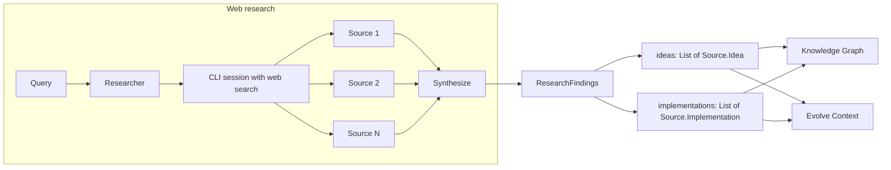

Kapso can research a topic on the public web and hand the findings back as structured sources. This is useful when your knowledge graph doesn't have the information you need, or when you want fresh implementation references.

Research runs as one read-only coding-agent CLI session with live web search — by default the Codex CLI on `gpt-5.6-sol`, from the platform's `inference` block — which searches authoritative sources, cross-validates claims across them, and synthesizes the results into typed sources.


```mermaid
flowchart LR
    subgraph Research["Web research"]
        Q[Query] --> R[Researcher]
        R --> WS[CLI session with web search]
        WS --> S1[Source 1]
        WS --> S2[Source 2]
        WS --> S3[Source N]
        S1 & S2 & S3 --> SYN[Synthesize]
    end
    
    SYN --> RF[ResearchFindings]
    RF --> I[ideas: List of Source.Idea]
    RF --> IM[implementations: List of Source.Implementation]
    
    I & IM --> KG[Knowledge Graph]
    I & IM --> CTX[Evolve Context]
```

## What are the research modes?

`mode` takes one of three values, or a list of them:

| Mode | Description | Returns |
|------|-------------|---------|
| `idea` | Conceptual understanding, principles, trade-offs | `List[Source.Idea]` |
| `implementation` | Code examples, APIs, libraries, configuration | `List[Source.Implementation]` |
| `study` | A comprehensive report on the topic | `Source.ResearchReport` |

The default is `["idea", "implementation"]`. **A list of modes returns a `ResearchFindings`** with `.ideas`, `.implementations` and `.report` filled per mode; **a single mode string returns that mode's result directly** — a bare list, with no `.ideas` attribute to reach for.

## How deep should a search go?

| Depth | Web-search context | Use case |
|-------|--------------------|----------|
| `light` | Medium | Quick answers, well-documented topics |
| `deep` | High | Complex topics, thorough research needed |

## How do I run research?

```python
from kapso import Kapso

kapso = Kapso()

# mode: "idea" | "implementation" | "study", or a list
#       (default: ["idea", "implementation"])
# depth: "light" | "deep" (default: "deep")

findings = kapso.research(
    "QLoRA fine-tuning best practices for LLaMA models",
    depth="deep",
)

# Access results
for idea in findings.ideas:
    print(idea.query)      # Original query
    print(idea.source)     # URL
    print(idea.content)    # Full content with sections
    print(idea.to_string())  # Formatted for LLM context

for impl in findings.implementations:
    print(impl.query)      # Original query
    print(impl.source)     # URL
    print(impl.content)    # Full content with code snippet
    print(impl.to_string())  # Formatted for LLM context
```

### Single-mode calls

A single mode string skips the `ResearchFindings` wrapper and returns the results directly:

```python
ideas = kapso.research("QLoRA fine-tuning best practices", mode="idea")

for idea in ideas:  # List[Source.Idea] — not findings.ideas
    print(idea.to_string())
```

## Research → evolve (add context)

Use research results to provide additional context during solution building:

```python
from kapso import Kapso

kapso = Kapso()

# Research
findings = kapso.research(
    "unsloth FastLanguageModel example",
    depth="deep",
)

# Use research as context for evolve
solution = kapso.evolve(
    goal="Fine-tune a model with Unsloth + LoRA",
    context=[findings.to_string()],
    output_path="./models/unsloth_v1",
)
```

## Research → learn_knowledge (ingest into the graph)

Permanently add research findings to your knowledge graph:

```python
from kapso import Kapso

kapso = Kapso()

# Research
findings = kapso.research(
    "LoRA rank selection best practices",
    depth="deep",
)

# Ingest everything into the knowledge graph
kapso.learn_knowledge(findings, wiki_dir="data/wikis")
```

## How are sources filtered?

The research system prioritizes sources in this order:

1. **Official documentation** — Maintainers, standards bodies
2. **Original papers** — arXiv, peer-reviewed publications
3. **Major vendors** — OpenAI, Google, Meta, Microsoft, NVIDIA
4. **Well-known engineers** — Established track record

Sources that are de-prioritized:
- SEO content farms
- Generic blog posts without evidence
- Single-source claims without corroboration

## What comes back?

### Idea content sections

Each `Source.Idea` contains structured content with:
- Description
- How to Apply
- When to Use
- Why Related
- Trade-offs
- Examples
- Prerequisites
- Related Concepts

### Implementation content sections

Each `Source.Implementation` contains structured content with:
- Description
- Why Related
- When to Use
- Code Snippet
- Dependencies
- Configuration Options
- Trade-offs
- Common Pitfalls
- Performance Notes

## Configuration

Research needs no API key of its own: the session runs on the coding-agent CLI named by the platform's [`inference` block](/docs/reference/configuration#inference) (shipped: Codex, `gpt-5.6-sol`, with the CLI's native web search). `kapso doctor research` verifies the CLI is installed and logged in before a run spends anything.

The full `research()` signature and the `Source.Idea` / `Source.Implementation` / `ResearchFindings` shapes are in the [Python API reference](/docs/reference/kapso-api#research).

## Related

<CardGroup cols={2}>
  <Card title="Learning Pipeline" icon="graduation-cap" href="/docs/knowledge/learning-pipeline">
    Learn how to ingest research into your knowledge graph
  </Card>
  <Card title="Evolve System" icon="flask" href="/docs/evolve/overview">
    Use research context to build better solutions
  </Card>
</CardGroup>
