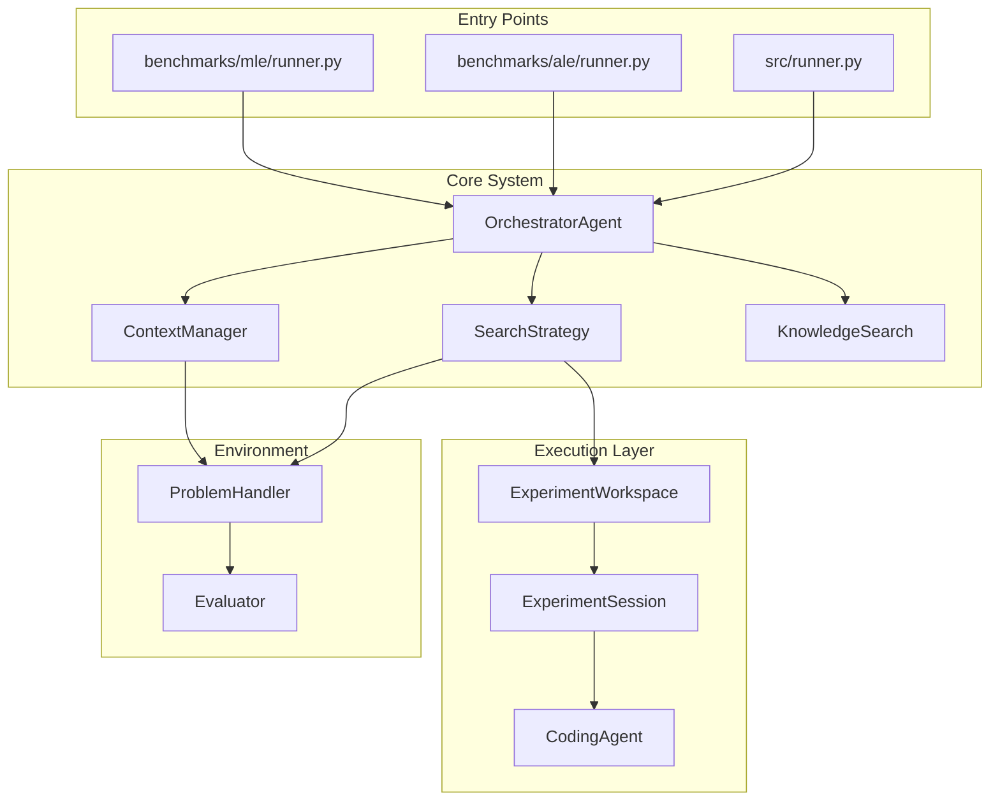
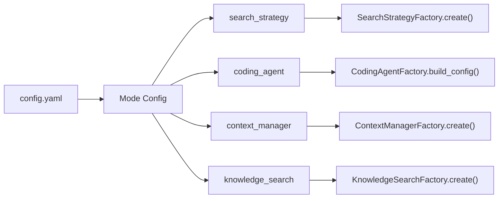

## Overview

Tinkerer Agent uses a modular architecture with pluggable components connected through factories.



## Component Responsibilities

### OrchestratorAgent

The central coordinator that manages the solve loop.

```python
# From src/execution/orchestrator.py
def solve(self, experiment_max_iter, time_budget_minutes, cost_budget):
    for i in range(experiment_max_iter):
        # Calculate budget progress
        budget_progress = max(time, iterations, cost) * 100
        
        # Check stopping conditions
        if self.problem_handler.stop_condition() or budget_progress >= 100:
            break
        
        # Get enriched context
        context = self.context_manager.get_context(budget_progress)
        
        # Run one search iteration
        self.search_strategy.run(context, budget_progress)
```

### Pluggable Components

All major components are created via factories and can be swapped via configuration:

| Component | Factory | Registered Types |
|-----------|---------|------------------|
| Search Strategy | `SearchStrategyFactory` | `llm_tree_search`, `linear_search` |
| Context Manager | `ContextManagerFactory` | `kg_enriched` |
| Knowledge Search | `KnowledgeSearchFactory` | `kg_llm_navigation` |
| Coding Agent | `CodingAgentFactory` | `aider`, `gemini`, `claude_code`, `openhands` |

### Configuration Flow



## Data Flow

1. **Problem Handler** provides problem context and evaluation
2. **Context Manager** gathers problem + history + knowledge
3. **Search Strategy** generates and selects solutions
4. **Experiment Workspace** manages git branches
5. **Coding Agent** generates code from solutions
6. **Problem Handler** evaluates code and returns scores

## Directory Structure

```
src/
├── core/                    # LLM utilities, config loading
├── environment/             # Problem handlers, evaluators
│   ├── handlers/            # Base + generic handler
│   ├── evaluators/          # Score evaluation
│   └── stop_conditions/     # Early stopping
├── execution/               # Execution layer
│   ├── orchestrator.py      # Main coordinator
│   ├── search_strategies/   # Tree search, linear search
│   ├── context_manager/     # Context gathering
│   ├── experiment_workspace/# Git workspace management
│   └── coding_agents/       # Agent adapters
└── knowledge/               # Knowledge system
    ├── search/              # KG search backends (Weaviate + Neo4j)
    └── learners/            # Knowledge learning pipeline
        ├── knowledge_learner_pipeline.py  # Main orchestrator
        ├── knowledge_merger.py            # Stage 2: merge into KG
        ├── sources.py                     # Source type wrappers
        └── ingestors/                     # Stage 1: source → WikiPages
            ├── base.py                    # Ingestor base class
            ├── factory.py                 # IngestorFactory
            ├── repo_ingestor/             # GitHub repos (7-phase pipeline)
            │   ├── __init__.py            # RepoIngestor main class
            │   ├── context_builder.py     # AST scaffolding, orphan detection
            │   ├── wiki_validator.py      # Deterministic validation
            │   ├── utils.py               # Clone/cleanup helpers
            │   └── prompts/               # Phase prompt templates
            └── experiment_ingestor.py     # Experiment logs (basic)
```

