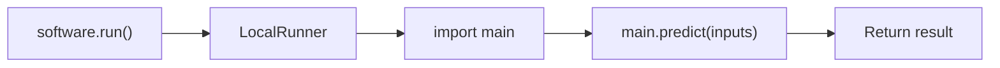
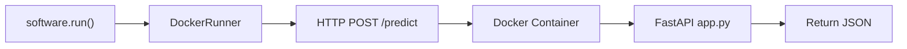
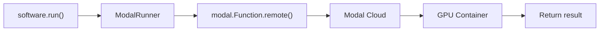
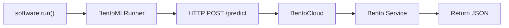
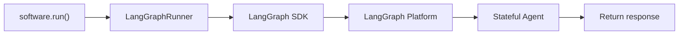

## Strategy Overview

The deployment system supports multiple strategies, each optimized for different use cases.

| Strategy | Provider | Interface | GPU | Best For |
|----------|----------|-----------|-----|----------|
| **LOCAL** | None | Function | ❌ | Development, testing |
| **DOCKER** | Docker | HTTP | ❌ | Containerized APIs |
| **MODAL** | Modal.com | Function | ✅ | Serverless GPU |
| **BENTOML** | BentoCloud | HTTP | ⚙️ | Production ML serving |
| **LANGGRAPH** | LangGraph Platform | LangGraph | ❌ | Stateful agents |

## Lifecycle Management

All strategies support full lifecycle management with `start()` and `stop()` methods:

```python
software = tinkerer.deploy(solution, strategy=DeployStrategy.DOCKER)

# Run
result = software.run(inputs)

# Stop (cleanup resources)
software.stop()

# Restart
software.start()

# Run again
result = software.run(inputs)
```

Each strategy handles lifecycle differently:

| Strategy | `stop()` Action | `start()` Action |
|----------|-----------------|------------------|
| **LOCAL** | Unload module from `sys.modules` | Reload module |
| **DOCKER** | Stop + remove container | Create + start new container |
| **MODAL** | Run `modal app stop` | Re-lookup Modal function |
| **BENTOML** | Run `bentoml deployment terminate` | Run `bentoml deployment apply` |
| **LANGGRAPH** | Delete thread + disconnect | Reconnect to platform |

---

## LOCAL

Run directly as a Python process on the local machine.

### When to Use

✅ **Best For:**
- Development and testing
- Simple scripts and utilities
- Quick prototyping
- No infrastructure needed
- CPU-only workloads

❌ **Not For:**
- Production deployments
- GPU workloads (use Modal)
- Scalable APIs (use Docker or BentoML)
- Stateful agents (use LangGraph)

### Configuration

```yaml
# config.yaml
name: local
provider: null
interface: function
runner_class: LocalRunner

default_resources: {}

run_interface:
  type: function
  module: main
  callable: predict
```

### How It Works

1. Adapter ensures `main.py` has a `predict()` function
2. `LocalRunner` imports the module using `importlib`
3. Each `run()` call invokes `predict(inputs)` directly



### Usage

```python
from src.deployment import DeploymentFactory, DeployStrategy, DeployConfig

software = DeploymentFactory.create(DeployStrategy.LOCAL, config)

# Direct function call
result = software.run({"text": "hello"})
print(result)
# {"status": "success", "output": {"result": "..."}}
```

### Lifecycle

```python
# Run
result = software.run(inputs)

# Stop unloads module
software.stop()

# Start reloads module (picks up code changes!)
software.start()
result = software.run(inputs)
```

### Requirements

- Python 3.8+
- Solution dependencies installed (`pip install -r requirements.txt`)

### Generated Files

| File | Description |
|------|-------------|
| `main.py` | Entry point with `predict()` function |

---

## DOCKER

Run in an isolated Docker container with HTTP API.

### When to Use

✅ **Best For:**
- Reproducible deployments
- Isolated environments
- HTTP-based APIs
- Local testing of production setup
- CPU-only workloads with network access

❌ **Not For:**
- Quick development iteration (use Local)
- GPU workloads (use Modal)
- Serverless auto-scaling (use Modal or BentoML)
- Stateful agents (use LangGraph)

### Configuration

```yaml
# config.yaml
name: docker
provider: null
interface: http
runner_class: DockerRunner

default_resources: {}

run_interface:
  type: http
  endpoint: http://localhost:8000
  predict_path: /predict
```

### How It Works

1. Adapter creates `Dockerfile` and `app.py` (FastAPI)
2. Agent builds and runs the Docker container
3. `DockerRunner` makes HTTP POST requests to the container



### Usage

```python
software = DeploymentFactory.create(DeployStrategy.DOCKER, config)

# HTTP request under the hood
result = software.run({"text": "hello"})
print(result)
# {"status": "success", "output": {"result": "..."}}

# Get endpoint for manual testing
print(software.get_endpoint())
# http://localhost:8000
```

### Lifecycle

```python
# Run
result = software.run(inputs)

# Stop removes the container
software.stop()
# Logs: "Stopping container...", "Container removed"

# Start creates a new container
software.start()
# Logs: "Creating new container...", "Container started"

result = software.run(inputs)
```

The Docker runner uses the `docker-py` SDK for programmatic container management.

### Requirements

- Docker installed and running
- `docker` Python package (`pip install docker`)
- Port 8000 available (configurable)

### Generated Files

| File | Description |
|------|-------------|
| `Dockerfile` | Container definition |
| `app.py` | FastAPI application |
| `main.py` | Business logic with `predict()` |

### Manual Deployment

```bash
# Build the image
docker build -t my-solution .

# Run the container
docker run -p 8000:8000 my-solution

# Test
curl -X POST http://localhost:8000/predict \
  -H "Content-Type: application/json" \
  -d '{"text": "hello"}'
```

---

## MODAL

Serverless GPU deployment on Modal.com with auto-scaling.

### When to Use

✅ **Best For:**
- GPU workloads (PyTorch, TensorFlow, CUDA)
- ML model inference at scale
- Serverless auto-scaling
- Pay-per-use pricing
- Fast cold starts for ML

❌ **Not For:**
- Simple local scripts (use Local)
- Persistent HTTP servers (use Docker)
- LangGraph/LangChain agents (use LangGraph)
- Need on-premise deployment (use Docker)

### Configuration

```yaml
# config.yaml
name: modal
provider: modal
interface: function
runner_class: ModalRunner

default_resources:
  gpu: T4
  memory: 16Gi

run_interface:
  type: modal
  function_name: predict
```

### Resource Options

| GPU | Memory Options | Use Case |
|-----|----------------|----------|
| T4 | 8Gi, 16Gi | Inference, light training |
| L4 | 16Gi, 32Gi | Medium models |
| A10G | 16Gi, 32Gi | Large models |
| A100 | 40Gi, 80Gi | Very large models |
| H100 | 80Gi | Maximum performance |

### How It Works

1. Adapter creates `modal_app.py` with Modal decorators
2. Agent runs `modal deploy modal_app.py`
3. `ModalRunner` calls `modal.Function.remote()` to invoke



### Usage

```python
software = DeploymentFactory.create(DeployStrategy.MODAL, config)

# Remote execution on GPU
result = software.run({"text": "Generate embeddings for this"})
print(result)
# {"status": "success", "output": {"embeddings": [...]}}
```

### Lifecycle

```python
# Run
result = software.run(inputs)

# Stop terminates the Modal app
software.stop()
# Runs: modal app stop {app_name}

# Start re-looks up the function
software.start()
# Calls: modal.Function.lookup(app_name, function_name)

result = software.run(inputs)
```

> **Note:** After `stop()`, the Modal app is terminated and won't consume resources. `start()` reconnects to an existing deployment (you may need to re-deploy if the app was fully stopped).

### Requirements

1. Install Modal: `pip install modal`
2. Authenticate: `modal token new`
3. Or set environment variables:
   ```bash
   export MODAL_TOKEN_ID=your_id
   export MODAL_TOKEN_SECRET=your_secret
   ```

### Generated Files

| File | Description |
|------|-------------|
| `modal_app.py` | Modal application with `@app.function` decorator |
| `main.py` | Business logic with `predict()` |

### Manual Deployment

```bash
# Deploy to Modal
modal deploy modal_app.py

# The deployment URL is printed after deploy
# Example: https://your-username--app-name.modal.run
```

### Example modal_app.py

```python
import modal

app = modal.App("my-solution")

image = modal.Image.debian_slim().pip_install_from_requirements("requirements.txt")

@app.function(image=image, gpu="T4", memory=16384)
def predict(inputs: dict) -> dict:
    from main import predict as _predict
    return _predict(inputs)
```

---

## BENTOML

Production ML service deployment on BentoCloud with batching and monitoring.

### When to Use

✅ **Best For:**
- Production ML model serving
- Need automatic request batching
- Production monitoring and observability
- Managed ML infrastructure
- Model versioning and A/B testing

❌ **Not For:**
- Quick development (use Local)
- Simple scripts (use Local)
- LangGraph agents (use LangGraph)
- GPU-heavy serverless (use Modal)

### Configuration

```yaml
# config.yaml
name: bentoml
provider: bentocloud
interface: http
runner_class: BentoMLRunner

default_resources:
  cpu: 2
  memory: 4Gi

run_interface:
  type: bentocloud
  predict_path: /predict
```

### Resource Options

| CPU | Memory | GPU | Use Case |
|-----|--------|-----|----------|
| 1 | 2Gi | 0 | Light workloads |
| 2 | 4Gi | 0 | Standard workloads |
| 4 | 8Gi | 0 | Heavy CPU workloads |
| 2 | 8Gi | 1 | GPU inference |

### How It Works

1. Adapter creates `service.py` and `bentofile.yaml`
2. Agent runs `bentoml build` and `bentoml deploy`
3. `BentoMLRunner` makes HTTP requests to BentoCloud endpoint



### Usage

```python
software = DeploymentFactory.create(DeployStrategy.BENTOML, config)

# HTTP to BentoCloud
result = software.run({"question": "What is ML?", "context": "..."})
print(result)
# {"status": "success", "output": {"answer": "..."}}

# Get endpoint
print(software.get_endpoint())
# https://your-bento.bentoml.ai
```

### Lifecycle

```python
# Run
result = software.run(inputs)

# Stop terminates the deployment
software.stop()
# Runs: bentoml deployment terminate {deployment_name}

# Start re-deploys by running deploy.py
software.start()
# Runs: python {code_path}/deploy.py
# Then connects to the new endpoint

result = software.run(inputs)
```

> **Note:** `stop()` actually terminates the BentoCloud deployment to avoid billing. `start()` re-deploys the service, which may take a minute.

### Requirements

1. Install BentoML: `pip install bentoml`
2. For BentoCloud (optional):
   ```bash
   bentoml cloud login
   ```
3. `BENTO_CLOUD_API_KEY` environment variable for API access

### Generated Files

| File | Description |
|------|-------------|
| `service.py` | BentoML service class |
| `bentofile.yaml` | Build configuration |
| `main.py` | Business logic |

### Manual Deployment

```bash
# Build the Bento
bentoml build

# Serve locally
bentoml serve service:MyService

# Deploy to BentoCloud
bentoml deploy .
```

---

## LANGGRAPH

Deploy stateful AI agents to LangGraph Platform with memory and streaming.

### When to Use

✅ **Best For:**
- LangGraph/LangChain agents
- Stateful conversational AI
- Multi-step agentic workflows
- Need conversation persistence (threads)
- Streaming responses
- Human-in-the-loop workflows

❌ **Not For:**
- Simple ML inference (use Modal or BentoML)
- Non-agent code (use Local or Docker)
- GPU-heavy workloads (use Modal)
- Batch processing (use BentoML)

### Configuration

```yaml
# config.yaml
name: langgraph
provider: langgraph
interface: langgraph
runner_class: LangGraphRunner

default_resources: {}

run_interface:
  type: langgraph
  assistant_id: agent
```

### How It Works

1. Adapter creates `langgraph.json` and agent structure
2. Agent runs `langgraph deploy`
3. `LangGraphRunner` uses LangGraph SDK to invoke



### Usage

```python
software = DeploymentFactory.create(DeployStrategy.LANGGRAPH, config)

# Invoke the agent
result = software.run({
    "messages": [{"role": "user", "content": "Hello!"}]
})
print(result)
# {"status": "success", "output": {"messages": [...]}}

# With thread persistence
result = software.run({
    "messages": [{"role": "user", "content": "Follow up question"}],
    "thread_id": "conversation-123"
})
```

### Lifecycle

```python
# Run (creates a conversation thread)
result = software.run({"messages": [...]})

# Stop deletes the thread and disconnects
software.stop()
# Thread is deleted, client is cleared

# Start reconnects to LangGraph Platform
software.start()
# New conversation thread is created on next run()

result = software.run({"messages": [...]})
```

> **Note:** LangGraph Platform manages the actual deployment. `stop()` only cleans up the local client and thread. The deployed agent remains available.

### Requirements

1. Install LangGraph: `pip install langgraph langgraph-cli`
2. Set API key:
   ```bash
   export LANGSMITH_API_KEY=your_key
   ```

### Generated Files

| File | Description |
|------|-------------|
| `langgraph.json` | LangGraph configuration |
| `agent.py` | Agent graph definition |
| `main.py` | Entry point |

### Manual Deployment

```bash
# Deploy to LangGraph Platform
langgraph deploy

# Or test locally first
langgraph dev
```

---

## AUTO Strategy

Let the system analyze your code and choose the best strategy.

```python
software = DeploymentFactory.create(DeployStrategy.AUTO, config)
print(f"Auto-selected: {software.name}")
```

### Selection Criteria

The `SelectorAgent` considers:

| Factor | Impact |
|--------|--------|
| Dependencies | `torch`, `tensorflow` → GPU needed → Modal |
| Existing files | `Dockerfile` exists → Docker |
| Goal description | "stateful agent" → LangGraph |
| Code patterns | LangGraph imports → LangGraph |
| Complexity | Simple script → Local |

### Restricting Choices

```python
# Only allow specific strategies
software = DeploymentFactory.create(
    DeployStrategy.AUTO, 
    config,
    strategies=["local", "docker"]  # Won't choose Modal, BentoML, etc.
)
```

---

## Strategy Comparison

### Performance

| Strategy | Cold Start | Scalability | Cost Model |
|----------|------------|-------------|------------|
| Local | None | Single process | Free |
| Docker | Seconds | Manual | Self-hosted |
| Modal | ~1s (optimized) | Auto-scaling | Pay-per-use |
| BentoML | Seconds | Auto-scaling | Pay-per-use |
| LangGraph | Seconds | Auto-scaling | Pay-per-use |

### Features

| Feature | Local | Docker | Modal | BentoML | LangGraph |
|---------|-------|--------|-------|---------|-----------|
| GPU Support | ❌ | ❌ | ✅ | ⚙️ | ❌ |
| Auto-scaling | ❌ | ❌ | ✅ | ✅ | ✅ |
| Request Batching | ❌ | ❌ | ⚙️ | ✅ | ❌ |
| State Persistence | ❌ | ❌ | ❌ | ❌ | ✅ |
| Streaming | ❌ | ⚙️ | ⚙️ | ⚙️ | ✅ |
| Monitoring | ❌ | ❌ | ✅ | ✅ | ✅ |

---

## Next Steps

<CardGroup cols={2}>
  <Card title="Adding Strategies" icon="plus" href="/docs/deployment/adding-strategies">
    Learn how to add your own deployment strategy
  </Card>
  <Card title="API Reference" icon="book" href="/docs/deployment/api-reference">
    Complete API documentation
  </Card>
</CardGroup>

