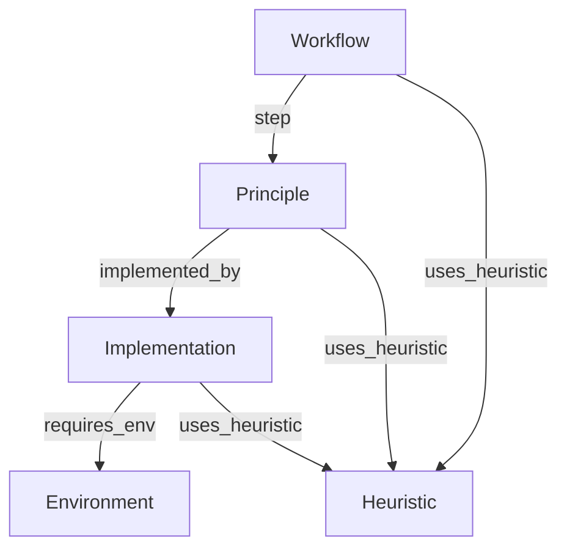

# Page Connections (Edges)

This document defines the strictly **Top-Down Directed Acyclic Graph (DAG)** schema for the wiki.

**Core Rule:** Connections always flow **Downwards** (Intent → Theory → Code) or **Outwards** (to Attributes like Environment/Heuristic). No loops allowed.

---

## Complete Edge Registry

### 1. Workflow Layer (The Recipe)
*Top-down. Orchestrates Principles.*

| Source Node | Edge Property | Target Node | Meaning |
|:---|:---|:---|:---|
| **Workflow** | `step` | **Principle** | "Step X of this workflow is defined by Theory Y." |
| **Workflow** | `uses_heuristic` | **Heuristic** | "This workflow is guided/warned by Wisdom Z." |

### 2. Principle Layer (The Theory)
*The heavy lifter. Must be connected to Code.*

| Source Node | Edge Property | Target Node | Meaning | Constraint |
|:---|:---|:---|:---|:---|
| **Principle** | `implemented_by` | **Implementation** | "This theory runs via this code." | **MANDATORY (1+)** |
| **Principle** | `uses_heuristic` | **Heuristic** | "This theory is optimized by Wisdom Z." | Leaf |

*Note: Hierarchical relationships are managed dynamically by Composers, which create new parent Principle nodes by merging existing ones.*

### 3. Implementation Layer (The Code)
*The ground truth.*

| Source Node | Edge Property | Target Node | Meaning |
|:---|:---|:---|:---|
| **Implementation** | `requires_env` | **Environment** | "Needs Context X to run." |
| **Implementation** | `uses_heuristic` | **Heuristic** | "Uses Hack/Config Z." |

### 4. Leaf Nodes (Attributes)
These nodes are **Targets Only**. They do not define outgoing edges in the core graph.
*   **Environment** (Hardware/OS context)
*   **Heuristic** (Wisdom/Tips)

---

## Visualization

---

## Link Integrity Rules

### Rule 1: The Executable Constraint
Every **Principle** MUST have at least one outgoing `[[implemented_by::Implementation:X]]` link.
- If the Principle is abstract (e.g., "Optimization"), it must link to a "Base Class" or "Interface" implementation.

### Rule 2: Top-Down Only
- **Implementations** never point to **Principles** (use inverse queries for navigation).
- **Heuristics** never point to **Implementations**.
- **Environments** never point to **Implementations**.

### Rule 3: No Loops
The graph must remain a DAG. Do not create edges that point back up the hierarchy.
