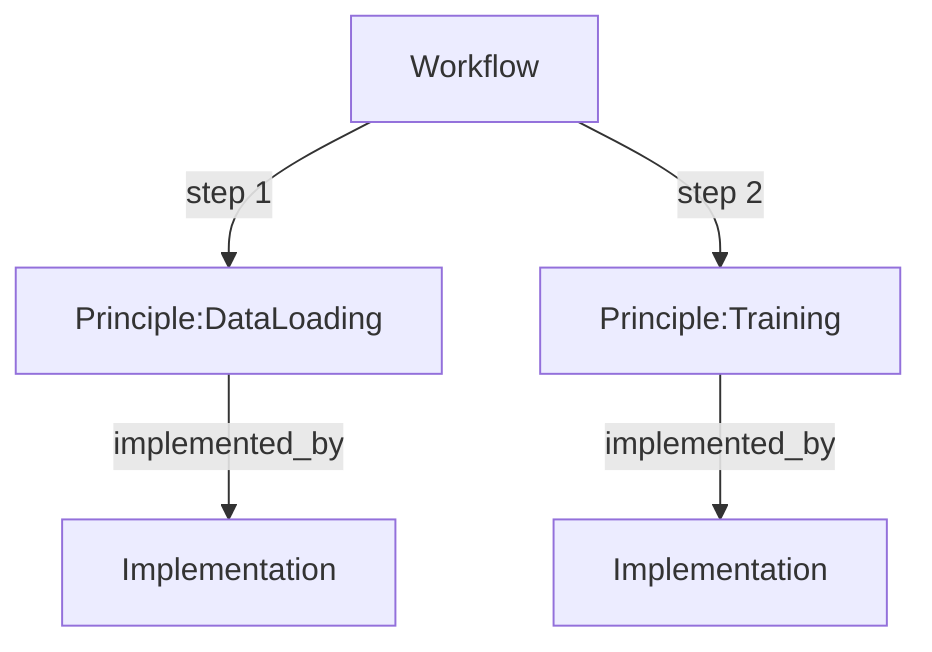

# Workflow Page Definition

## 1. Core Definition
**Role:** Recipe (High-value "Job to be Done")

A **Workflow** is an ordered sequence of Principles that delivers a high-value business outcome. It is temporal (Start → End), representing a complete process (e.g., "Fine-tuning Llama-2" or "RAG Pipeline"). It is the "Root Intent" of the graph.

## 2. Graph Connectivity (Top-Down DAG)

### Role in Graph
*   **Type:** The Root / Entry Point.
*   **Direction:** **Orchestrator**. Workflows do not implement logic; they structure the execution of Principles.

### Outgoing Connections (Dependencies)
*   **To Principle:** `step`
    *   *Meaning:* "This workflow requires executing this theory as a step."
    *   *Constraint:* **Ordered**. Steps must follow a logical temporal sequence.
*   **To Heuristic:** `uses_heuristic`
    *   *Meaning:* "This whole process is optimized/guided by this wisdom."

### Visualization

## 3. Key Purpose
1.  **Intent Mapping:** Maps high-level user goals ("Train a model") to low-level graph nodes.
2.  **Process Documentation:** Captures the "Recipe" or "Standard Operating Procedure".
3.  **Visualization:** Provides a clear flow diagram of how components fit together.

